# corporateZ
Analyzing open data of Ministry of Corporate Affairs **( M.C.A. )**, Govt. of India to get deeper insight ( in District, State & Country Level ), with :heart:

## Data Source
All data upon which following analysis work will be done, is collected from [here](https://data.gov.in/).

Dataset upon which I'm working, was last updated on _21-04-2018_ ( as mentioned on Open Data Portal of India ).

## Analysis of M.C.A. Data for _Madhyapradesh_, India
### Status of Companies in Madhyapradesh
Following PIE chart shows an overview of STATUS _( as of 21-04-2018 )_ of various companies registered in Madhyapradesh, India.
- Active ( 62.1060% )
- Strike Off ( 35.8259% )
- Under Process of Striking off ( 0.7618% )
- Amalgamated ( 0.3108% )
- Not Available for eFiling ( 0.3080% )
- Converted to LLP ( 0.2420% )
- Under liquidation ( 0.2420% )
- Converted to LLP and dissolved ( 0.1320% )
- Dormant under section 455 ( 0.0440% )
- Dormant ( 0.0138% )
- Dissolved ( 0.0083% )
- Liquidated ( 0.0055% )

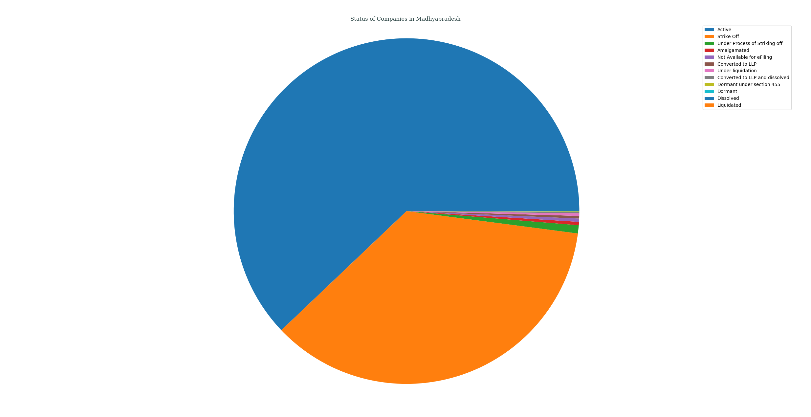

---
### Class of Companies in Madhyapradesh
Following PIE chart shows various companies categorized by their CLASS _( as of 21-04-2018 )_, present in Madhyapradesh, India.
- Private ( 90.9961% )
- Public ( 7.8654% )
- Private(One Person Company) ( 1.0918% )
- NA ( 0.0468% )

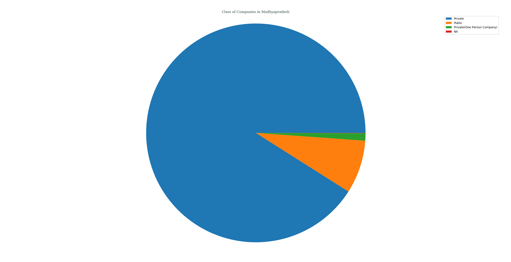

---
### Category of Companies in Madhyapradesh
Following PIE chart shows various companies categorized by their CATEGORY _( as of 21-04-2018 )_, present in Madhyapradesh, India.
- Company limited by Shares ( 99.6232% )
- Company Limited by Guarantee ( 0.3025% )
- NA ( 0.0468% )
- Unlimited Company ( 0.0275% )

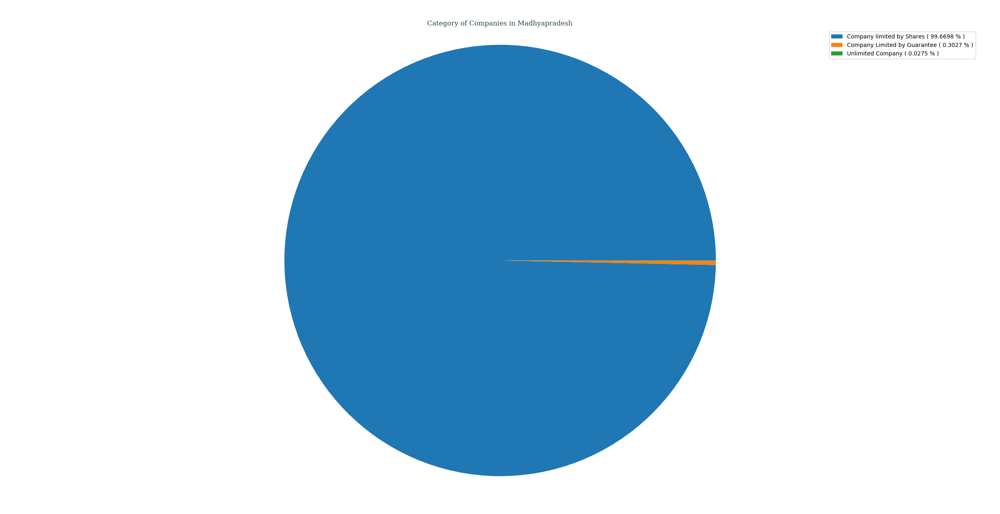

---
### Sub-Category of Companies in Madhyapradesh
Following PIE chart shows various companies categorized by their SUB_CATEGORY _( as of 21-04-2018 )_, present in Madhyapradesh, India.
- Non-govt company ( 99.5105% )
- State Govt company ( 0.2943% )
- Subsidiary of Foreign Company ( 0.0908% )
- NA ( 0.0468% )
- Guarantee and Association comp ( 0.0413% )
- Union Govt company ( 0.0165% )

---
### Principal Business Activity of Companies in Madhyapradesh
Following PIE chart shows various companies categorized by their PRINCIPAL_BUSINESS_ACTIVITY _( as of 21-04-2018 )_, present in Madhyapradesh, India.
- Business Services ( 18.2333% )
- Trading ( 12.4168% )
- Construction ( 10.8685% )
- Manufacturing (Metals & Chemicals, and products thereof) ( 10.6127% )
- Agriculture and Allied Activities ( 8.6739% )
- Real Estate and Renting ( 6.3858% )
- Community, personal & Social Services ( 5.9870% )
- Finance ( 4.7302% )
- Manufacturing (Food stuffs) ( 4.6367% )
- Manufacturing (Machinery & Equipments) ( 4.2792% )
- OTHERS ( 2.9839% )
- Transport, storage and Communications ( 2.7584% )
- Manufacturing (Paper & Paper products, Publishing, printing and reproduction of recorded media) ( 1.8646% )
- Manufacturing (Textiles) ( 1.7601% )
- Mining & Quarrying ( 1.6336% )
- Electricity, Gas & Water companies ( 1.2541% )
- Manufacturing (Others) ( 0.5088% )
- Manufacturing (Leather & products thereof) ( 0.1595% )
- Manufacturing (Wood Products) ( 0.1568% )
- Insurance ( 0.0660% )
- Others ( 0.0303% )

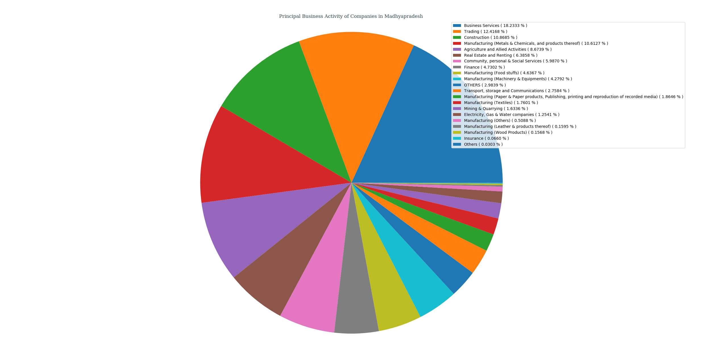

---
### Registration of Companies by Year in Madhyapradesh
Companies registered in Madhyapradesh gets categorized by Year of Registration, which is plotted as year of registration vs. #-of companies registered in that certain year _( while filtering out those companies which didn't had any date of registration data )_.

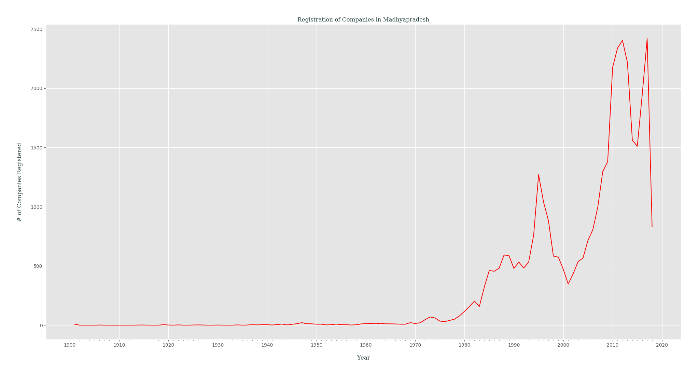

---

## Analysis of M.C.A. Data for _Maharashtra_, India
### Status of Companies in Maharashtra
Following PIE chart shows an overview of STATUS _( as of 21-04-2018 )_ of various companies registered in Maharashtra, India.
- Active ( 65.8143% )
- Strike Off ( 27.0488% )
- Dissolved ( 1.6389% )
- Amalgamated ( 1.6172% )
- Under Process of Striking off ( 1.1242% )
- Not Available for eFiling ( 0.9562% )
- Converted to LLP ( 0.6331% )
- Converted to LLP and dissolved ( 0.4939% )
- Under liquidation ( 0.4643% )
- Liquidated ( 0.1457% )
- Dormant under section 455 ( 0.0473% )
- Active In Progress ( 0.0121% )
- Dormant ( 0.0020% )
- Captured ( 0.0020% )

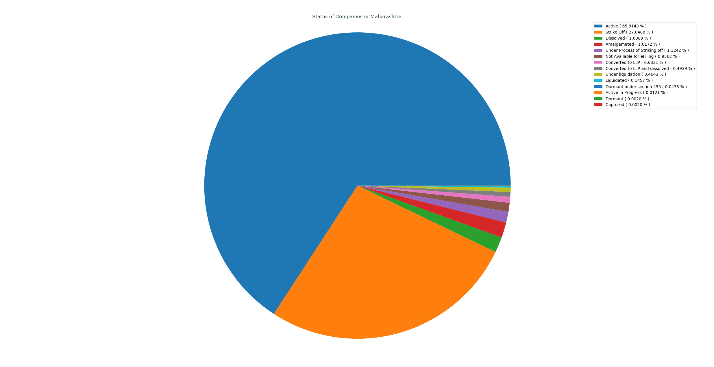

---
### Class of Companies in Maharashtra
Following PIE chart shows various companies categorized by their CLASS _( as of 21-04-2018 )_, present in Maharashtra, India.
- Private ( 91.1473% )
- Public ( 7.9748% )
- Private(One Person Company) ( 0.8697% )
- NA ( 0.0082% )

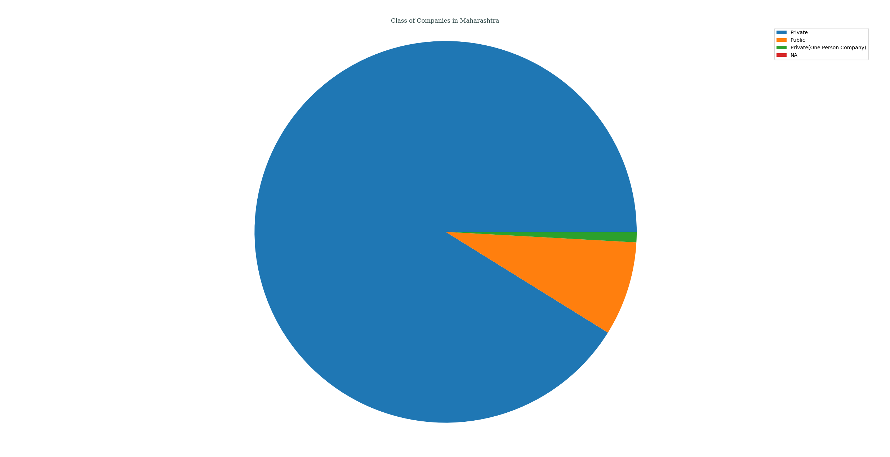

---
### Category of Companies in Maharashtra
Following PIE chart shows various companies categorized by their CATEGORY _( as of 21-04-2018 )_, present in Maharashtra, India.
- Company limited by Shares ( 96.6512% )
- Company Limited by Guarantee ( 3.2899% )
- Unlimited Company ( 0.0507% )
- NA ( 0.0082% )

---
### Sub-Category of Companies in Maharashtra
Following PIE chart shows various companies categorized by their SUB_CATEGORY _( as of 21-04-2018 )_, present in Maharashtra, India.
- Non-govt company ( 98.9133% )
- Subsidiary of Foreign Company ( 0.8013% )
- Guarantee and Association comp ( 0.2088% )
- State Govt company ( 0.0425% )
- Union Govt company ( 0.0259% )
- NA ( 0.0082% )

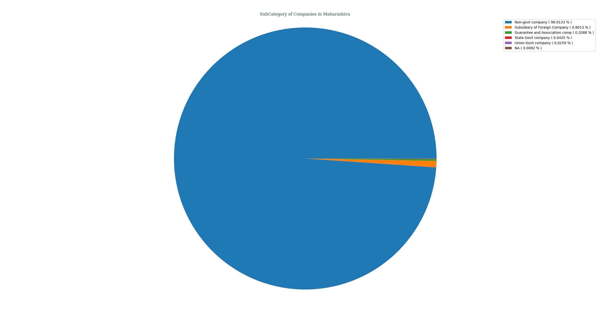

---
### Principal Business Activity of Companies in Maharashtra
Following PIE chart shows various companies categorized by their PRINCIPAL_BUSINESS_ACTIVITY _( as of 21-04-2018 )_, present in Maharashtra, India.
- Business Services ( 26.8744% )
- Trading ( 11.4084% )
- Manufacturing (Metals & Chemicals, and products thereof) ( 8.1173% )
- Construction ( 7.9097% )
- Others ( 7.8333% )
- Finance ( 6.7266% )
- Manufacturing (Machinery & Equipments) ( 5.8504% )
- Community, personal & Social Services ( 5.6439% )
- Real Estate and Renting ( 4.3073% )
- Transport, storage and Communications ( 3.2837% )
- Agriculture and Allied Activities ( 2.8118% )
- Manufacturing (Textiles) ( 2.6323% )
- Manufacturing (Food stuffs) ( 2.2616% )
- Manufacturing (Paper & Paper products, Publishing, printing and reproduction of recorded media) ( 1.2777% )
- Manufacturing (Others) ( 1.0864% )
- Electricity, Gas & Water companies ( 0.8221% )
- Mining & Quarrying ( 0.5857% )
- OTHERS ( 0.1865% )
- Manufacturing (Wood Products) ( 0.1440% )
- Manufacturing (Leather & products thereof) ( 0.1344% )
- Insurance ( 0.1023% )

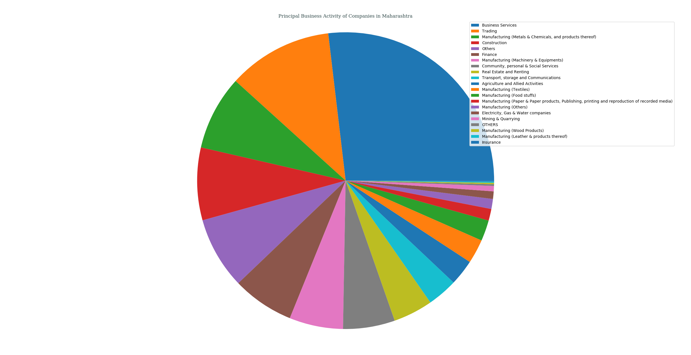

---
### Registration of Companies by Year in Maharashtra
Companies registered in Maharashtra gets categorized by Year of Registration, which is plotted as year of registration vs. #-of companies registered in that certain year _( while filtering out those companies which didn't had any date of registration data )_.

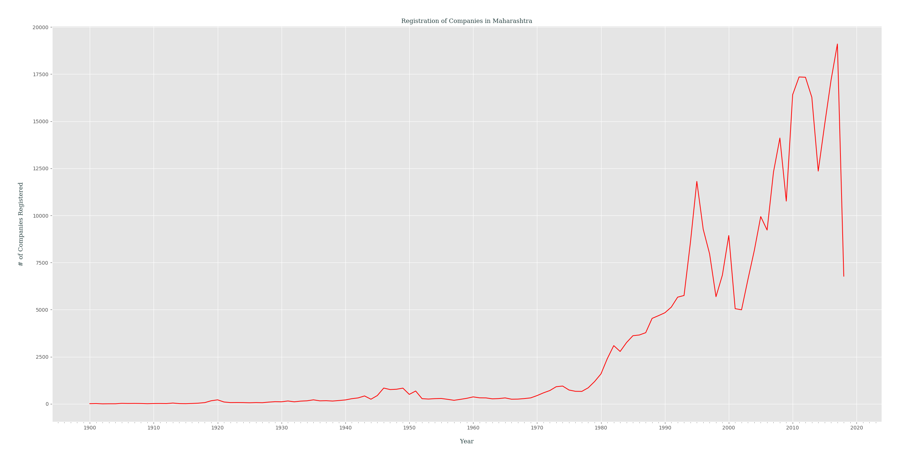

---

## Analysis of M.C.A. Data for _Manipur_, India
### Status of Companies in Manipur
Following PIE chart shows an overview of STATUS _( as of 21-04-2018 )_ of various companies registered in Manipur, India.
- Active ( 65.6805% )
- Strike Off ( 23.9645% )
- Not Available for eFiling ( 5.3254% )
- Under Process of Striking off ( 4.7337% )
- Converted to LLP and dissolved ( 0.1479% )
- Active In Progress ( 0.1479% )

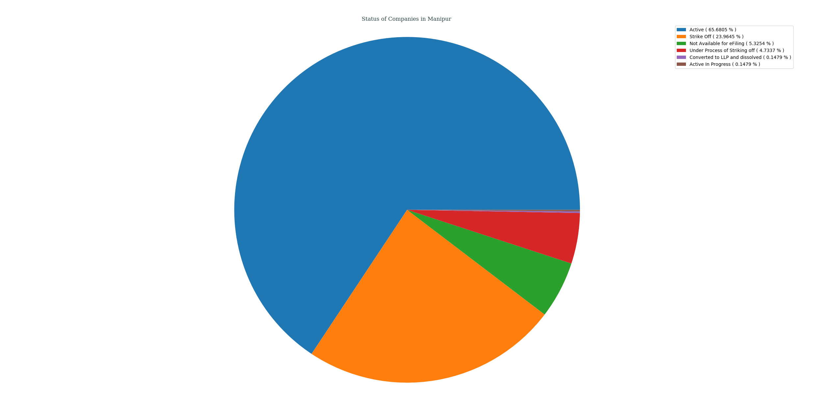

---
### Class of Companies in Manipur
Following PIE chart shows various companies categorized by their CLASS _( as of 21-04-2018 )_, present in Manipur, India.
- Private ( 82.5444% )
- Public ( 15.0888% )
- Private(One Person Company) ( 2.3669% )

---
### Category of Companies in Manipur
Following PIE chart shows various companies categorized by their CATEGORY _( as of 21-04-2018 )_, present in Manipur, India.
- Company limited by Shares ( 93.9349% )
- Company Limited by Guarantee ( 5.7692% )
- Unlimited Company ( 0.2959% )

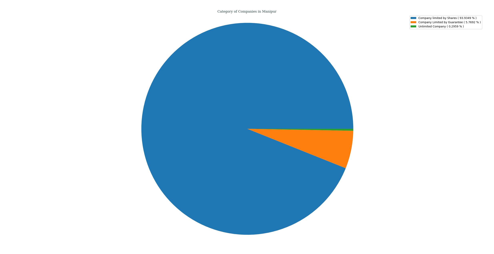

---
### Sub-Category of Companies in Manipur
Following PIE chart shows various companies categorized by their SUB_CATEGORY _( as of 21-04-2018 )_, present in Manipur, India.
- Non-govt company ( 96.8935% )
- State Govt company ( 2.9586% )
- Union Govt company ( 0.1479% )

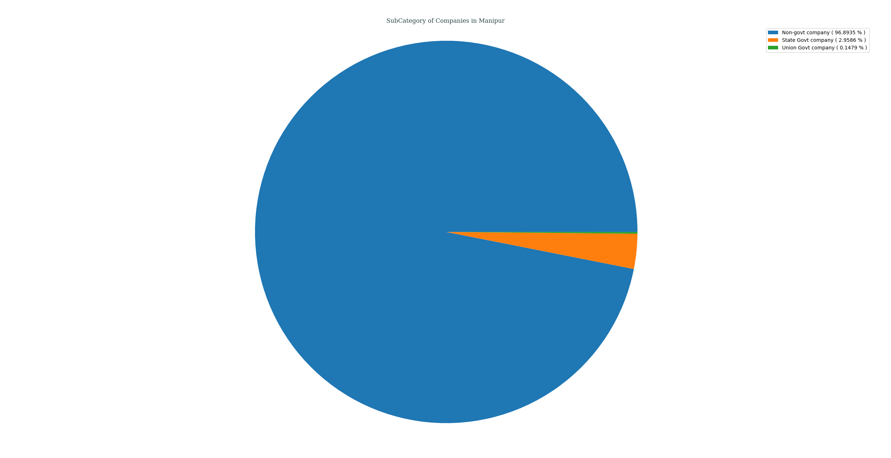

---
### Principal Business Activity of Companies in Manipur
Following PIE chart shows various companies categorized by their PRINCIPAL_BUSINESS_ACTIVITY _( as of 21-04-2018 )_, present in Manipur, India.
- Business Services ( 21.5976% )
- Trading ( 19.9704% )
- Construction ( 12.2781% )
- Agriculture and Allied Activities ( 8.1361% )
- Community, personal & Social Services ( 7.8402% )
- Finance ( 6.2130% )
- Others ( 5.1775% )
- Manufacturing (Food stuffs) ( 3.8462% )
- Transport, storage and Communications ( 3.6982% )
- Manufacturing (Metals & Chemicals, and products thereof) ( 3.4024% )
- Real Estate and Renting ( 1.6272% )
- Electricity, Gas & Water companies ( 1.3314% )
- Manufacturing (Textiles) ( 1.3314% )
- Manufacturing (Machinery & Equipments) ( 1.1834% )
- Manufacturing (Wood Products) ( 0.8876% )
- Manufacturing (Paper & Paper products, Publishing, printing and reproduction of recorded media) ( 0.7396% )
- Manufacturing (Others) ( 0.4438% )
- Mining & Quarrying ( 0.2959% )

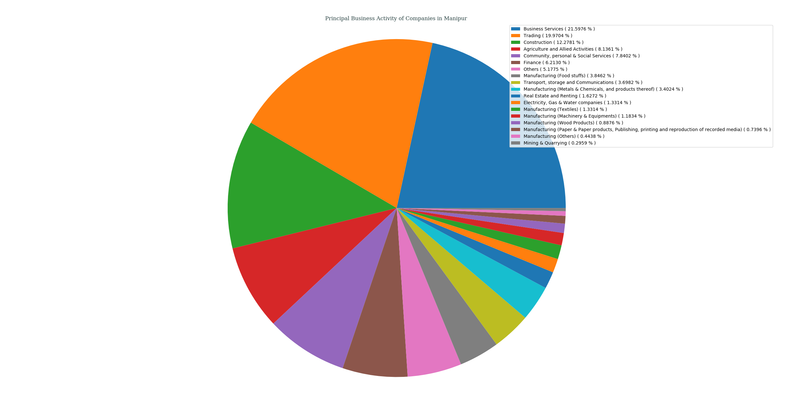

---
### Registration of Companies by Year in Manipur
Companies registered in Manipur gets categorized by Year of Registration, which is plotted as year of registration vs. #-of companies registered in that certain year _( while filtering out those companies which didn't had any date of registration data )_.

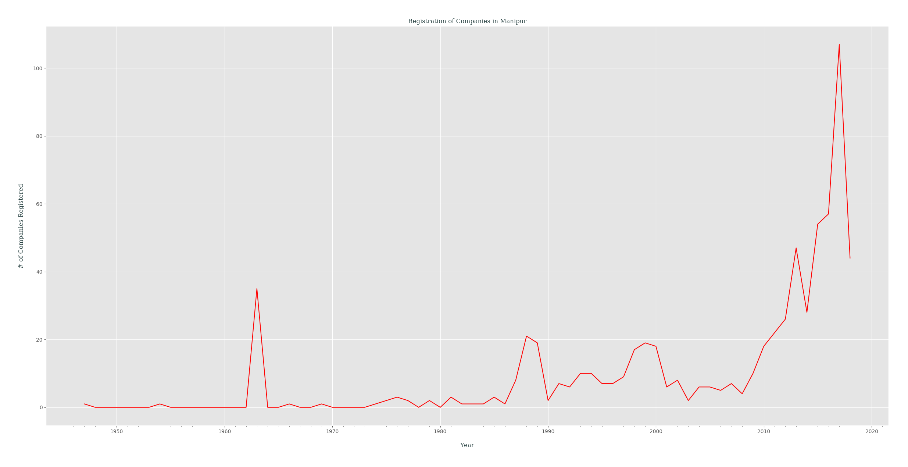

---

## Analysis of M.C.A. Data for _Meghalaya_, India
### Status of Companies in Meghalaya
Following PIE chart shows an overview of STATUS _( as of 21-04-2018 )_ of various companies registered in Meghalaya, India.
- Active ( 54.5370% )
- Strike Off ( 33.3957% )
- Under Process of Striking off ( 5.9869% )
- Not Available for eFiling ( 5.3321% )
- Amalgamated ( 0.4677% )
- Under liquidation ( 0.1871% )
- Converted to LLP and dissolved ( 0.0935% )

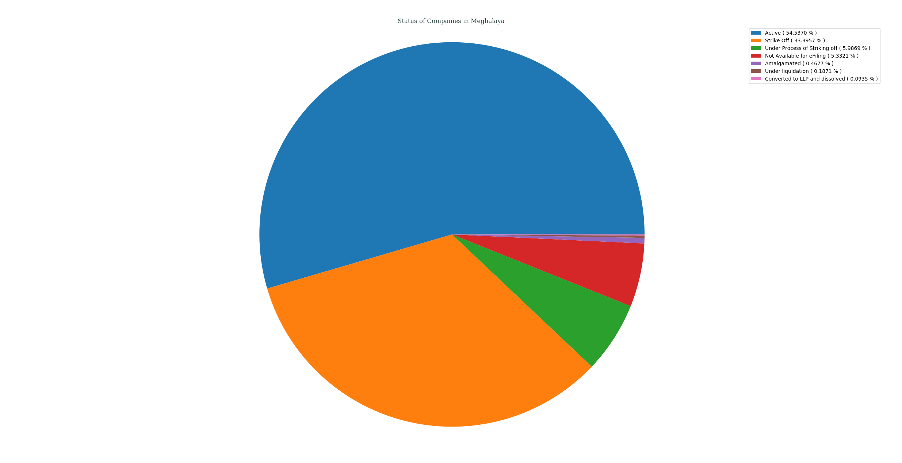

---
### Class of Companies in Meghalaya
Following PIE chart shows various companies categorized by their CLASS _( as of 21-04-2018 )_, present in Meghalaya, India.
- Private ( 80.9167% )
- Public ( 18.6155% )
- Private(One Person Company) ( 0.4677% )

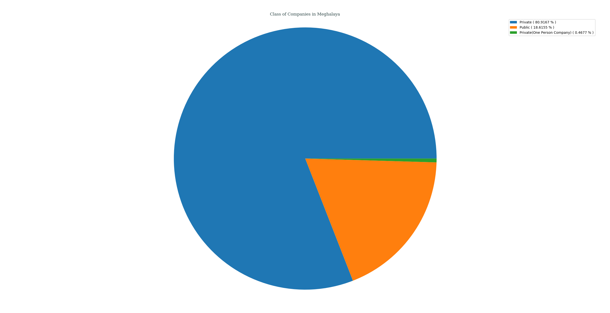

---
### Category of Companies in Meghalaya
Following PIE chart shows various companies categorized by their CATEGORY _( as of 21-04-2018 )_, present in Meghalaya, India.
- Company limited by Shares ( 95.2292% )
- Company Limited by Guarantee ( 4.7708% )

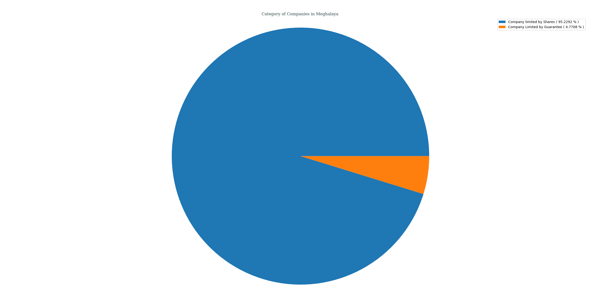

---
### Sub-Category of Companies in Meghalaya
Following PIE chart shows various companies categorized by their SUB_CATEGORY _( as of 21-04-2018 )_, present in Meghalaya, India.
- Non-govt company ( 97.6614% )
- State Govt company ( 1.6838% )
- Union Govt company ( 0.2806% )
- Subsidiary of Foreign Company ( 0.2806% )
- Guarantee and Association comp ( 0.0935% )

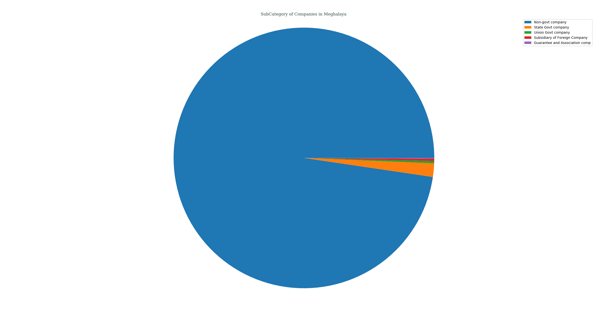

---
### Principal Business Activity of Companies in Meghalaya
Following PIE chart shows various companies categorized by their PRINCIPAL_BUSINESS_ACTIVITY _( as of 21-04-2018 )_, present in Meghalaya, India.
- Manufacturing (Metals & Chemicals, and products thereof) ( 24.5089% )
- Trading ( 12.4415% )
- Business Services ( 10.5706% )
- Mining & Quarrying ( 9.6352% )
- Manufacturing (Food stuffs) ( 6.5482% )
- Construction ( 5.3321% )
- Community, personal & Social Services ( 5.1450% )
- Agriculture and Allied Activities ( 5.0514% )
- Others ( 4.1160% )
- Manufacturing (Wood Products) ( 3.2741% )
- Finance ( 2.5257% )
- Electricity, Gas & Water companies ( 2.4322% )
- Transport, storage and Communications ( 2.2451% )
- Manufacturing (Machinery & Equipments) ( 1.7774% )
- Real Estate and Renting ( 1.4967% )
- Manufacturing (Paper & Paper products, Publishing, printing and reproduction of recorded media) ( 1.4032% )
- Manufacturing (Textiles) ( 0.7484% )
- Manufacturing (Others) ( 0.6548% )
- Manufacturing (Leather & products thereof) ( 0.0935% )

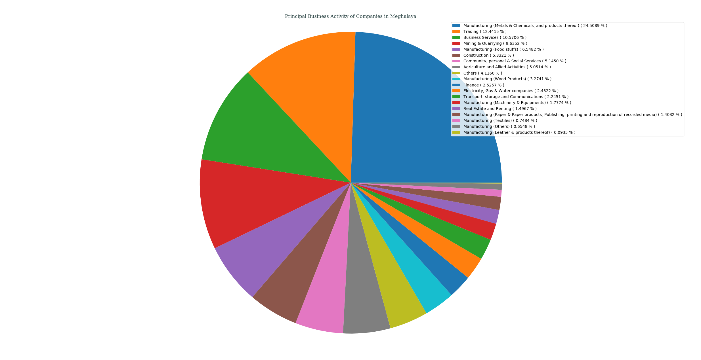

---
### Registration of Companies by Year in Meghalaya
Companies registered in Meghalaya gets categorized by Year of Registration, which is plotted as year of registration vs. #-of companies registered in that certain year _( while filtering out those companies which didn't had any date of registration data )_.

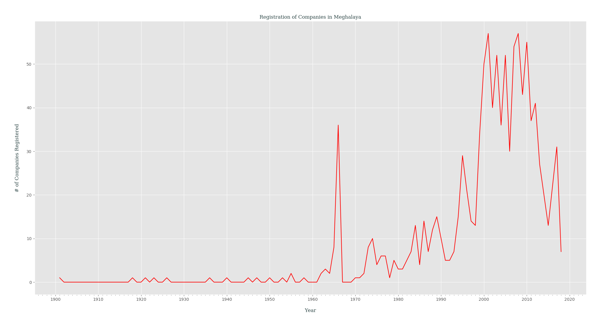

---

## Analysis of M.C.A. Data for _Mizoram_, India
### Status of Companies in Mizoram
Following PIE chart shows an overview of STATUS _( as of 21-04-2018 )_ of various companies registered in Mizoram, India.
- Active ( 50.0000% )
- Strike Off ( 43.9394% )
- Under Process of Striking off ( 6.0606% )

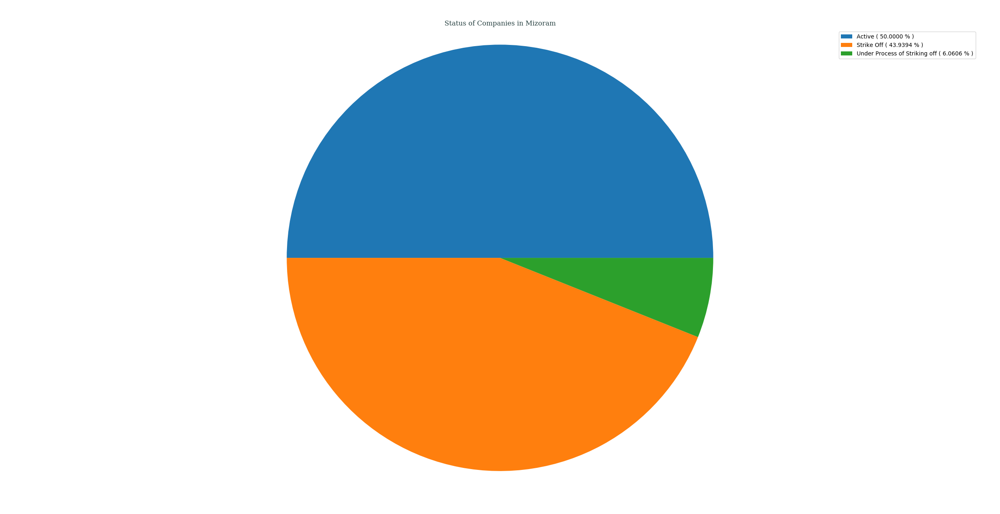

---
### Class of Companies in Mizoram
Following PIE chart shows various companies categorized by their CLASS _( as of 21-04-2018 )_, present in Mizoram, India.
- Private ( 85.6061% )
- Public ( 12.8788% )
- Private(One Person Company) ( 1.5152% )

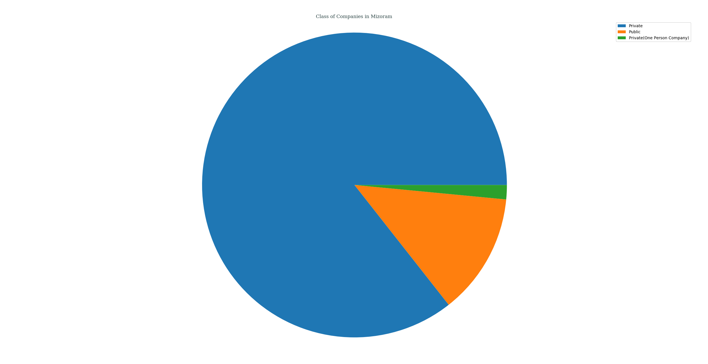

---
### Category of Companies in Mizoram
Following PIE chart shows various companies categorized by their CATEGORY _( as of 21-04-2018 )_, present in Mizoram, India.
- Company limited by Shares ( 98.4848% )
- Company Limited by Guarantee ( 1.5152% )

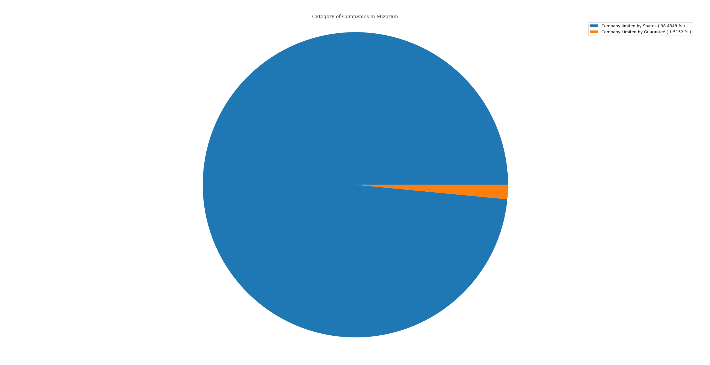

---
### Sub-Category of Companies in Mizoram
Following PIE chart shows various companies categorized by their SUB_CATEGORY _( as of 21-04-2018 )_, present in Mizoram, India.
- Non-govt company ( 93.1818% )
- State Govt company ( 6.8182% )

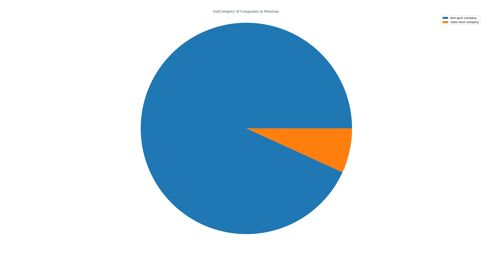

---
### Principal Business Activity of Companies in Mizoram
Following PIE chart shows various companies categorized by their PRINCIPAL_BUSINESS_ACTIVITY _( as of 21-04-2018 )_, present in Mizoram, India.
- Business Services ( 24.2424% )
- Agriculture and Allied Activities ( 15.1515% )
- Trading ( 11.3636% )
- Construction ( 10.6061% )
- Manufacturing (Food stuffs) ( 6.0606% )
- Manufacturing (Wood Products) ( 4.5455% )
- Transport, storage and Communications ( 4.5455% )
- Finance ( 3.7879% )
- Community, personal & Social Services ( 3.7879% )
- Electricity, Gas & Water companies ( 3.0303% )
- Real Estate and Renting ( 3.0303% )
- Manufacturing (Machinery & Equipments) ( 3.0303% )
- Manufacturing (Metals & Chemicals, and products thereof) ( 3.0303% )
- Manufacturing (Others) ( 1.5152% )
- Manufacturing (Paper & Paper products, Publishing, printing and reproduction of recorded media) ( 0.7576% )
- Manufacturing (Textiles) ( 0.7576% )
- Mining & Quarrying ( 0.7576% )

---
### Registration of Companies by Year in Mizoram
Companies registered in Mizoram gets categorized by Year of Registration, which is plotted as year of registration vs. #-of companies registered in that certain year _( while filtering out those companies which didn't had any date of registration data )_.

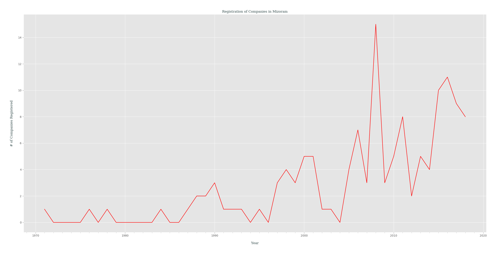

---

## Analysis of M.C.A. Data for _Nagaland_, India
### Status of Companies in Nagaland
Following PIE chart shows an overview of STATUS _( as of 21-04-2018 )_ of various companies registered in Nagaland, India.
- Strike Off ( 48.4902% )
- Active ( 41.7407% )
- Under Process of Striking off ( 6.2167% )
- Not Available for eFiling ( 3.1972% )
- Amalgamated ( 0.1776% )
- Under liquidation ( 0.1776% )

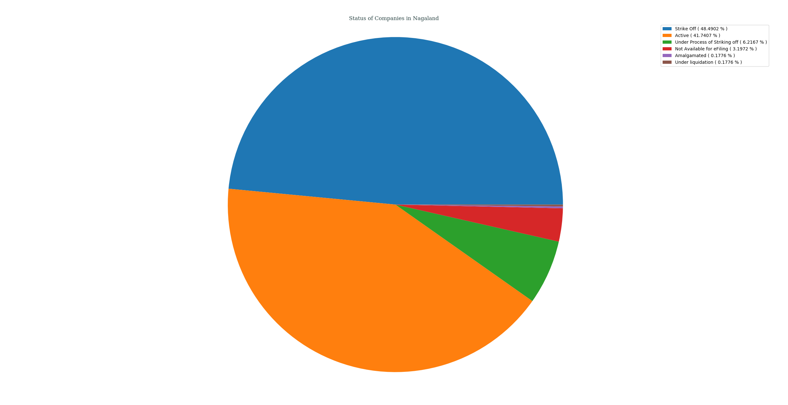

---
### Class of Companies in Nagaland
Following PIE chart shows various companies categorized by their CLASS _( as of 21-04-2018 )_, present in Nagaland, India.
- Private ( 90.4085% )
- Public ( 8.5258% )
- Private(One Person Company) ( 1.0657% )

---
### Category of Companies in Nagaland
Following PIE chart shows various companies categorized by their CATEGORY _( as of 21-04-2018 )_, present in Nagaland, India.
- Company limited by Shares ( 98.2238% )
- Company Limited by Guarantee ( 1.7762% )

---
### Sub-Category of Companies in Nagaland
Following PIE chart shows various companies categorized by their SUB_CATEGORY _( as of 21-04-2018 )_, present in Nagaland, India.
- Non-govt company ( 98.0462% )
- State Govt company ( 1.9538% )

---
### Principal Business Activity of Companies in Nagaland
Following PIE chart shows various companies categorized by their PRINCIPAL_BUSINESS_ACTIVITY _( as of 21-04-2018 )_, present in Nagaland, India.
- Manufacturing (Wood Products) ( 21.3144% )
- Business Services ( 14.7425% )
- Trading ( 11.3677% )
- Agriculture and Allied Activities ( 11.0124% )
- Construction ( 6.3943% )
- Manufacturing (Metals & Chemicals, and products thereof) ( 5.3286% )
- Manufacturing (Food stuffs) ( 4.4405% )
- Electricity, Gas & Water companies ( 3.9076% )
- Community, personal & Social Services ( 3.7300% )
- Transport, storage and Communications ( 3.7300% )
- Real Estate and Renting ( 2.8419% )
- Finance ( 2.6643% )
- Mining & Quarrying ( 2.1314% )
- Manufacturing (Machinery & Equipments) ( 1.7762% )
- Others ( 1.4210% )
- Manufacturing (Textiles) ( 1.2433% )
- Manufacturing (Paper & Paper products, Publishing, printing and reproduction of recorded media) ( 1.0657% )
- Manufacturing (Others) ( 0.3552% )
- Manufacturing (Leather & products thereof) ( 0.3552% )
- OTHERS ( 0.1776% )

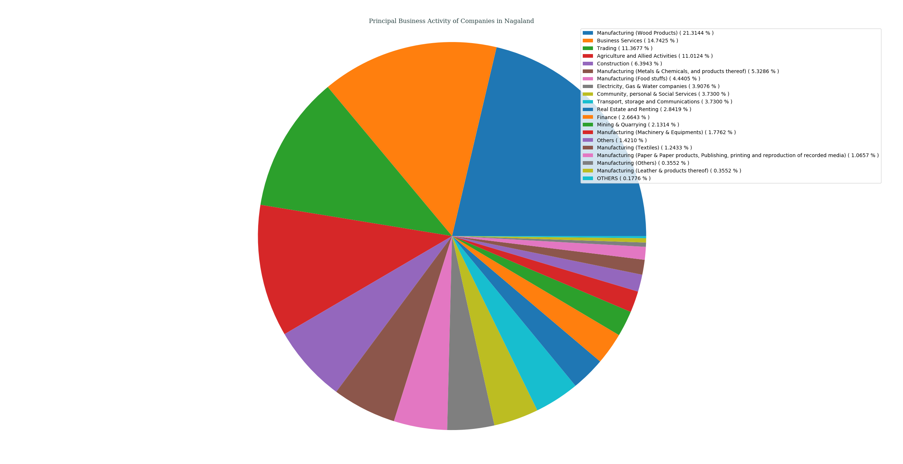

---
### Registration of Companies by Year in Nagaland
Companies registered in Nagaland gets categorized by Year of Registration, which is plotted as year of registration vs. #-of companies registered in that certain year _( while filtering out those companies which didn't had any date of registration data )_.

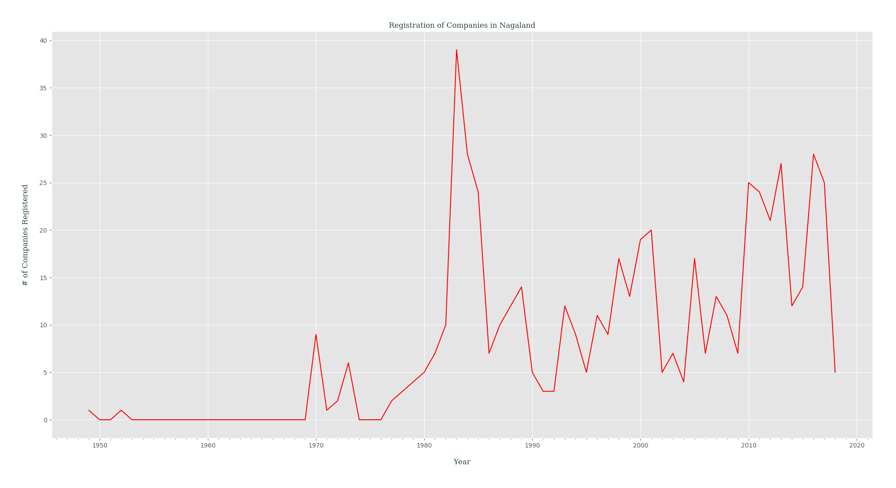

---

## Analysis of M.C.A. Data for _Odisha_, India
### Status of Companies in Odisha
Following PIE chart shows an overview of STATUS _( as of 21-04-2018 )_ of various companies registered in Odisha, India.
- Active ( 66.0905% )
- Strike Off ( 31.8498% )
- Dormant under section 455 ( 0.6235% )
- Under Process of Striking off ( 0.3182% )
- Amalgamated ( 0.2967% )
- Under liquidation ( 0.2623% )
- Not Available for eFiling ( 0.2623% )
- Dissolved ( 0.2580% )
- Converted to LLP ( 0.0258% )
- Converted to LLP and dissolved ( 0.0086% )
- Liquidated ( 0.0043% )

---
### Class of Companies in Odisha
Following PIE chart shows various companies categorized by their CLASS _( as of 21-04-2018 )_, present in Odisha, India.
- Private ( 89.7876% )
- Public ( 8.3118% )
- Private(One Person Company) ( 1.8834% )
- NA ( 0.0172% )

---
### Category of Companies in Odisha
Following PIE chart shows various companies categorized by their CATEGORY _( as of 21-04-2018 )_, present in Odisha, India.
- Company limited by Shares ( 99.5786% )
- Company Limited by Guarantee ( 0.3784% )
- Unlimited Company ( 0.0258% )
- NA ( 0.0172% )

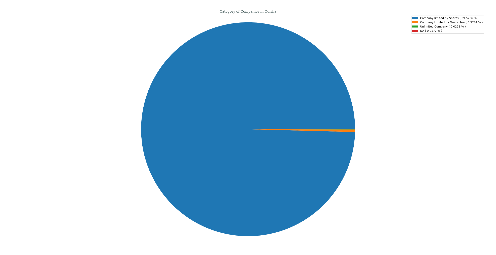

---
### Sub-Category of Companies in Odisha
Following PIE chart shows various companies categorized by their SUB_CATEGORY _( as of 21-04-2018 )_, present in Odisha, India.
- Non-govt company ( 99.2776% )
- State Govt company ( 0.4257% )
- Guarantee and Association comp ( 0.1505% )
- Subsidiary of Foreign Company ( 0.0774% )
- Union Govt company ( 0.0516% )
- NA ( 0.0172% )

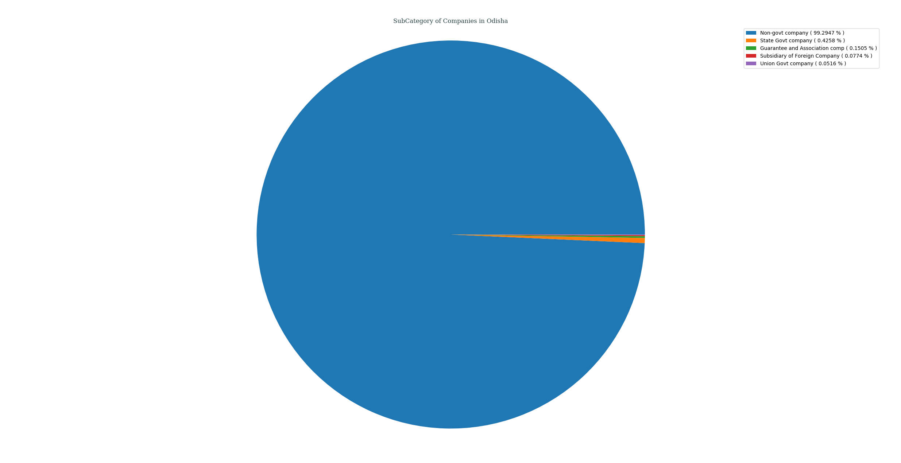

---
### Principal Business Activity of Companies in Odisha
Following PIE chart shows various companies categorized by their PRINCIPAL_BUSINESS_ACTIVITY _( as of 21-04-2018 )_, present in Odisha, India.
- Business Services ( 20.5796% )
- Construction ( 16.1034% )
- Trading ( 13.5492% )
- Manufacturing (Metals & Chemicals, and products thereof) ( 10.3844% )
- Real Estate and Renting ( 6.5101% )
- Agriculture and Allied Activities ( 6.1189% )
- Community, personal & Social Services ( 5.0740% )
- Manufacturing (Food stuffs) ( 5.0353% )
- Transport, storage and Communications ( 3.5346% )
- Mining & Quarrying ( 3.1003% )
- Manufacturing (Machinery & Equipments) ( 2.7606% )
- Finance ( 2.5886% )
- Manufacturing (Paper & Paper products, Publishing, printing and reproduction of recorded media) ( 1.5093% )
- Electricity, Gas & Water companies ( 1.1051% )
- Manufacturing (Textiles) ( 0.9976% )
- Manufacturing (Others) ( 0.3483% )
- OTHERS ( 0.3010% )
- Manufacturing (Wood Products) ( 0.1892% )
- Manufacturing (Leather & products thereof) ( 0.1032% )
- Others ( 0.0559% )
- Insurance ( 0.0516% )

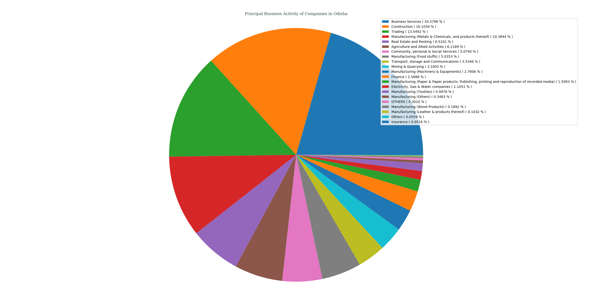

---
### Registration of Companies by Year in Odisha
Companies registered in Odisha gets categorized by Year of Registration, which is plotted as year of registration vs. #-of companies registered in that certain year _( while filtering out those companies which didn't had any date of registration data )_.

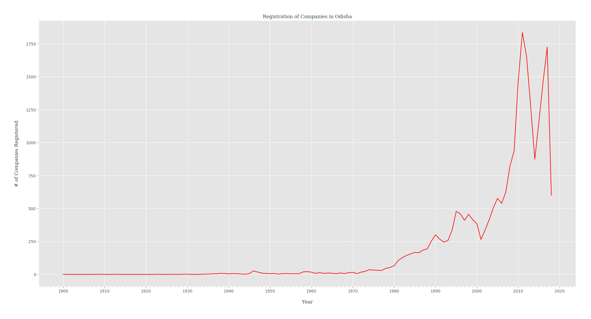

---

## Analysis of M.C.A. Data for _Puducherry_, India
### Status of Companies in Puducherry
Following PIE chart shows an overview of STATUS _( as of 21-04-2018 )_ of various companies registered in Puducherry, India.
- Strike Off ( 53.3106% )
- Active ( 39.6658% )
- Not Available for eFiling ( 4.9505% )
- Amalgamated ( 0.8045% )
- Under Process of Striking off ( 0.6807% )
- Dissolved ( 0.3094% )
- Under liquidation ( 0.1856% )
- Converted to LLP ( 0.0309% )
- Converted to LLP and dissolved ( 0.0309% )
- Dormant under section 455 ( 0.0309% )

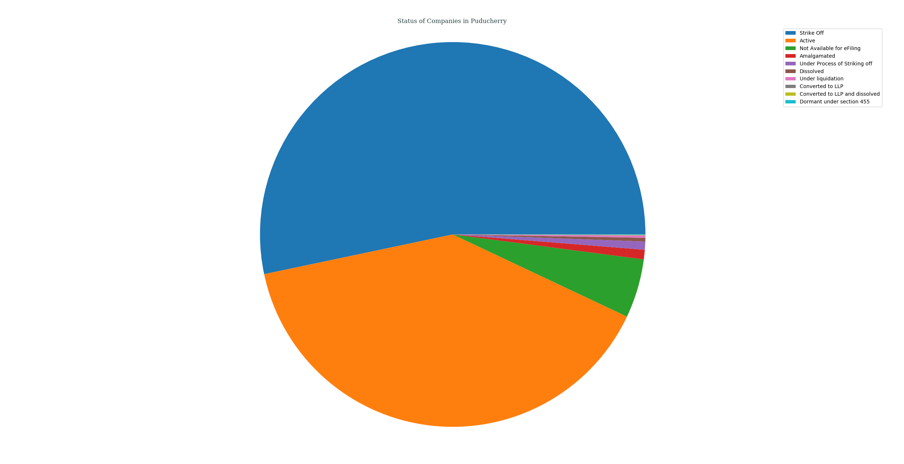

---
### Class of Companies in Puducherry
Following PIE chart shows various companies categorized by their CLASS _( as of 21-04-2018 )_, present in Puducherry, India.
- Private ( 90.6869% )
- Public ( 8.5087% )
- Private(One Person Company) ( 0.8045% )

---
### Category of Companies in Puducherry
Following PIE chart shows various companies categorized by their CATEGORY _( as of 21-04-2018 )_, present in Puducherry, India.
- Company limited by Shares ( 99.5359% )
- Company Limited by Guarantee ( 0.4022% )
- Unlimited Company ( 0.0619% )

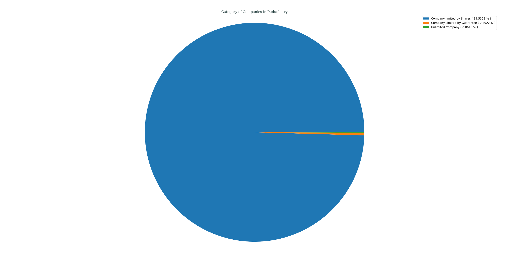

---
### Sub-Category of Companies in Puducherry
Following PIE chart shows various companies categorized by their SUB_CATEGORY _( as of 21-04-2018 )_, present in Puducherry, India.
- Non-govt company ( 99.2574% )
- State Govt company ( 0.5260% )
- Subsidiary of Foreign Company ( 0.2166% )

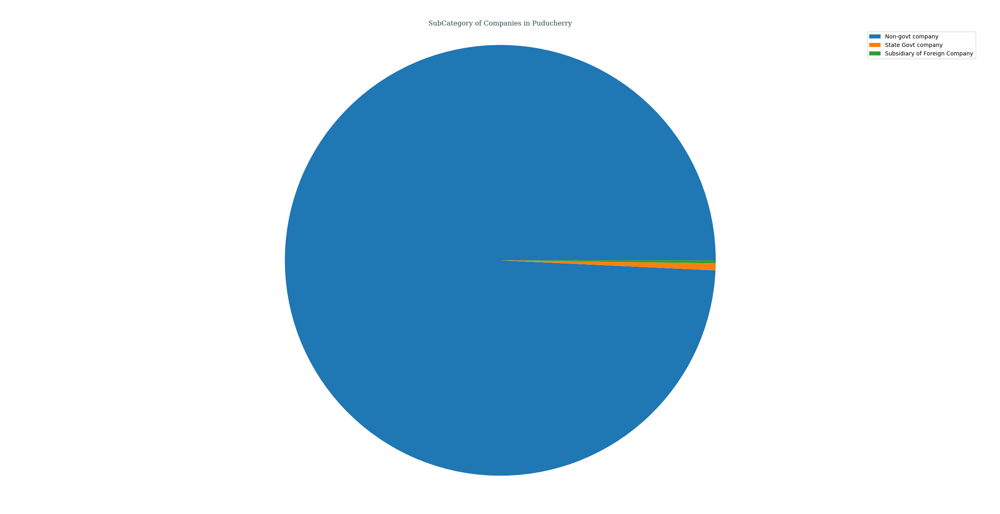

---
### Principal Business Activity of Companies in Puducherry
Following PIE chart shows various companies categorized by their PRINCIPAL_BUSINESS_ACTIVITY _( as of 21-04-2018 )_, present in Puducherry, India.
- Business Services ( 24.9072% )
- Others ( 16.6770% )
- Manufacturing (Metals & Chemicals, and products thereof) ( 10.9220% )
- Trading ( 9.5606% )
- Finance ( 5.6931% )
- Manufacturing (Machinery & Equipments) ( 5.3837% )
- Community, personal & Social Services ( 4.6411% )
- Construction ( 4.1151% )
- Manufacturing (Food stuffs) ( 3.6510% )
- Transport, storage and Communications ( 3.2797% )
- Manufacturing (Textiles) ( 2.1658% )
- Agriculture and Allied Activities ( 2.0421% )
- Manufacturing (Paper & Paper products, Publishing, printing and reproduction of recorded media) ( 1.8255% )
- Real Estate and Renting ( 1.2067% )
- Mining & Quarrying ( 1.0210% )
- Electricity, Gas & Water companies ( 0.8973% )
- Manufacturing (Leather & products thereof) ( 0.8354% )
- Manufacturing (Others) ( 0.7735% )
- Manufacturing (Wood Products) ( 0.3094% )
- OTHERS ( 0.0619% )
- Insurance ( 0.0309% )

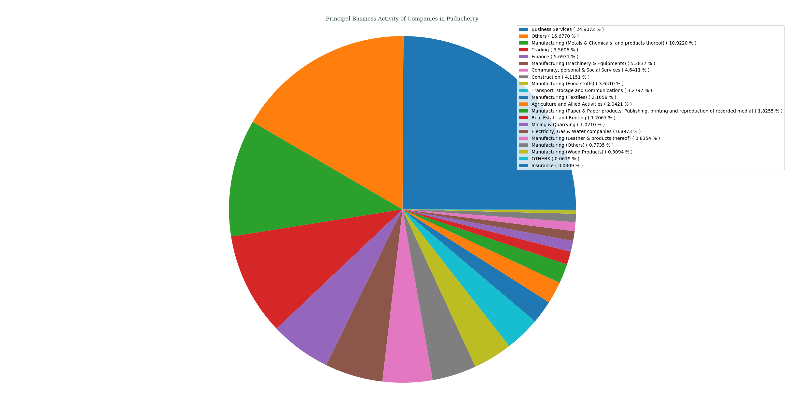

---
### Registration of Companies by Year in Puducherry
Companies registered in Puducherry gets categorized by Year of Registration, which is plotted as year of registration vs. #-of companies registered in that certain year _( while filtering out those companies which didn't had any date of registration data )_.

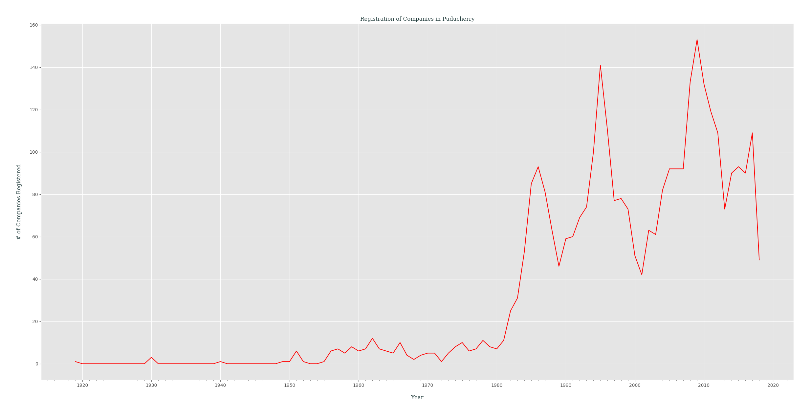

---

## Analysis of M.C.A. Data for _Punjab_, India
### Status of Companies in Punjab
Following PIE chart shows an overview of STATUS _( as of 21-04-2018 )_ of various companies registered in Punjab, India.
- Active ( 57.3301% )
- Strike Off ( 39.7634% )
- Under Process of Striking off ( 1.2668% )
- Amalgamated ( 0.5074% )
- Under liquidation ( 0.4032% )
- Not Available for eFiling ( 0.3763% )
- Dissolved ( 0.1310% )
- Converted to LLP ( 0.1008% )
- Converted to LLP and dissolved ( 0.0706% )
- Dormant under section 455 ( 0.0470% )
- Dormant ( 0.0034% )

---
### Class of Companies in Punjab
Following PIE chart shows various companies categorized by their CLASS _( as of 21-04-2018 )_, present in Punjab, India.
- Private ( 88.4816% )
- Public ( 10.7893% )
- Private(One Person Company) ( 0.6888% )
- NA ( 0.0403% )

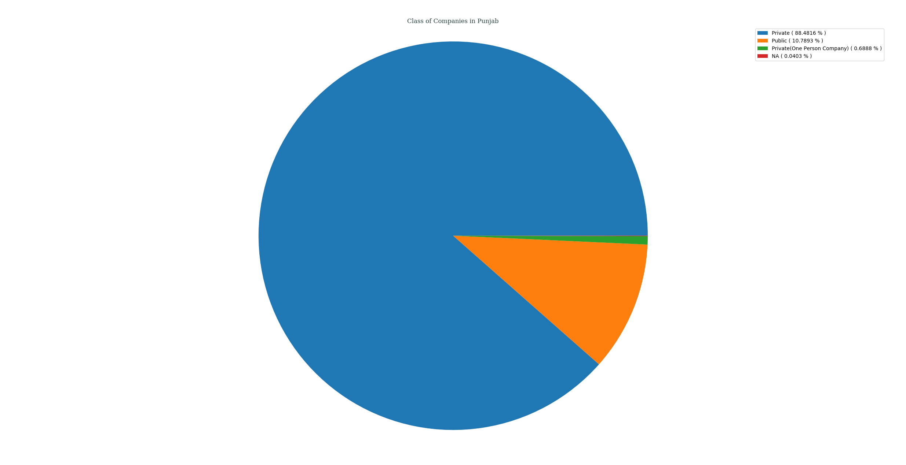

---
### Category of Companies in Punjab
Following PIE chart shows various companies categorized by their CATEGORY _( as of 21-04-2018 )_, present in Punjab, India.
- Company limited by Shares ( 99.4456% )
- Company Limited by Guarantee ( 0.4435% )
- Unlimited Company ( 0.0706% )
- NA ( 0.0403% )

---
### Sub-Category of Companies in Punjab
Following PIE chart shows various companies categorized by their SUB_CATEGORY _( as of 21-04-2018 )_, present in Punjab, India.
- Non-govt company ( 99.7245% )
- Subsidiary of Foreign Company ( 0.1478% )
- State Govt company ( 0.0638% )
- NA ( 0.0403% )
- Guarantee and Association comp ( 0.0202% )
- Union Govt company ( 0.0034% )

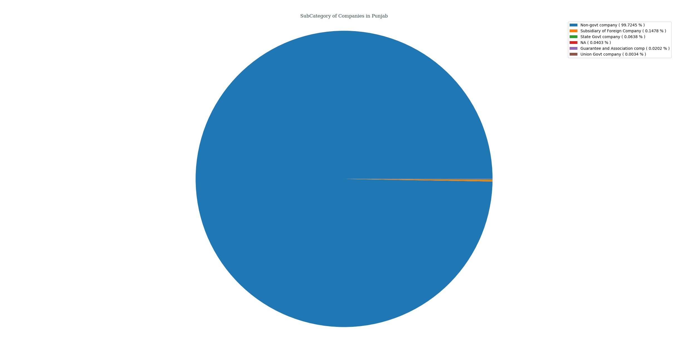

---
### Principal Business Activity of Companies in Punjab
Following PIE chart shows various companies categorized by their PRINCIPAL_BUSINESS_ACTIVITY _( as of 21-04-2018 )_, present in Punjab, India.
- Business Services ( 15.2213% )
- Trading ( 13.0809% )
- Manufacturing (Metals & Chemicals, and products thereof) ( 12.4156% )
- Finance ( 11.1656% )
- Manufacturing (Textiles) ( 6.7336% )
- Manufacturing (Machinery & Equipments) ( 6.3136% )
- Community, personal & Social Services ( 5.8768% )
- Construction ( 5.7995% )
- Real Estate and Renting ( 5.1477% )
- Manufacturing (Food stuffs) ( 4.8923% )
- Transport, storage and Communications ( 4.3009% )
- Agriculture and Allied Activities ( 2.8393% )
- Manufacturing (Paper & Paper products, Publishing, printing and reproduction of recorded media) ( 1.8010% )
- OTHERS ( 1.0719% )
- Electricity, Gas & Water companies ( 0.8299% )
- Manufacturing (Others) ( 0.7493% )
- Manufacturing (Leather & products thereof) ( 0.5544% )
- Others ( 0.5376% )
- Manufacturing (Wood Products) ( 0.3562% )
- Mining & Quarrying ( 0.2822% )
- Insurance ( 0.0302% )

---
### Registration of Companies by Year in Punjab
Companies registered in Punjab gets categorized by Year of Registration, which is plotted as year of registration vs. #-of companies registered in that certain year _( while filtering out those companies which didn't had any date of registration data )_.

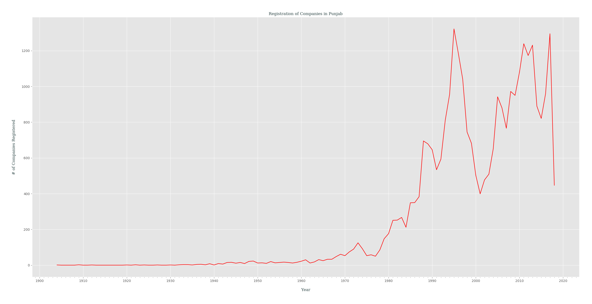

---

## Analysis of M.C.A. Data for _Rajasthan_, India
### Status of Companies in Rajasthan
Following PIE chart shows an overview of STATUS _( as of 21-04-2018 )_ of various companies registered in Rajasthan, India.
- Active ( 68.0539% )
- Strike Off ( 25.3067% )
- Under Process of Striking off ( 4.5951% )
- Converted to LLP ( 0.6345% )
- Converted to LLP and dissolved ( 0.5632% )
- Not Available for eFiling ( 0.2469% )
- Amalgamated ( 0.2267% )
- Under liquidation ( 0.1463% )
- Liquidated ( 0.1426% )
- Dissolved ( 0.0439% )
- Dormant under section 455 ( 0.0366% )
- Active In Progress ( 0.0018% )
- Dormant ( 0.0018% )

---
### Class of Companies in Rajasthan
Following PIE chart shows various companies categorized by their CLASS _( as of 21-04-2018 )_, present in Rajasthan, India.
- Private ( 93.4612% )
- Public ( 5.6081% )
- Private(One Person Company) ( 0.8795% )
- NA ( 0.0512% )

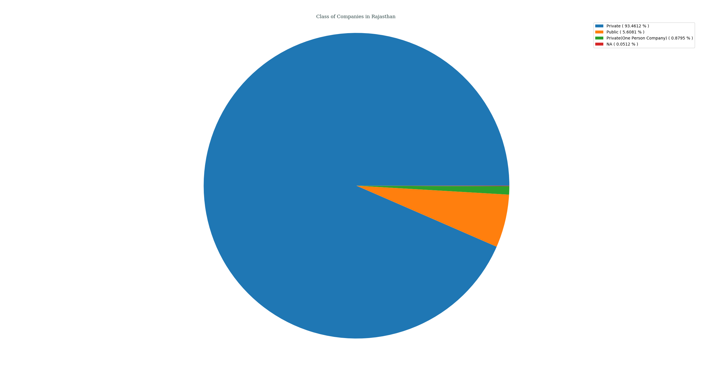

---
### Category of Companies in Rajasthan
Following PIE chart shows various companies categorized by their CATEGORY _( as of 21-04-2018 )_, present in Rajasthan, India.
- Company limited by Shares ( 99.7330% )
- Company Limited by Guarantee ( 0.2030% )
- NA ( 0.0512% )
- Unlimited Company ( 0.0128% )

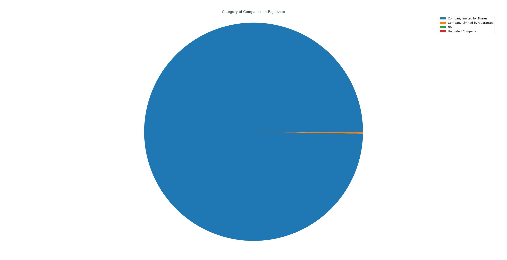

---
### Sub-Category of Companies in Rajasthan
Following PIE chart shows various companies categorized by their SUB_CATEGORY _( as of 21-04-2018 )_, present in Rajasthan, India.
- Non-govt company ( 99.6380% )
- State Govt company ( 0.1353% )
- Subsidiary of Foreign Company ( 0.0933% )
- Guarantee and Association comp ( 0.0622% )
- NA ( 0.0512% )
- Union Govt company ( 0.0201% )

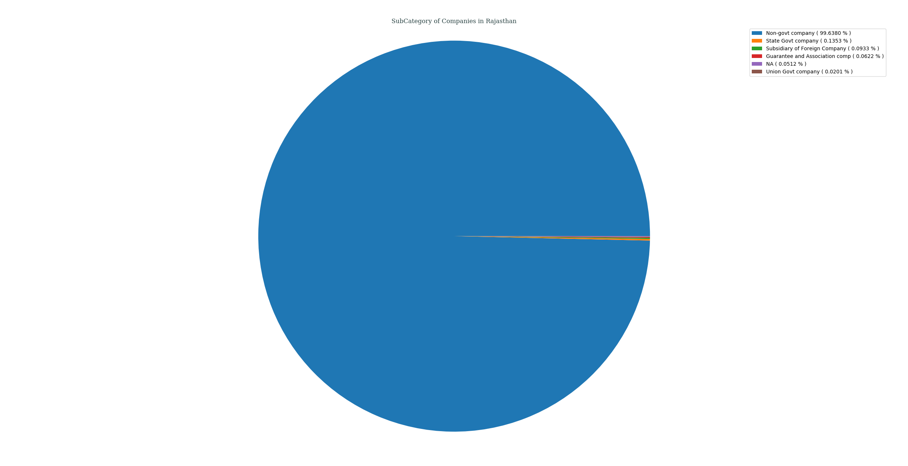

---
### Principal Business Activity of Companies in Rajasthan
Following PIE chart shows various companies categorized by their PRINCIPAL_BUSINESS_ACTIVITY _( as of 21-04-2018 )_, present in Rajasthan, India.
- Business Services ( 16.4384% )
- Trading ( 13.0904% )
- Construction ( 12.8892% )
- Manufacturing (Metals & Chemicals, and products thereof) ( 10.1647% )
- Mining & Quarrying ( 7.5554% )
- Real Estate and Renting ( 7.1038% )
- Community, personal & Social Services ( 5.9537% )
- Finance ( 5.0869% )
- Manufacturing (Textiles) ( 4.3811% )
- Manufacturing (Machinery & Equipments) ( 3.8070% )
- Manufacturing (Food stuffs) ( 3.2182% )
- Transport, storage and Communications ( 2.8415% )
- Agriculture and Allied Activities ( 2.7190% )
- Manufacturing (Others) ( 2.0223% )
- Electricity, Gas & Water companies ( 1.0679% )
- Manufacturing (Paper & Paper products, Publishing, printing and reproduction of recorded media) ( 0.8759% )
- Manufacturing (Wood Products) ( 0.2469% )
- Others ( 0.2359% )
- Manufacturing (Leather & products thereof) ( 0.1682% )
- OTHERS ( 0.1115% )
- Insurance ( 0.0219% )

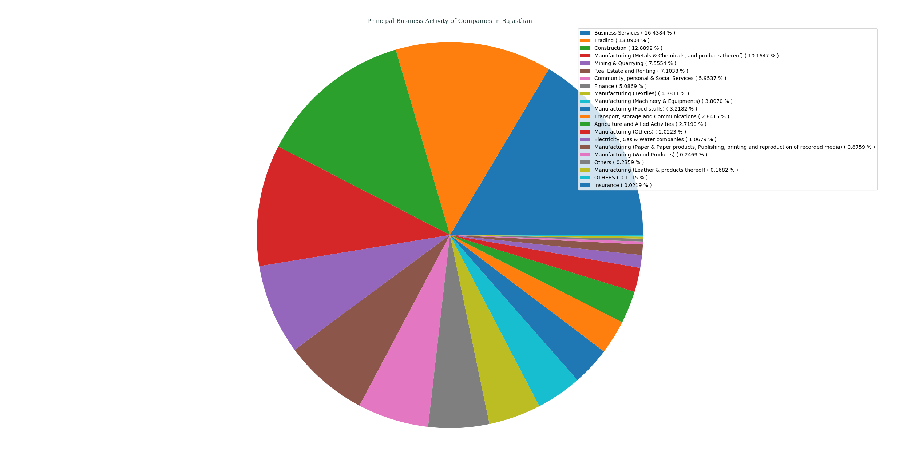

---
### Registration of Companies by Year in Rajasthan
Companies registered in Rajasthan gets categorized by Year of Registration, which is plotted as year of registration vs. #-of companies registered in that certain year _( while filtering out those companies which didn't had any date of registration data )_.

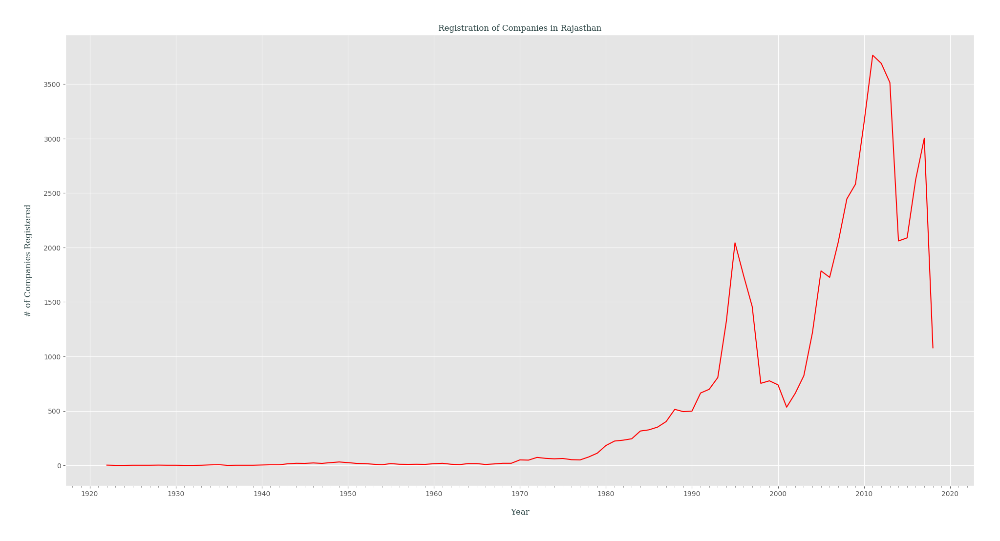

---

## Analysis of M.C.A. Data for _Sikkim_, India
### Status of Companies in Sikkim
Following PIE chart shows an overview of STATUS _( as of 21-04-2018 )_ of various companies registered in Sikkim, India.
- Active ( 100.0000% )

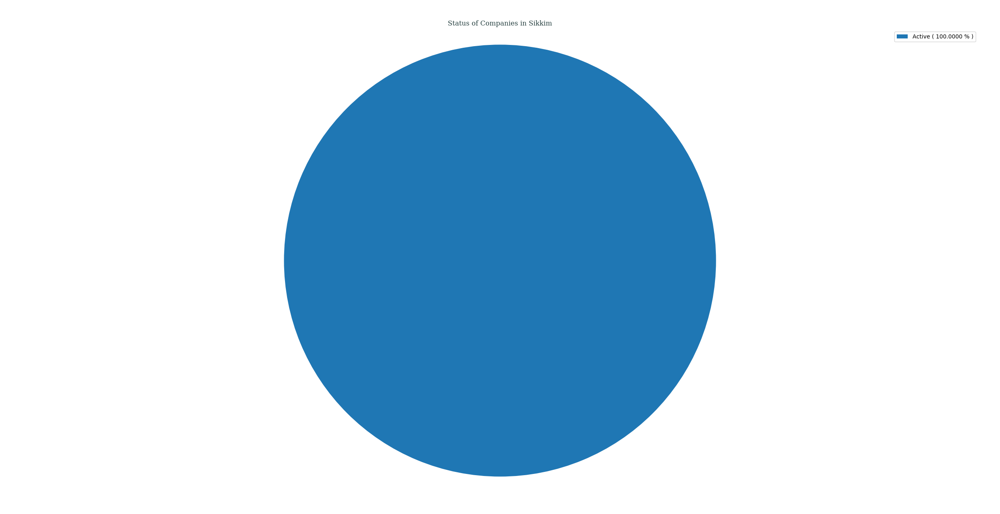

---
### Class of Companies in Sikkim
Following PIE chart shows various companies categorized by their CLASS _( as of 21-04-2018 )_, present in Sikkim, India.
- Private ( 100.0000% )

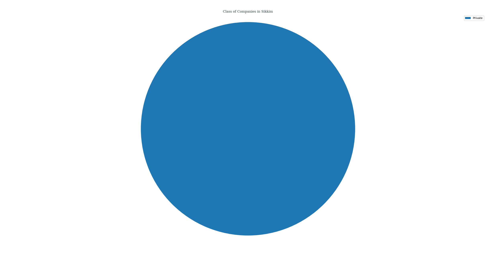

---
### Category of Companies in Sikkim
Following PIE chart shows various companies categorized by their CATEGORY _( as of 21-04-2018 )_, present in Sikkim, India.
- Company limited by Shares ( 100.0000% )

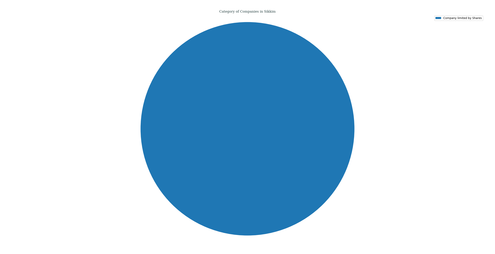

---
### Sub-Category of Companies in Sikkim
Following PIE chart shows various companies categorized by their SUB_CATEGORY _( as of 21-04-2018 )_, present in Sikkim, India.
- Non-govt company ( 100.0000% )

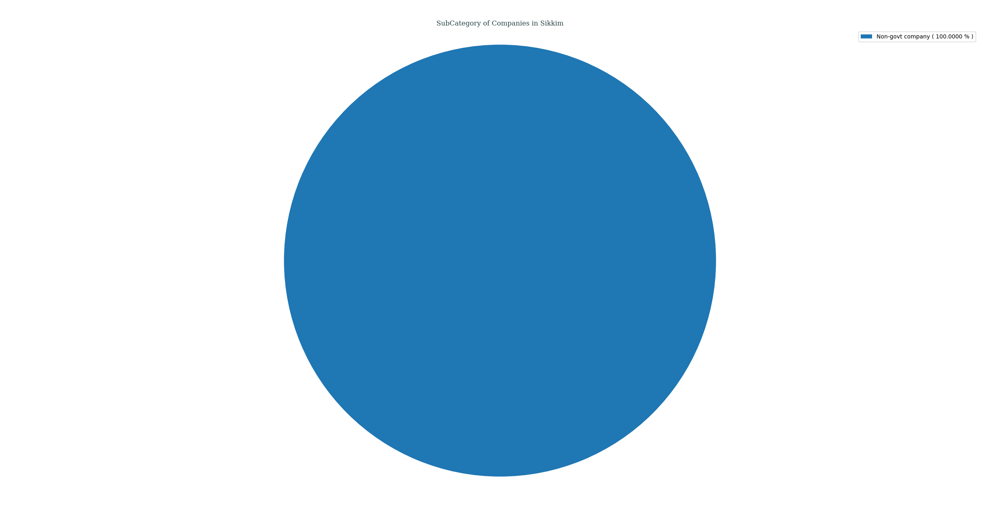

---
### Principal Business Activity of Companies in Sikkim
Following PIE chart shows various companies categorized by their PRINCIPAL_BUSINESS_ACTIVITY _( as of 21-04-2018 )_, present in Sikkim, India.
- Business Services ( 50.0000% )
- Transport, storage and Communications ( 50.0000% )

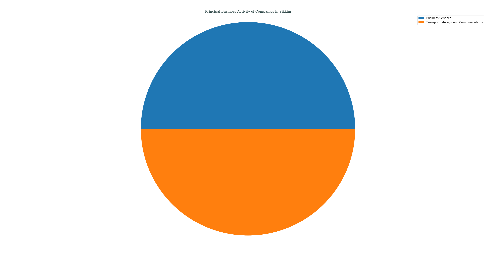

---
### Registration of Companies by Year in Sikkim
Companies registered in Sikkim gets categorized by Year of Registration, which is plotted as year of registration vs. #-of companies registered in that certain year _( while filtering out those companies which didn't had any date of registration data )_.

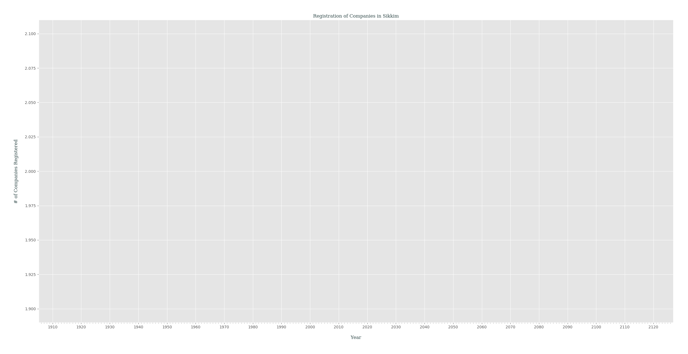

---

## Analysis of M.C.A. Data for _Tamilnadu_, India
### Status of Companies in Tamilnadu
Following PIE chart shows an overview of STATUS _( as of 21-04-2018 )_ of various companies registered in Tamilnadu, India.
- Active ( 56.6819% )
- Strike Off ( 38.1739% )
- Under Process of Striking off ( 2.1699% )
- Amalgamated ( 1.0222% )
- Dissolved ( 0.6013% )
- Not Available for eFiling ( 0.4627% )
- Liquidated ( 0.2853% )
- Under liquidation ( 0.2677% )
- Converted to LLP ( 0.1525% )
- Converted to LLP and dissolved ( 0.0902% )
- Dormant under section 455 ( 0.0770% )
- Active In Progress ( 0.0117% )
- Captured ( 0.0037% )

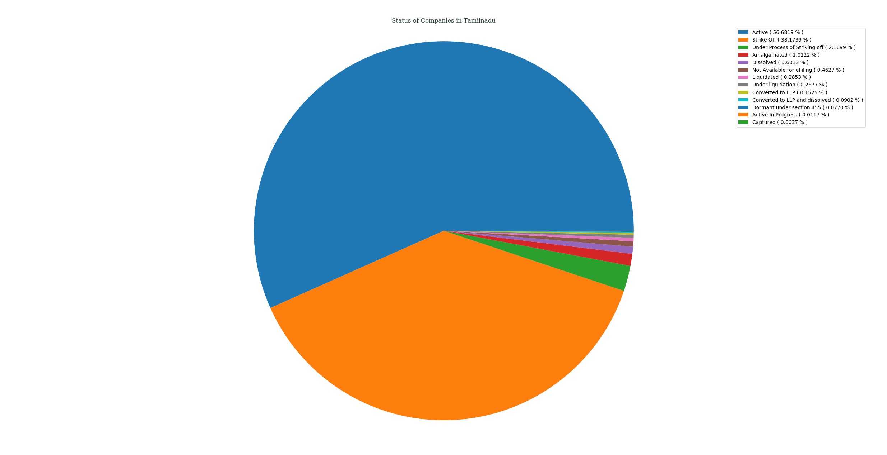

---
### Class of Companies in Tamilnadu
Following PIE chart shows various companies categorized by their CLASS _( as of 21-04-2018 )_, present in Tamilnadu, India.
- Private ( 90.7647% )
- Public ( 8.2534% )
- Private(One Person Company) ( 0.9636% )
- NA ( 0.0183% )

---
### Category of Companies in Tamilnadu
Following PIE chart shows various companies categorized by their CATEGORY _( as of 21-04-2018 )_, present in Tamilnadu, India.
- Company limited by Shares ( 99.5901% )
- Company Limited by Guarantee ( 0.3806% )
- NA ( 0.0183% )
- Unlimited Company ( 0.0110% )

---
### Sub-Category of Companies in Tamilnadu
Following PIE chart shows various companies categorized by their SUB_CATEGORY _( as of 21-04-2018 )_, present in Tamilnadu, India.
- Non-govt company ( 99.1684% )
- Subsidiary of Foreign Company ( 0.6240% )
- Guarantee and Association comp ( 0.0953% )
- State Govt company ( 0.0763% )
- NA ( 0.0183% )
- Union Govt company ( 0.0176% )

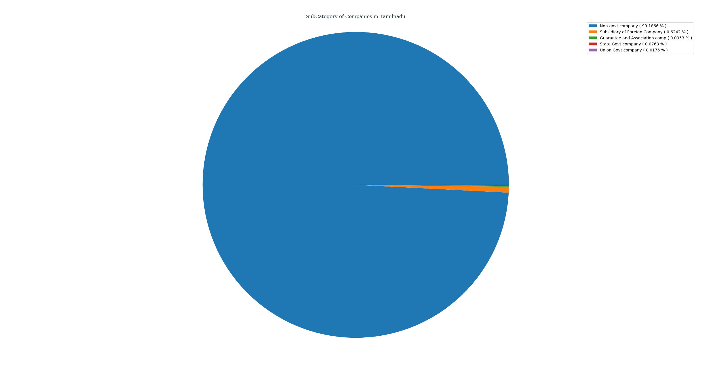

---
### Principal Business Activity of Companies in Tamilnadu
Following PIE chart shows various companies categorized by their PRINCIPAL_BUSINESS_ACTIVITY _( as of 21-04-2018 )_, present in Tamilnadu, India.
- Business Services ( 27.5563% )
- Trading ( 10.8097% )
- Finance ( 9.6174% )
- Manufacturing (Metals & Chemicals, and products thereof) ( 7.3566% )
- Manufacturing (Machinery & Equipments) ( 6.4641% )
- Construction ( 6.1576% )
- Community, personal & Social Services ( 5.8144% )
- Manufacturing (Textiles) ( 5.0899% )
- Agriculture and Allied Activities ( 4.4915% )
- Transport, storage and Communications ( 4.1322% )
- Real Estate and Renting ( 3.1994% )
- Manufacturing (Food stuffs) ( 2.4441% )
- Electricity, Gas & Water companies ( 1.6668% )
- Manufacturing (Paper & Paper products, Publishing, printing and reproduction of recorded media) ( 1.4806% )
- Mining & Quarrying ( 0.9606% )
- Manufacturing (Others) ( 0.9460% )
- Manufacturing (Leather & products thereof) ( 0.5940% )
- Others ( 0.5624% )
- OTHERS ( 0.3967% )
- Manufacturing (Wood Products) ( 0.1877% )
- Insurance ( 0.0719% )

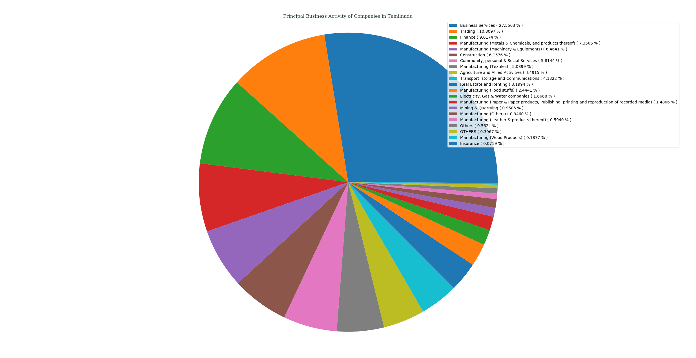

---
### Registration of Companies by Year in Tamilnadu
Companies registered in Tamilnadu gets categorized by Year of Registration, which is plotted as year of registration vs. #-of companies registered in that certain year _( while filtering out those companies which didn't had any date of registration data )_.

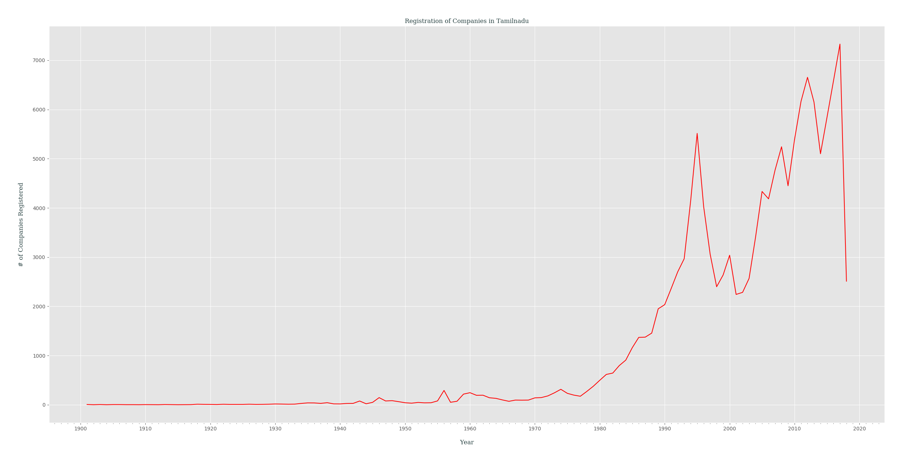

---

## Analysis of M.C.A. Data for _Telangana_, India
### Status of Companies in Telangana
Following PIE chart shows an overview of STATUS _( as of 21-04-2018 )_ of various companies registered in Telangana, India.
- Active ( 71.8490% )
- Strike Off ( 25.8808% )
- Under Process of Striking off ( 0.9579% )
- Amalgamated ( 0.5974% )
- Converted to LLP ( 0.2768% )
- Under liquidation ( 0.2400% )
- Converted to LLP and dissolved ( 0.0592% )
- Not Available for eFiling ( 0.0551% )
- Dormant under section 455 ( 0.0378% )
- Liquidated ( 0.0204% )
- Active In Progress ( 0.0123% )
- Dissolved ( 0.0092% )
- Captured ( 0.0020% )
- Dormant ( 0.0020% )

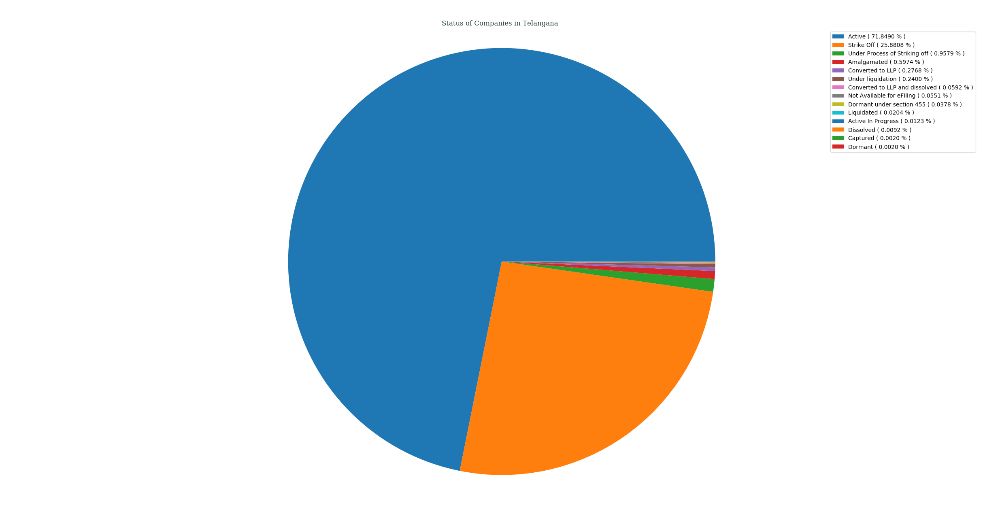

---
### Class of Companies in Telangana
Following PIE chart shows various companies categorized by their CLASS _( as of 21-04-2018 )_, present in Telangana, India.
- Private ( 92.0049% )
- Public ( 6.9739% )
- Private(One Person Company) ( 1.0161% )
- NA ( 0.0051% )

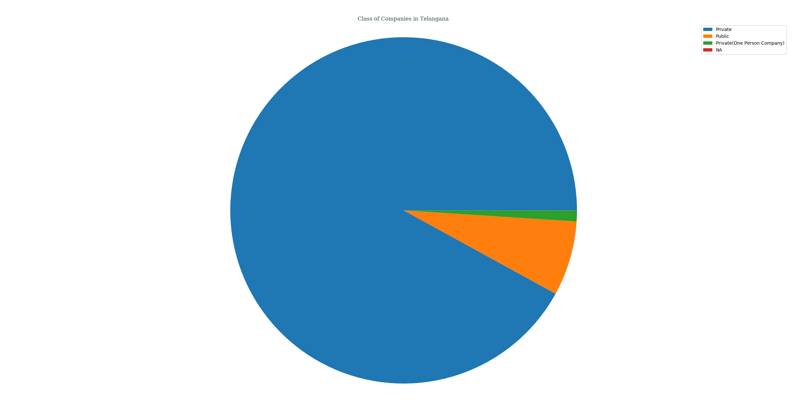

---
### Category of Companies in Telangana
Following PIE chart shows various companies categorized by their CATEGORY _( as of 21-04-2018 )_, present in Telangana, India.
- Company limited by Shares ( 98.9532% )
- Company Limited by Guarantee ( 0.9988% )
- Unlimited Company ( 0.0429% )
- NA ( 0.0051% )

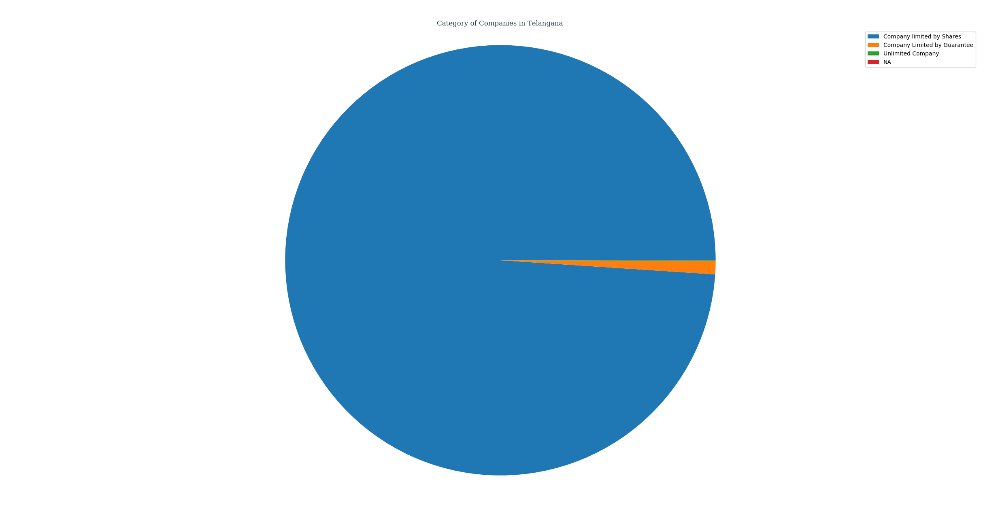

---
### Sub-Category of Companies in Telangana
Following PIE chart shows various companies categorized by their SUB_CATEGORY _( as of 21-04-2018 )_, present in Telangana, India.
- Non-govt company ( 99.2514% )
- Subsidiary of Foreign Company ( 0.5852% )
- State Govt company ( 0.1164% )
- Guarantee and Association comp ( 0.0337% )
- NA ( 0.0071% )
- Union Govt company ( 0.0061% )

---
### Principal Business Activity of Companies in Telangana
Following PIE chart shows various companies categorized by their PRINCIPAL_BUSINESS_ACTIVITY _( as of 21-04-2018 )_, present in Telangana, India.
- Business Services ( 35.7254% )
- Construction ( 9.2900% )
- Manufacturing (Metals & Chemicals, and products thereof) ( 9.2615% )
- Finance ( 6.5940% )
- Trading ( 6.3571% )
- Community, personal & Social Services ( 6.2866% )
- Agriculture and Allied Activities ( 4.9713% )
- Manufacturing (Machinery & Equipments) ( 4.2605% )
- Real Estate and Renting ( 3.4150% )
- Electricity, Gas & Water companies ( 3.0371% )
- Manufacturing (Food stuffs) ( 2.5326% )
- Transport, storage and Communications ( 2.2579% )
- Mining & Quarrying ( 1.7524% )
- Manufacturing (Paper & Paper products, Publishing, printing and reproduction of recorded media) ( 1.4838% )
- Manufacturing (Textiles) ( 1.4083% )
- Others ( 0.5208% )
- Manufacturing (Others) ( 0.4544% )
- Manufacturing (Wood Products) ( 0.1848% )
- Manufacturing (Leather & products thereof) ( 0.1031% )
- Insurance ( 0.0909% )
- OTHERS ( 0.0123% )

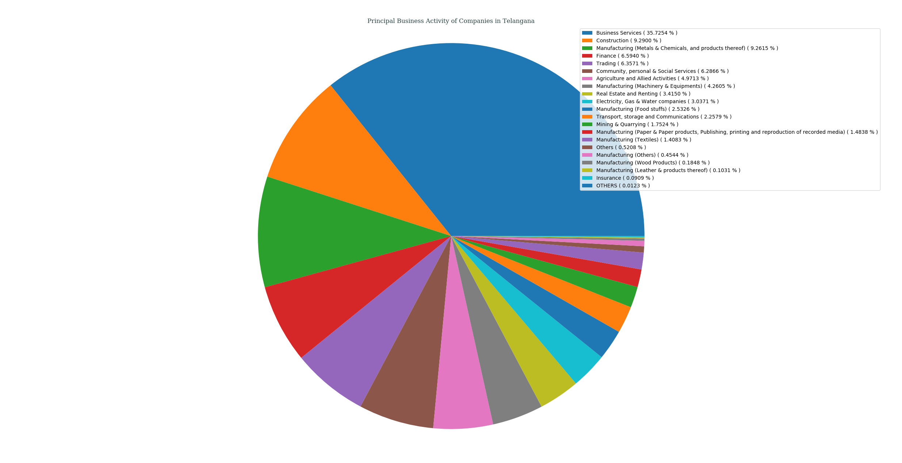

---
### Registration of Companies by Year in Telangana
Companies registered in Telangana gets categorized by Year of Registration, which is plotted as year of registration vs. #-of companies registered in that certain year _( while filtering out those companies which didn't had any date of registration data )_.

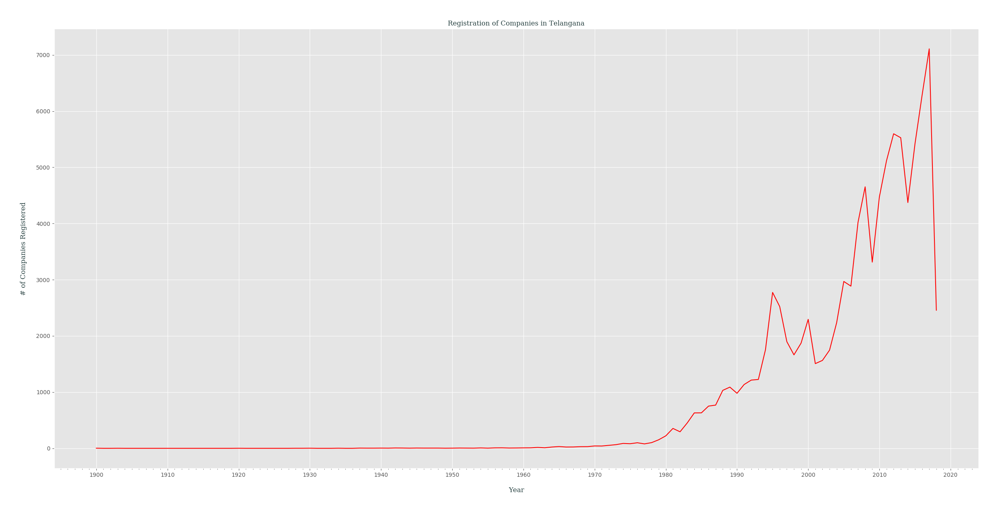

---

## Analysis of M.C.A. Data for _Tripura_, India
### Status of Companies in Tripura
Following PIE chart shows an overview of STATUS _( as of 21-04-2018 )_ of various companies registered in Tripura, India.
- Active ( 69.8238% )
- Strike Off ( 22.0264% )
- Under Process of Striking off ( 7.7093% )
- Amalgamated ( 0.2203% )
- Not Available for eFiling ( 0.2203% )

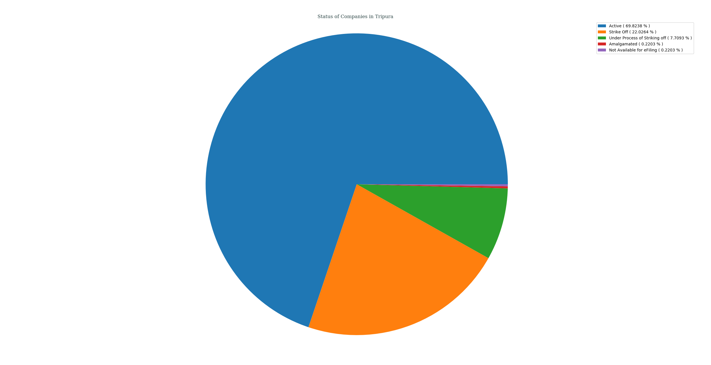

---
### Class of Companies in Tripura
Following PIE chart shows various companies categorized by their CLASS _( as of 21-04-2018 )_, present in Tripura, India.
- Private ( 85.9031% )
- Public ( 11.4537% )
- Private(One Person Company) ( 2.6432% )

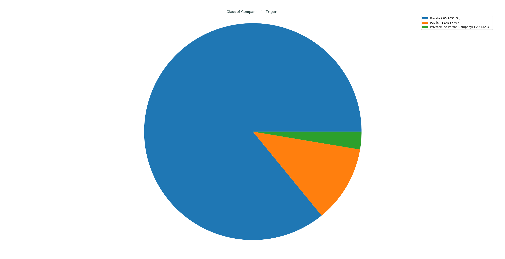

---
### Category of Companies in Tripura
Following PIE chart shows various companies categorized by their CATEGORY _( as of 21-04-2018 )_, present in Tripura, India.
- Company limited by Shares ( 96.4758% )
- Company Limited by Guarantee ( 3.5242% )

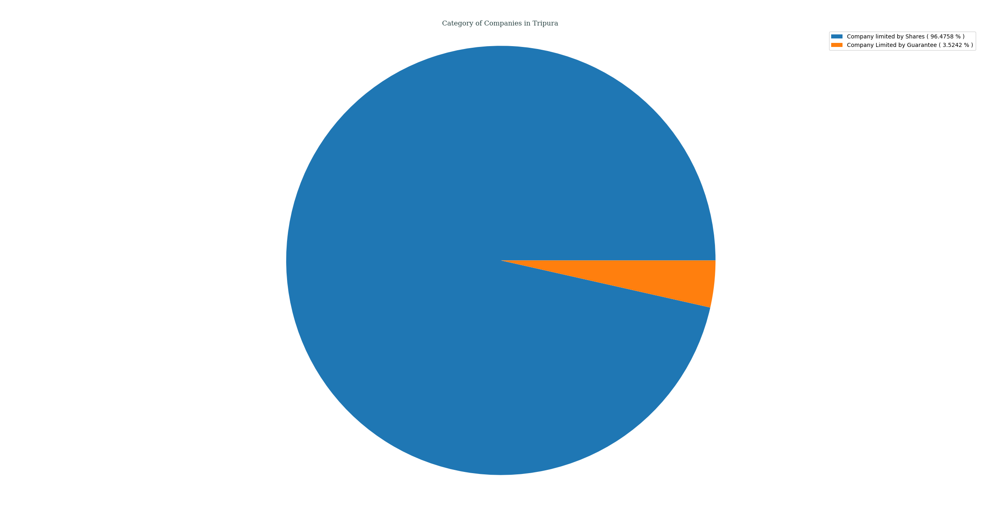

---
### Sub-Category of Companies in Tripura
Following PIE chart shows various companies categorized by their SUB_CATEGORY _( as of 21-04-2018 )_, present in Tripura, India.
- Non-govt company ( 96.4758% )
- State Govt company ( 3.3040% )
- Guarantee and Association comp ( 0.2203% )

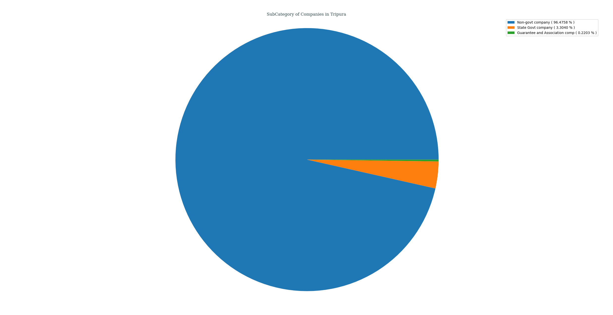

---
### Principal Business Activity of Companies in Tripura
Following PIE chart shows various companies categorized by their PRINCIPAL_BUSINESS_ACTIVITY _( as of 21-04-2018 )_, present in Tripura, India.
- Business Services ( 20.4846% )
- Trading ( 20.2643% )
- Manufacturing (Metals & Chemicals, and products thereof) ( 9.9119% )
- Agriculture and Allied Activities ( 8.8106% )
- Construction ( 8.5903% )
- Transport, storage and Communications ( 5.7269% )
- Community, personal & Social Services ( 4.8458% )
- Finance ( 4.8458% )
- Manufacturing (Food stuffs) ( 4.6256% )
- Real Estate and Renting ( 3.0837% )
- Electricity, Gas & Water companies ( 1.7621% )
- Manufacturing (Machinery & Equipments) ( 1.5419% )
- Manufacturing (Wood Products) ( 1.5419% )
- Manufacturing (Paper & Paper products, Publishing, printing and reproduction of recorded media) ( 1.3216% )
- Manufacturing (Textiles) ( 1.1013% )
- Manufacturing (Others) ( 0.6608% )
- Insurance ( 0.4405% )
- Mining & Quarrying ( 0.4405% )

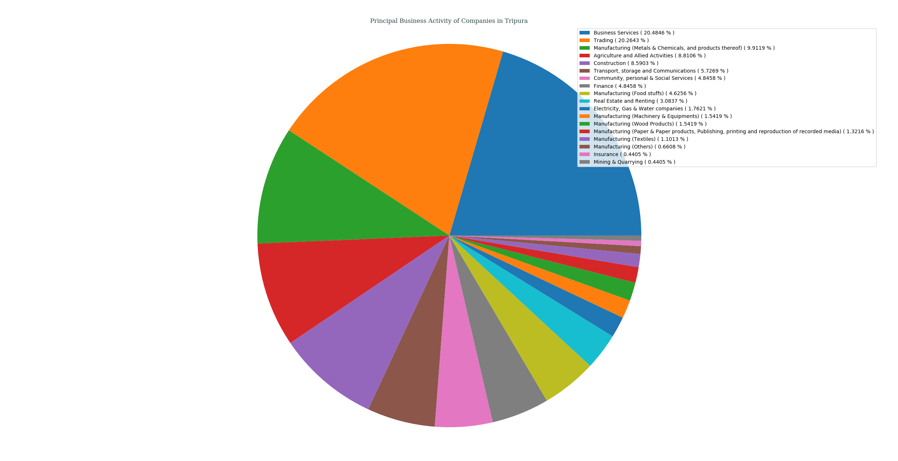

---
### Registration of Companies by Year in Tripura
Companies registered in Tripura gets categorized by Year of Registration, which is plotted as year of registration vs. #-of companies registered in that certain year _( while filtering out those companies which didn't had any date of registration data )_.

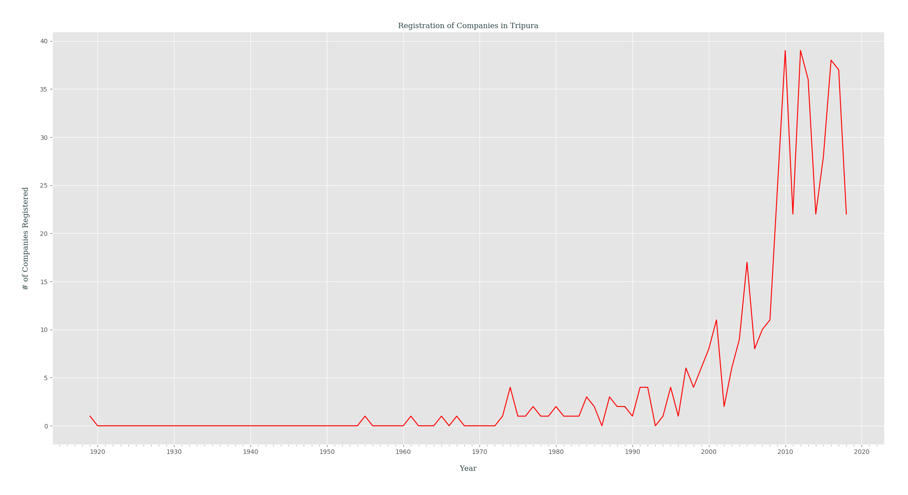

---

## Analysis of M.C.A. Data for _Uttarakhand_, India
### Status of Companies in Uttarakhand
Following PIE chart shows an overview of STATUS _( as of 21-04-2018 )_ of various companies registered in Uttarakhand, India.
- Active ( 70.6806% )
- Strike Off ( 23.5166% )
- Under Process of Striking off ( 5.0320% )
- Under liquidation ( 0.2182% )
- Not Available for eFiling ( 0.1745% )
- Converted to LLP ( 0.1600% )
- Amalgamated ( 0.0873% )
- Dormant under section 455 ( 0.0436% )
- Liquidated ( 0.0436% )
- Converted to LLP and dissolved ( 0.0436% )

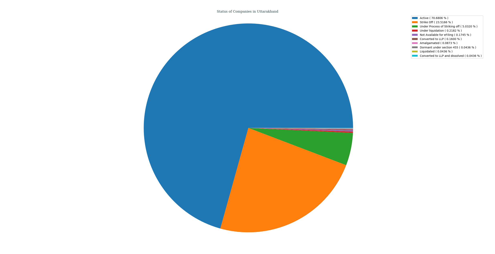

---
### Class of Companies in Uttarakhand
Following PIE chart shows various companies categorized by their CLASS _( as of 21-04-2018 )_, present in Uttarakhand, India.
- Private ( 90.4159% )
- Public ( 7.6062% )
- Private(One Person Company) ( 1.9197% )
- NA ( 0.0582% )

---
### Category of Companies in Uttarakhand
Following PIE chart shows various companies categorized by their CATEGORY _( as of 21-04-2018 )_, present in Uttarakhand, India.
- Company limited by Shares ( 99.5492% )
- Company Limited by Guarantee ( 0.3200% )
- Unlimited Company ( 0.0727% )
- NA ( 0.0582% )

---
### Sub-Category of Companies in Uttarakhand
Following PIE chart shows various companies categorized by their SUB_CATEGORY _( as of 21-04-2018 )_, present in Uttarakhand, India.
- Non-govt company ( 99.3892% )
- State Govt company ( 0.3636% )
- Subsidiary of Foreign Company ( 0.1163% )
- NA ( 0.0582% )
- Union Govt company ( 0.0582% )
- Guarantee and Association comp ( 0.0145% )

---
### Principal Business Activity of Companies in Uttarakhand
Following PIE chart shows various companies categorized by their PRINCIPAL_BUSINESS_ACTIVITY _( as of 21-04-2018 )_, present in Uttarakhand, India.
- Business Services ( 30.6283% )
- Trading ( 11.2129% )
- Construction ( 9.5550% )
- Community, personal & Social Services ( 8.1152% )
- Manufacturing (Metals & Chemicals, and products thereof) ( 7.7952% )
- Finance ( 5.2792% )
- Real Estate and Renting ( 5.2356% )
- Manufacturing (Food stuffs) ( 4.7120% )
- Agriculture and Allied Activities ( 4.2467% )
- Manufacturing (Machinery & Equipments) ( 4.0867% )
- Transport, storage and Communications ( 2.2688% )
- Manufacturing (Paper & Paper products, Publishing, printing and reproduction of recorded media) ( 1.7016% )
- Manufacturing (Textiles) ( 1.3816% )
- Electricity, Gas & Water companies ( 1.0908% )
- Manufacturing (Others) ( 1.0908% )
- Mining & Quarrying ( 0.9017% )
- Manufacturing (Wood Products) ( 0.4072% )
- Others ( 0.1018% )
- Manufacturing (Leather & products thereof) ( 0.0873% )
- Insurance ( 0.0582% )
- OTHERS ( 0.0436% )

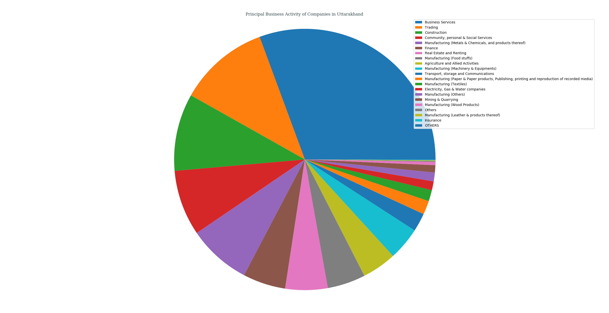

---
### Registration of Companies by Year in Uttarakhand
Companies registered in Uttarakhand gets categorized by Year of Registration, which is plotted as year of registration vs. #-of companies registered in that certain year _( while filtering out those companies which didn't had any date of registration data )_.

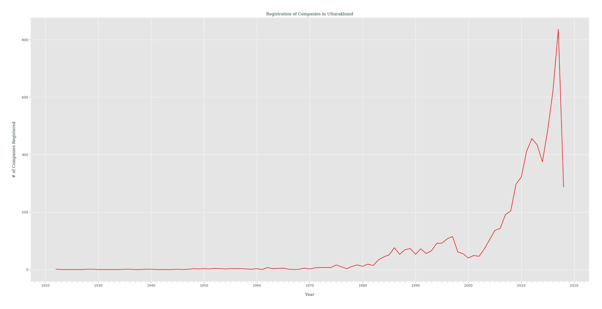

---

## Analysis of M.C.A. Data for _Uttar Pradesh_
### Status of Companies in Uttar Pradesh
Following PIE chart shows an overview of STATUS _( as of 21-04-2018 )_ of various companies registered in Uttar Pradesh, India.
- Active ( 75.9273% )
- Strike Off ( 21.6220% )
- Under Process of Striking off ( 1.2637% )
- Amalgamated ( 0.3314% )
- Under liquidation ( 0.2302% )
- Not Available for eFiling ( 0.2163% )
- Converted to LLP ( 0.1993% )
- Converted to LLP and dissolved ( 0.1151% )
- Dormant under section 455 ( 0.0586% )
- Liquidated ( 0.0192% )
- Dissolved ( 0.0085% )
- Active In Progress ( 0.0053% )
- Captured ( 0.0032% )

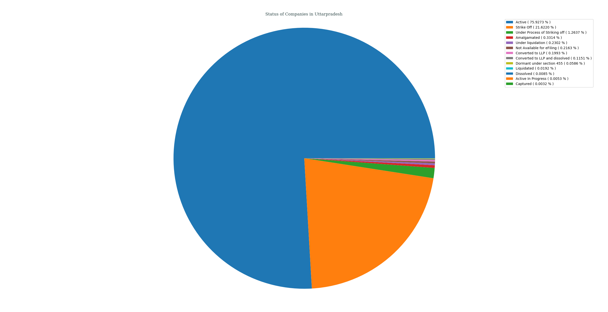

---
### Class of Companies in Uttar Pradesh
Following PIE chart shows various companies categorized by their CLASS _( as of 21-04-2018 )_, present in Uttar Pradesh, India.
- Private ( 89.2029% )
- Public ( 8.9186% )
- Private(One Person Company) ( 1.8583% )
- NA ( 0.0202% )

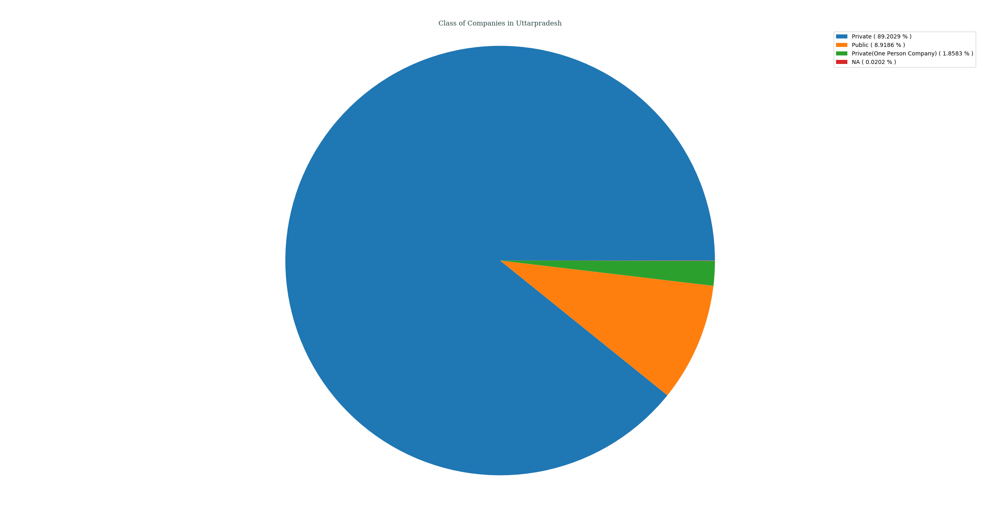

---
### Category of Companies in Uttar Pradesh
Following PIE chart shows various companies categorized by their CATEGORY _( as of 21-04-2018 )_, present in Uttar Pradesh, India.
- Company limited by Shares ( 99.7464% )
- Company Limited by Guarantee ( 0.1961% )
- Unlimited Company ( 0.0373% )
- NA ( 0.0202% )

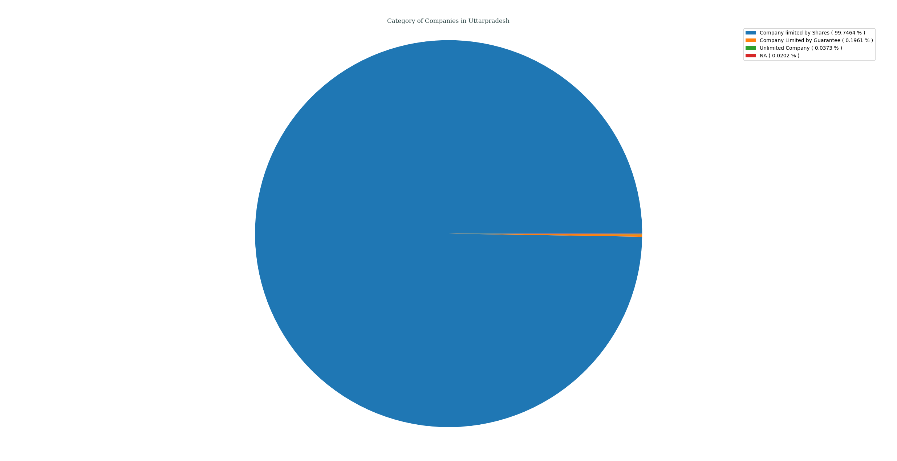

---
### Sub-Category of Companies in Uttar Pradesh
Following PIE chart shows various companies categorized by their SUB_CATEGORY _( as of 21-04-2018 )_, present in Uttar Pradesh, India.
- Non-govt company ( 99.6228% )
- Subsidiary of Foreign Company ( 0.1737% )
- State Govt company ( 0.1417% )
- Union Govt company ( 0.0234% )
- NA ( 0.0202% )
- Guarantee and Association comp ( 0.0181% )

---
### Principal Business Activity of Companies in Uttar Pradesh
Following PIE chart shows various companies categorized by their PRINCIPAL_BUSINESS_ACTIVITY _( as of 21-04-2018 )_, present in Uttar Pradesh, India.
- Business Services ( 29.4345% )
- Real Estate and Renting ( 10.2782% )
- Construction ( 10.1930% )
- Trading ( 8.4146% )
- Manufacturing (Metals & Chemicals, and products thereof) ( 7.6442% )
- Community, personal & Social Services ( 6.9910% )
- Finance ( 6.5989% )
- Manufacturing (Food stuffs) ( 4.5957% )
- Agriculture and Allied Activities ( 3.2051% )
- Manufacturing (Machinery & Equipments) ( 3.1892% )
- Manufacturing (Textiles) ( 2.0533% )
- Transport, storage and Communications ( 1.8114% )
- Manufacturing (Paper & Paper products, Publishing, printing and reproduction of recorded media) ( 1.7315% )
- Others ( 0.8194% )
- Manufacturing (Leather & products thereof) ( 0.7672% )
- Manufacturing (Others) ( 0.7128% )
- Electricity, Gas & Water companies ( 0.5679% )
- Mining & Quarrying ( 0.5061% )
- Manufacturing (Wood Products) ( 0.2952% )
- Insurance ( 0.1428% )
- OTHERS ( 0.0479% )

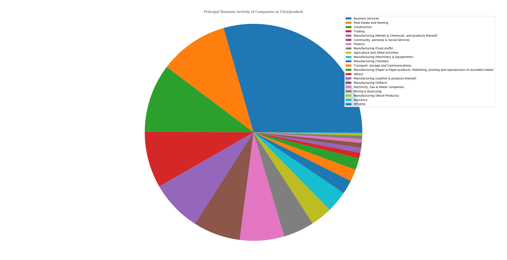

---
### Registration of Companies by Year in Uttar Pradesh
Companies registered in Uttar Pradesh gets categorized by Year of Registration, which is plotted as year of registration vs. #-of companies registered in that certain year _( while filtering out those companies which didn't had any date of registration data )_.

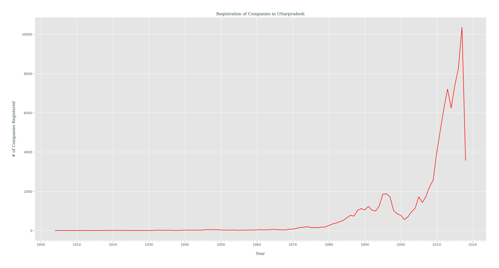

---

## Analysis of M.C.A. Data for _West Bengal_
### Status of Companies in West Bengal
Following PIE chart shows an overview of STATUS _( as of 21-04-2018 )_ of various companies in West Bengal, India.
- Active ( 68.2958% )
- Strike Off ( 24.2760% )
- Amalgamated ( 2.6358% )
- Under Process of Striking off ( 2.2453% )
- Converted to LLP ( 1.0173% )
- Converted to LLP and dissolved ( 0.4340% )
- Under liquidation ( 0.3424% )
- Not Available for eFiling ( 0.3374% )
- Dissolved ( 0.3174% )
- Dormant under section 455 ( 0.0846% )
- Liquidated ( 0.0125% )
- Active In Progress ( 0.0010% )
- Captured ( 0.0005% )

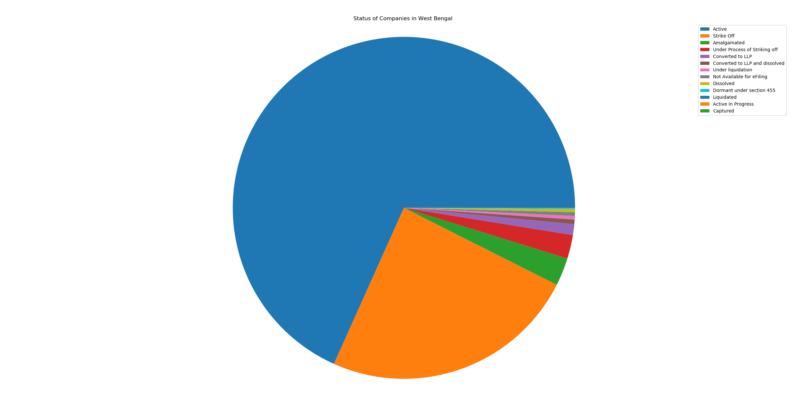

---
### Class of Companies in West Bengal
Following PIE chart shows various companies categorized by their CLASS _( as of 21-04-2018 )_, present in West Bengal, India.
- Private ( 90.1093% )
- Public ( 9.5868% )
- Private(One Person Company) ( 0.2949% )
- NA ( 0.0085% )
- PRIVATE ( 0.0005% )

---
### Category of Companies in West Bengal
Following PIE chart shows various companies categorized by their CATEGORY _( as of 21-04-2018 )_, present in West Bengal, India.
- Company limited by Shares ( 99.6511% )
- Company Limited by Guarantee ( 0.3239% 
- Unlimited Company ( 0.0155% )
- NA ( 0.0090% )
- COMPANY LIMITED BY SHARES ( 0.0005% )

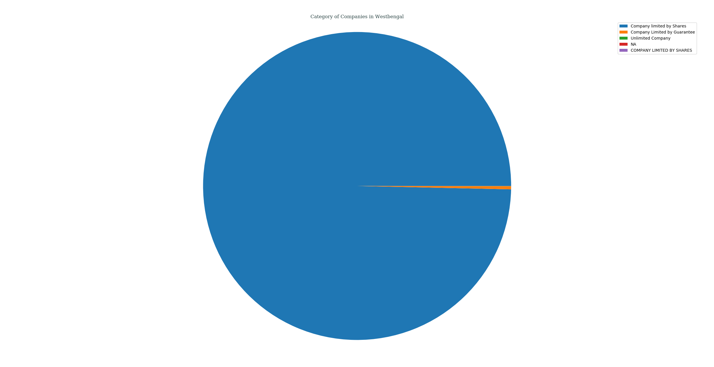

---
### Sub-Category of Companies in West Bengal
Following PIE chart shows various companies categorized by their SUB_CATEGORY _( as of 21-04-2018 )_, present in West Bengal, India.
- Non-govt company ( 99.7502% )
- Guarantee and Association comp ( 0.1126% )
- Subsidiary of Foreign Company ( 0.0616% )
- State Govt company ( 0.0436% )
- Union Govt company ( 0.0225% )
- NA ( 0.0090% )
- NON-GOVT COMPANY ( 0.0005% )

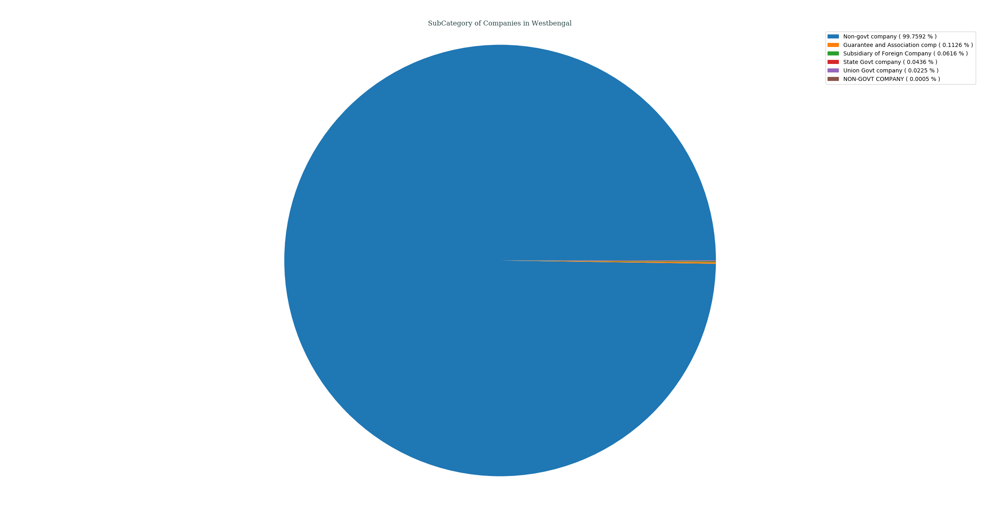

---
### Principal Business Activity of Companies in West Bengal
Following PIE chart shows various companies categorized by their PRINCIPAL_BUSINESS_ACTIVITY _( as of 21-04-2018 )_, present in West Bengal, India.
- Trading ( 33.91% )
- Business Services ( 16.26% )
- Real Estate and Renting ( 10.65% )
- Construction ( 7.75% )
- Manufacturing (Metals & Chemicals and products thereof) ( 6.75% )
- Finance ( 5.52% )
- Manufacturing (Machinery & Equipments) ( 3.12% )
- Community personal & Social Services ( 2.93% )
- Agriculture and Allied Activities ( 2.46% )
- Transport storage and Communications ( 2.35% )
- Manufacturing (Food stuffs) ( 2.33% )
- Manufacturing (Textiles) ( 2.17% )
- Manufacturing (Paper & Paper products Publishing printing and reproduction of recorded media) ( 1.12% )
- Mining & Quarrying ( 0.70% )
- Manufacturing (Others) ( 0.62% )
- Manufacturing (Leather & products thereof) ( 0.41% )
- Electricity Gas & Water companies ( 0.37% )
- Manufacturing (Wood Products) ( 0.28% )
- Insurance ( 0.07% )
- OTHERS ( 0.06% )
- Others ( 0.05% )

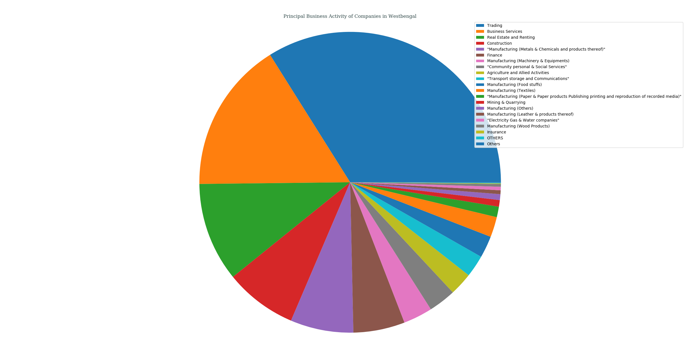

---
### Registration of Companies by Year in West Bengal
Companies registered in West Bengal gets categorized by Year of Registration, which is plotted as year of registration vs. #-of companies registered in that certain year _( while filtering out those companies which didn't had any date of registration data )_.

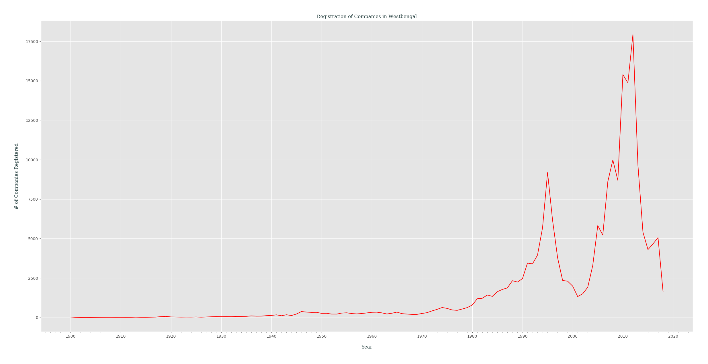

---

## Status of Companies all over India
Below is a list of company statuses, which show percentage of its presence in different state(s) in form of BAR chart _( as of 21-04-2018 )_
### Active
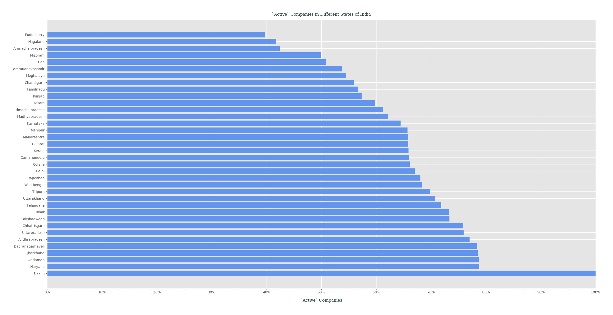
### Strike Off
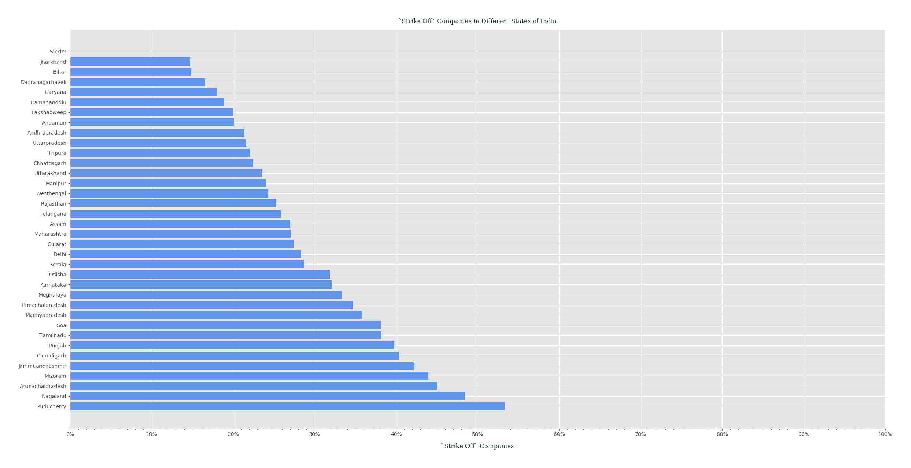
### Under Process of Striking Off
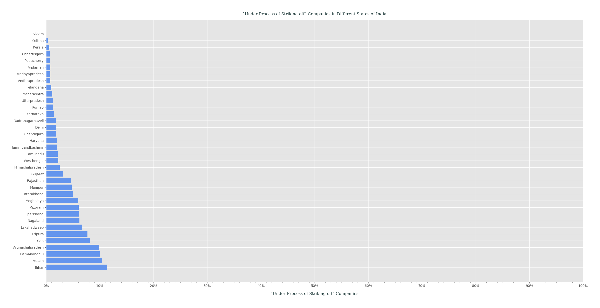
### Not Available for e-Filing
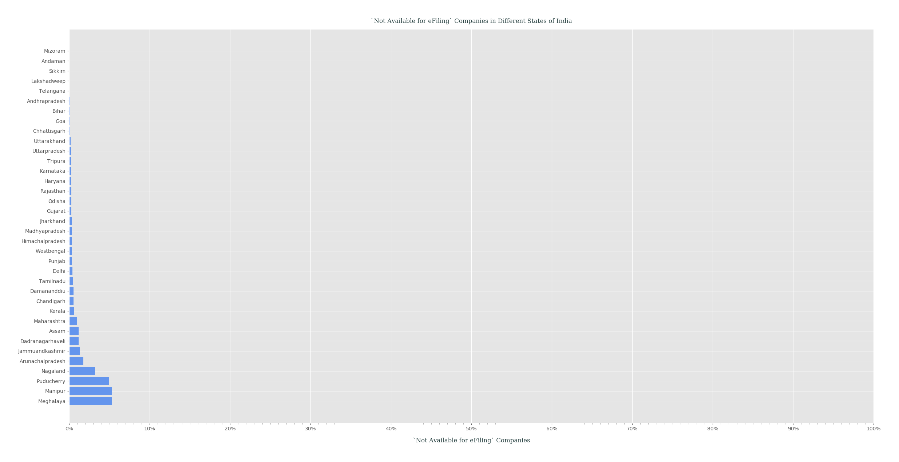
### Amalgamated
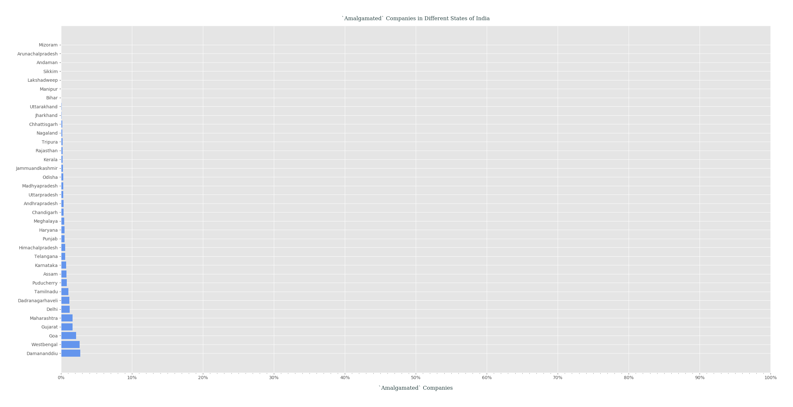
### Under Liquidation
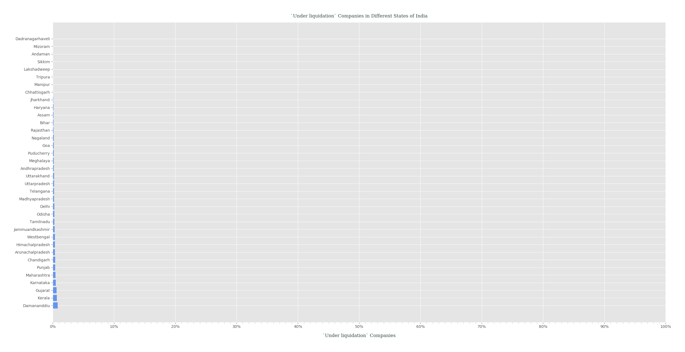

## Email Service(s) used by Companies in India
Following PIE chart tries to pictorially depict, which email service provider(s) are in use at which percentage by **1407239**
companies _( for which we had Ministry of Corporate Affairs, Govt. of India open data regarding all companies registered in various states of India )_ spread across several parts of India.

For keeping things simple, I extracted top 10 email service provider(s) being used by Companies & generated a PIE chart for them, showing their percentage of usage.

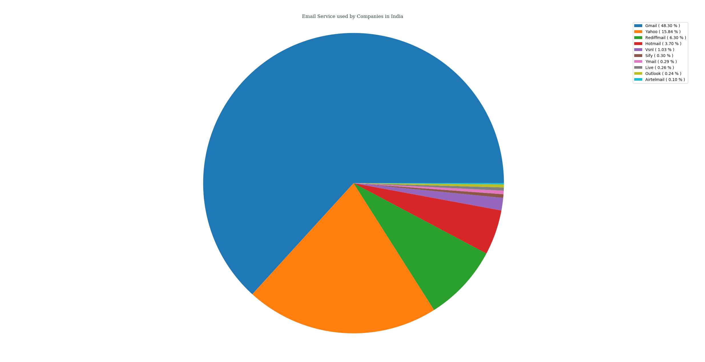

## Companies Registered under various RoC(s)
Here I tried to extract how many companies are registered under which RoC _( Registrar of Companies )_ 
and plotted that into BAR chart

Currently our dataset is having **27 RoCs** across India. Percentage of companies registered across these RoCs is as follows

- RoC-Delhi ( 20.4109% )
- RoC-Mumbai ( 16.3580% )
- RoC-Kolkata ( 11.2028% )
- RoC-Hyderabad ( 7.1035% )
- RoC-Chennai ( 6.2814% )
- RoC-Bangalore ( 5.9830% )
- RoC-Ahmedabad ( 5.4137% )
- RoC-Kanpur ( 5.2838% )
- RoC-Pune ( 3.5978% )
- RoC-Jaipur ( 3.0764% )
- ROC-Ernakulam ( 2.6974% )
- RoC-Chandigarh ( 2.4802% )
- RoC-Gwalior ( 2.0502% )
- RoC-Patna ( 1.6143% )
- RoC-Coimbatore ( 1.4225% )
- RoC-Cuttack ( 1.3115% )
- RoC-Shillong ( 0.8016% )
- RoC-Jharkhand ( 0.7005% )
- RoC-Chhattisgarh ( 0.5282% )
- RoC-Goa ( 0.4871% )
- RoC-Uttarakhand ( 0.3875% )
- RoC-Himachal Pradesh ( 0.3281% )
- RoC-Jammu ( 0.2914% )
- RoC-Pondicherry ( 0.1822% )
- RCAND ( 0.0058% )
- RCDMM ( 0.0004% )
- RCSRI ( 0.0001% )

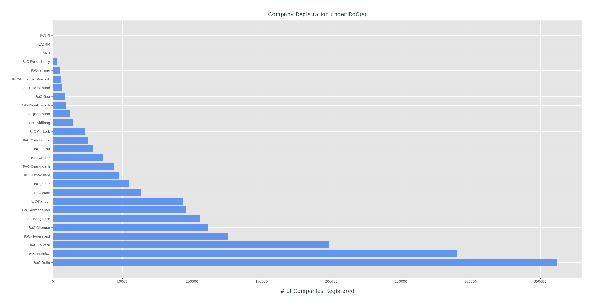

## Registration of Companies around Years ( all over India )
Following diagram shows, rate of companies being registered over the years _( starting from 1900 )_ across different states of India
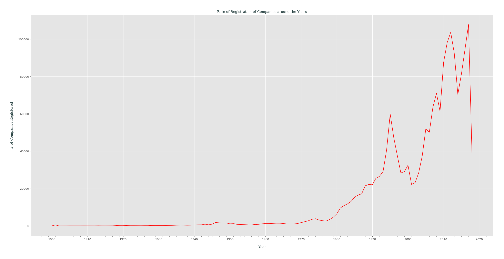

**More to come ...** :wink:
