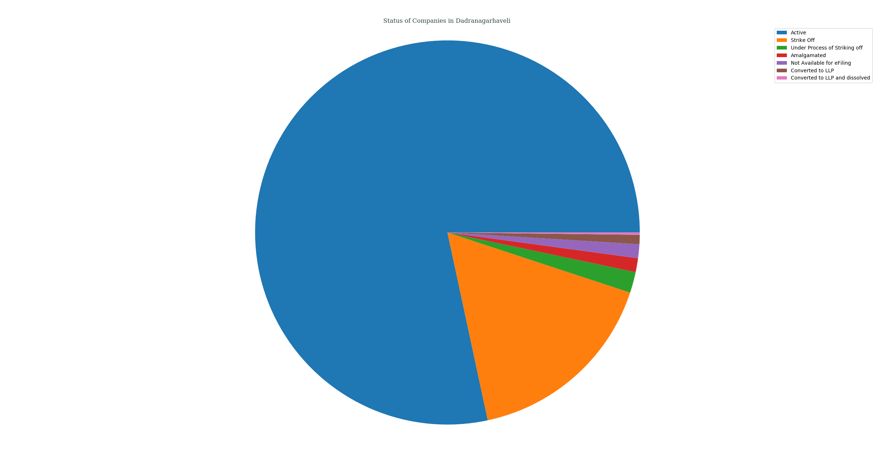
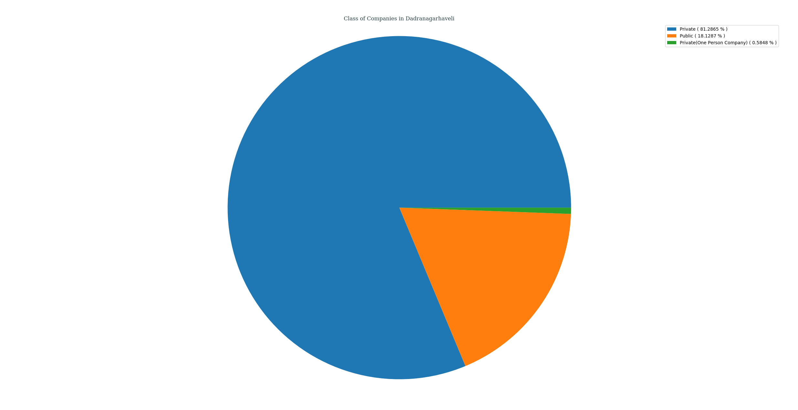
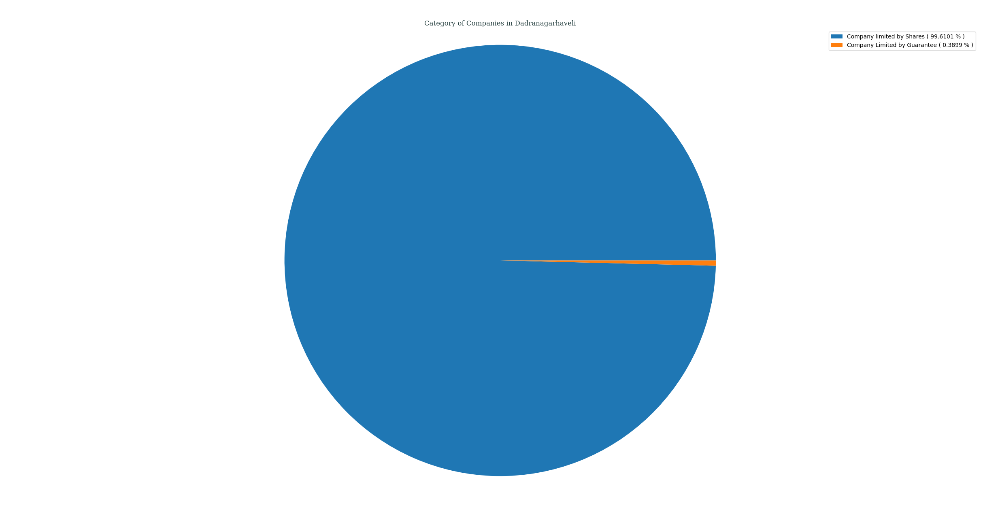
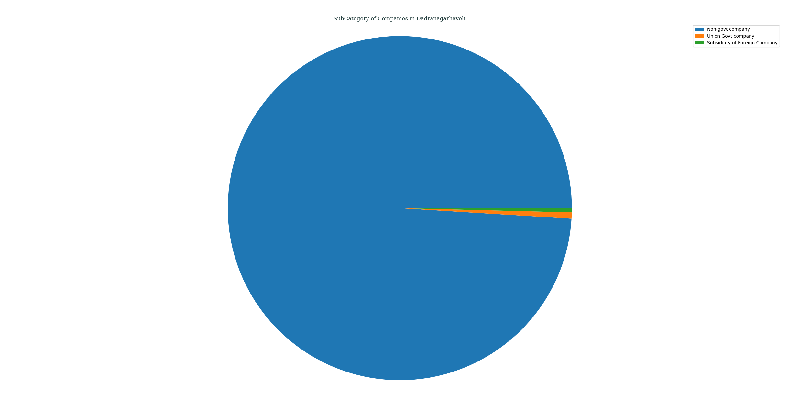
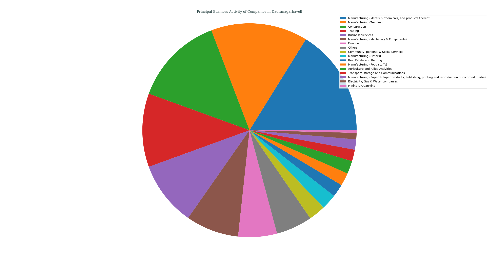
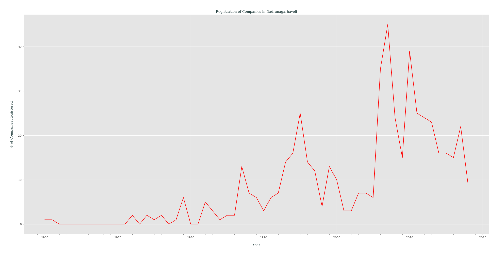

## Analysis of M.C.A. Data for _Dadra Nagar Haveli_, India
### Status of Companies in Dadra Nagar Haveli
Following PIE chart shows an overview of STATUS _( as of 21-04-2018 )_ of various companies registered in Dadra Nagar Haveli, India.
- Active ( 78.3626% )
- Strike Off ( 16.5692% )
- Under Process of Striking off ( 1.7544% )
- Amalgamated ( 1.1696% )
- Not Available for eFiling ( 1.1696% )
- Converted to LLP ( 0.7797% )
- Converted to LLP and dissolved ( 0.1949% )

---
### Class of Companies in Dadra Nagar Haveli
Following PIE chart shows various companies categorized by their CLASS _( as of 21-04-2018 )_, present in Dadra Nagar Haveli, India.
- Private ( 81.2865% )
- Public ( 18.1287% )
- Private(One Person Company) ( 0.5848% )

---
### Category of Companies in Dadra Nagar Haveli
Following PIE chart shows various companies categorized by their CATEGORY _( as of 21-04-2018 )_, present in Dadra Nagar Haveli, India.
- Company limited by Shares ( 99.6101% )
- Company Limited by Guarantee ( 0.3899% )

---
### Sub-Category of Companies in Dadra Nagar Haveli
Following PIE chart shows various companies categorized by their SUB_CATEGORY _( as of 21-04-2018 )_, present in Dadra Nagar Haveli, India.
- Non-govt company ( 99.0253% )
- Union Govt company ( 0.5848% )
- Subsidiary of Foreign Company ( 0.3899% )

---
### Principal Business Activity of Companies in Dadra Nagar Haveli
Following PIE chart shows various companies categorized by their PRINCIPAL_BUSINESS_ACTIVITY _( as of 21-04-2018 )_, present in Dadra Nagar Haveli, India.
- Manufacturing (Metals & Chemicals, and products thereof) ( 16.1793% )
- Manufacturing (Textiles) ( 14.6199% )
- Construction ( 13.6452% )
- Trading ( 11.1111% )
- Business Services ( 9.7466% )
- Manufacturing (Machinery & Equipments) ( 7.9922% )
- Finance ( 5.8480% )
- Others ( 5.4581% )
- Community, personal & Social Services ( 2.5341% )
- Manufacturing (Others) ( 2.3392% )
- Real Estate and Renting ( 1.9493% )
- Manufacturing (Food stuffs) ( 1.9493% )
- Agriculture and Allied Activities ( 1.9493% )
- Transport, storage and Communications ( 1.7544% )
- Manufacturing (Paper & Paper products, Publishing, printing and reproduction of recorded media) ( 1.5595% )
- Electricity, Gas & Water companies ( 0.9747% )
- Mining & Quarrying ( 0.3899% )

---
### Registration of Companies by Year in Dadra Nagar Haveli
Companies registered in Dadra Nagar Haveli gets categorized by Year of Registration, which is plotted as year of registration vs. #-of companies registered in that certain year _( while filtering out those companies which didn't had any date of registration data )_.

