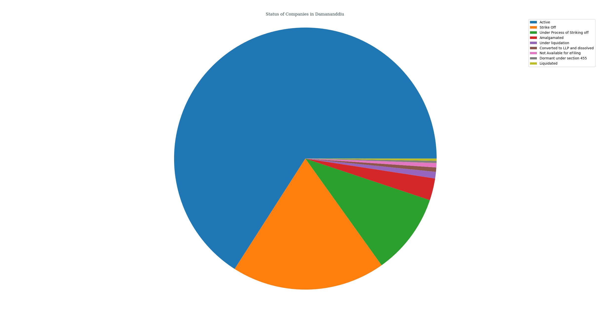
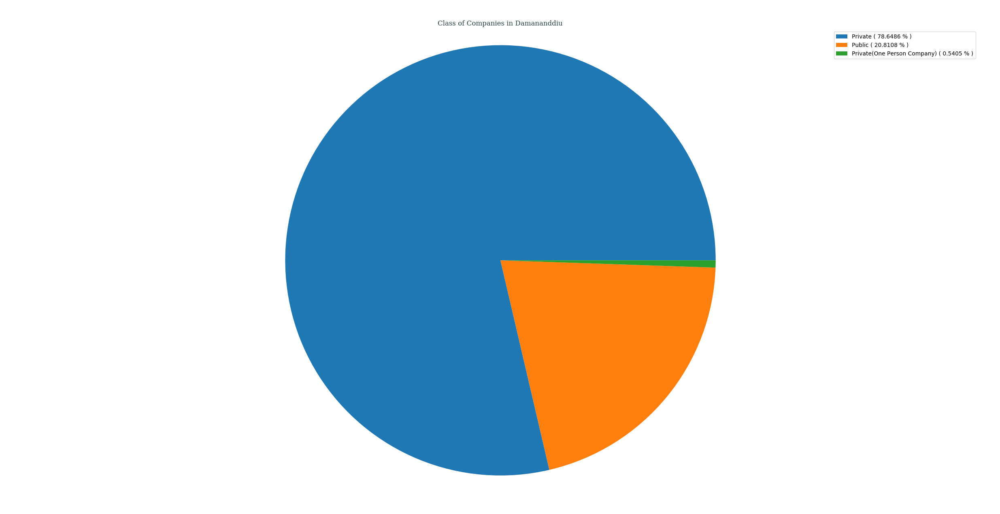
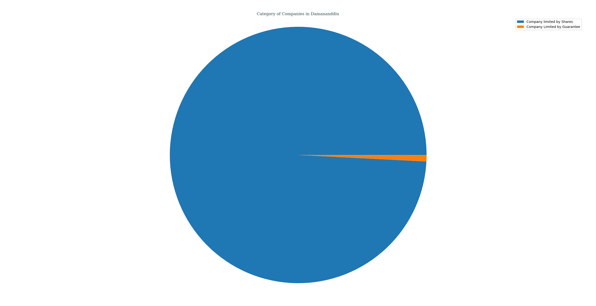
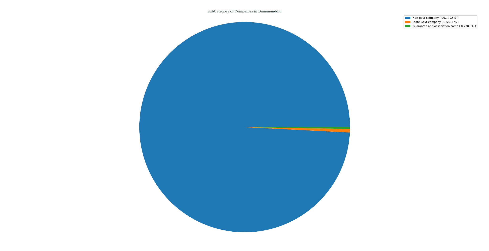
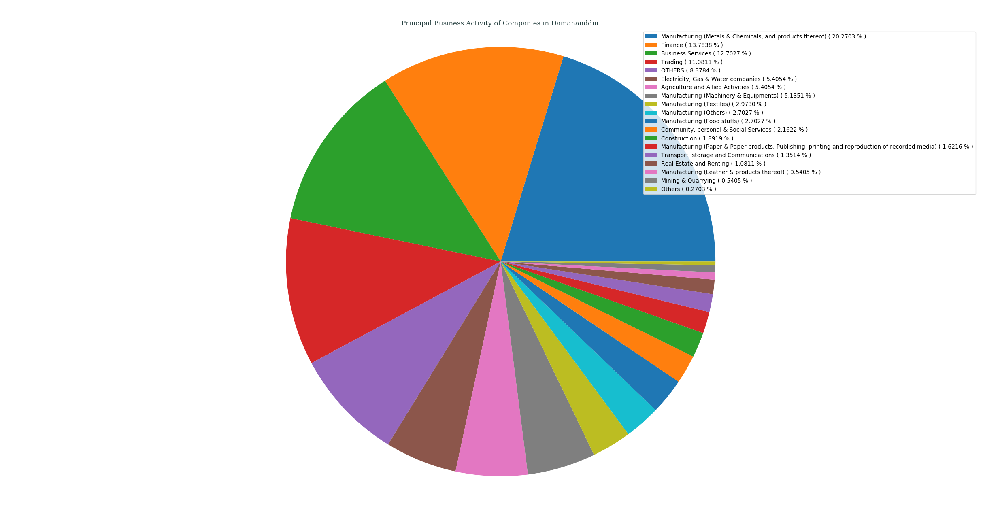
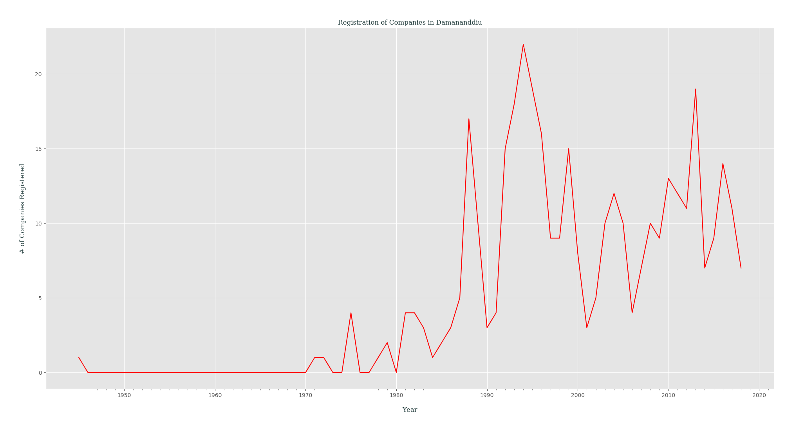

## Analysis of M.C.A. Data for _Daman & Diu_, India
### Status of Companies in Daman & Diu
Following PIE chart shows an overview of STATUS _( as of 21-04-2018 )_ of various companies registered in Daman & Diu, India.
- Active ( 65.9459% )
- Strike Off ( 18.9189% )
- Under Process of Striking off ( 10.0000% )
- Amalgamated ( 2.7027% )
- Under liquidation ( 0.8108% )
- Converted to LLP and dissolved ( 0.5405% )
- Not Available for eFiling ( 0.5405% )
- Dormant under section 455 ( 0.2703% )
- Liquidated ( 0.2703% )

---
### Class of Companies in Daman & Diu
Following PIE chart shows various companies categorized by their CLASS _( as of 21-04-2018 )_, present in Daman & Diu, India.
- Private ( 78.6486% )
- Public ( 20.8108% )
- Private(One Person Company) ( 0.5405% )

---
### Category of Companies in Daman & Diu
Following PIE chart shows various companies categorized by their CATEGORY _( as of 21-04-2018 )_, present in Daman & Diu, India.
- Company limited by Shares ( 99.1892% )
- Company Limited by Guarantee ( 0.8108% )

---
### Sub-Category of Companies in Daman & Diu
Following PIE chart shows various companies categorized by their SUB_CATEGORY _( as of 21-04-2018 )_, present in Daman & Diu, India.
- Non-govt company ( 99.1892% )
- State Govt company ( 0.5405% )
- Guarantee and Association comp ( 0.2703% )

---
### Principal Business Activity of Companies in Daman & Diu
Following PIE chart shows various companies categorized by their PRINCIPAL_BUSINESS_ACTIVITY _( as of 21-04-2018 )_, present in Daman & Diu, India.
- Manufacturing (Metals & Chemicals, and products thereof) ( 20.2703% )
- Finance ( 13.7838% )
- Business Services ( 12.7027% )
- Trading ( 11.0811% )
- OTHERS ( 8.3784% )
- Electricity, Gas & Water companies ( 5.4054% )
- Agriculture and Allied Activities ( 5.4054% )
- Manufacturing (Machinery & Equipments) ( 5.1351% )
- Manufacturing (Textiles) ( 2.9730% )
- Manufacturing (Others) ( 2.7027% )
- Manufacturing (Food stuffs) ( 2.7027% )
- Community, personal & Social Services ( 2.1622% )
- Construction ( 1.8919% )
- Manufacturing (Paper & Paper products, Publishing, printing and reproduction of recorded media) ( 1.6216% )
- Transport, storage and Communications ( 1.3514% )
- Real Estate and Renting ( 1.0811% )
- Manufacturing (Leather & products thereof) ( 0.5405% )
- Mining & Quarrying ( 0.5405% )
- Others ( 0.2703% )

---
### Registration of Companies by Year in Daman & Diu
Companies registered in Daman & Diu gets categorized by Year of Registration, which is plotted as year of registration vs. #-of companies registered in that certain year _( while filtering out those companies which didn't had any date of registration data )_.

