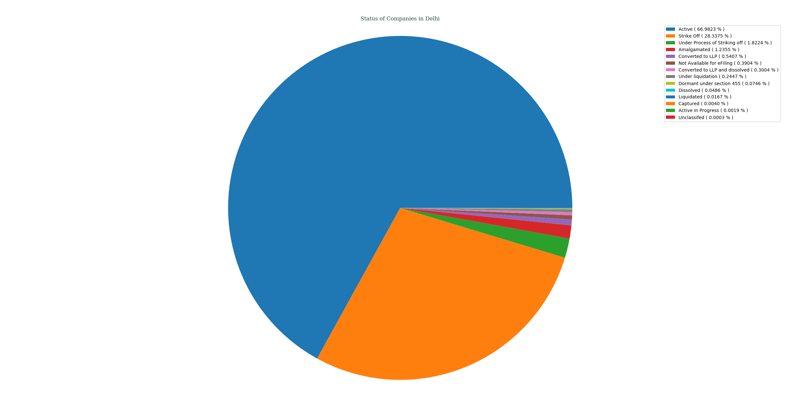
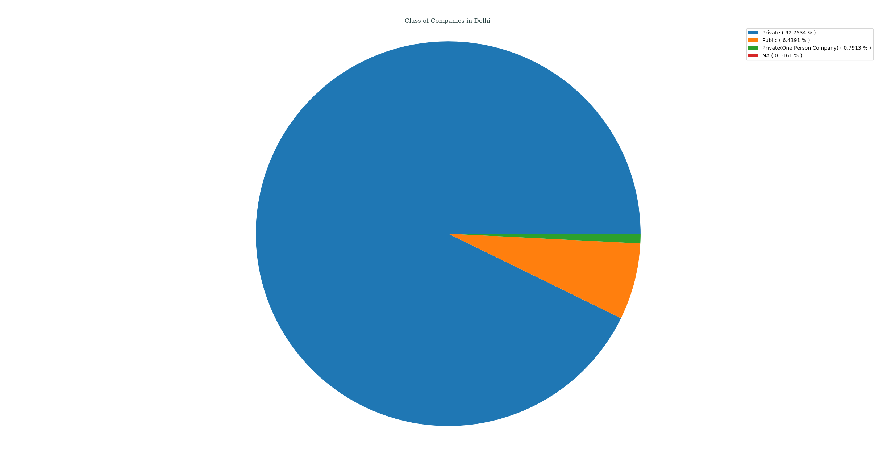
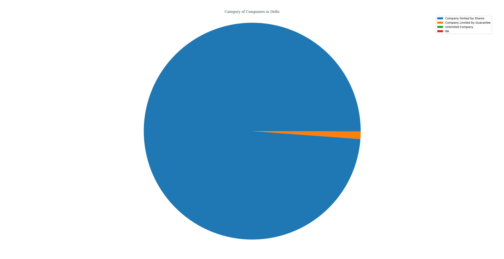
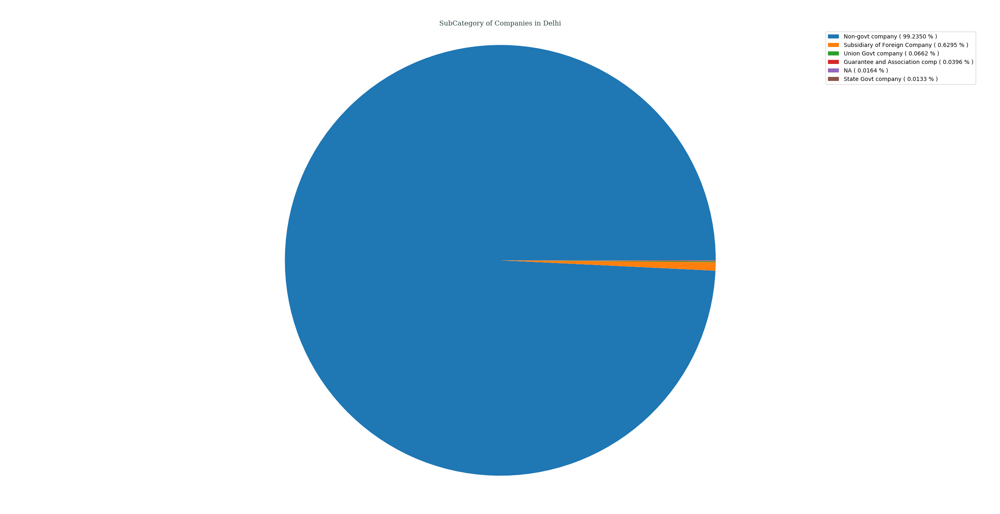
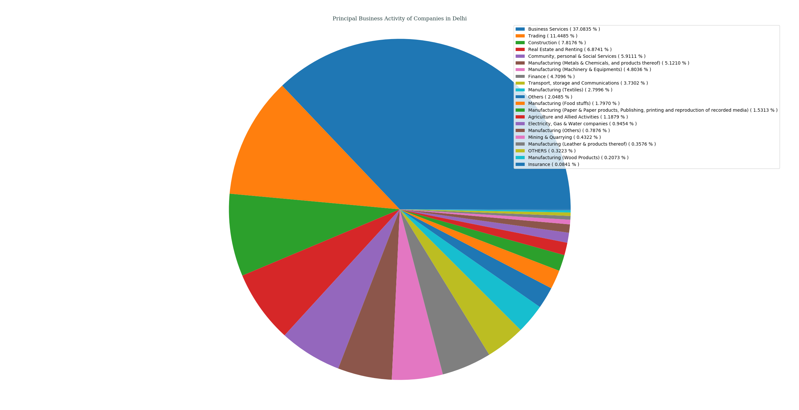
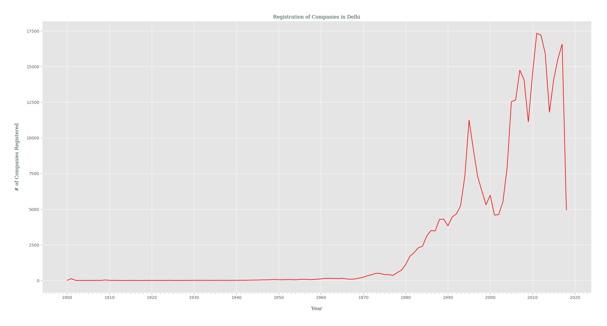

## Analysis of M.C.A. Data for _Delhi_, India
### Status of Companies in Delhi
Following PIE chart shows an overview of STATUS _( as of 21-04-2018 )_ of various companies registered in Delhi, India.
- Active ( 66.9823% )
- Strike Off ( 28.3375% )
- Under Process of Striking off ( 1.8224% )
- Amalgamated ( 1.2355% )
- Converted to LLP ( 0.5407% )
- Not Available for eFiling ( 0.3904% )
- Converted to LLP and dissolved ( 0.3004% )
- Under liquidation ( 0.2447% )
- Dormant under section 455 ( 0.0746% )
- Dissolved ( 0.0486% )
- Liquidated ( 0.0167% )
- Captured ( 0.0040% )
- Active In Progress ( 0.0019% )
- Unclassifed ( 0.0003% )

---
### Class of Companies in Delhi
Following PIE chart shows various companies categorized by their CLASS _( as of 21-04-2018 )_, present in Delhi, India.
- Private ( 92.7684% )
- Public ( 6.4402% )
- Private(One Person Company) ( 0.7914% )

---
### Category of Companies in Delhi
Following PIE chart shows various companies categorized by their CATEGORY _( as of 21-04-2018 )_, present in Delhi, India.
- Company limited by Shares ( 98.8561% )
- Company Limited by Guarantee ( 1.0875% )
- Unlimited Company ( 0.0563% ))

---
### Sub-Category of Companies in Delhi
Following PIE chart shows various companies categorized by their SUB_CATEGORY _( as of 21-04-2018 )_, present in Delhi, India.
- Non-govt company ( 99.2512% )
- Subsidiary of Foreign Company ( 0.6296% )
- Union Govt company ( 0.0662% )
- Guarantee and Association comp ( 0.0396% )
- State Govt company ( 0.0133% )

---
### Principal Business Activity of Companies in Delhi
Following PIE chart shows various companies categorized by their PRINCIPAL_BUSINESS_ACTIVITY _( as of 21-04-2018 )_, present in Delhi, India.
- Business Services ( 37.0835% )
- Trading ( 11.4485% )
- Construction ( 7.8176% )
- Real Estate and Renting ( 6.8741% )
- Community, personal & Social Services ( 5.9111% )
- Manufacturing (Metals & Chemicals, and products thereof) ( 5.1210% )
- Manufacturing (Machinery & Equipments) ( 4.8036% )
- Finance ( 4.7096% )
- Transport, storage and Communications ( 3.7302% )
- Manufacturing (Textiles) ( 2.7996% )
- Others ( 2.0485% )
- Manufacturing (Food stuffs) ( 1.7970% )
- Manufacturing (Paper & Paper products, Publishing, printing and reproduction of recorded media) ( 1.5313% )
- Agriculture and Allied Activities ( 1.1879% )
- Electricity, Gas & Water companies ( 0.9454% )
- Manufacturing (Others) ( 0.7876% )
- Mining & Quarrying ( 0.4322% )
- Manufacturing (Leather & products thereof) ( 0.3576% )
- OTHERS ( 0.3223% )
- Manufacturing (Wood Products) ( 0.2073% )
- Insurance ( 0.0841% )

---
### Registration of Companies by Year in Delhi
Companies registered in Delhi gets categorized by Year of Registration, which is plotted as year of registration vs. #-of companies registered in that certain year _( while filtering out those companies which didn't had any date of registration data )_.

