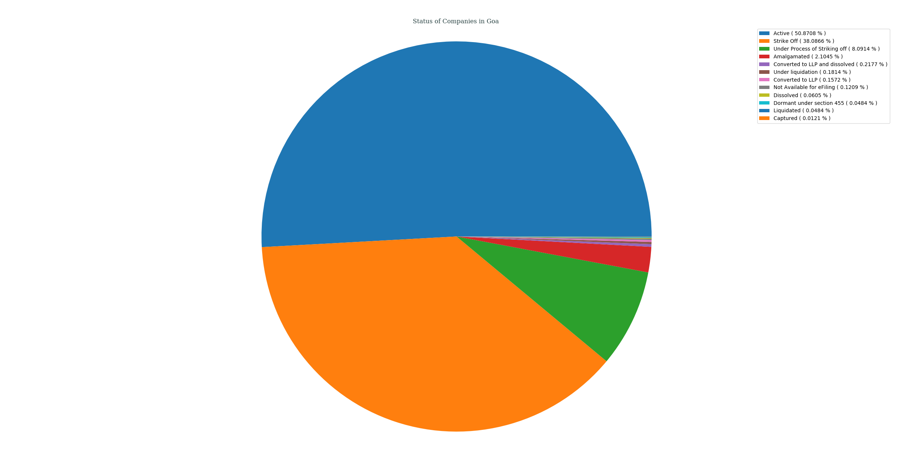
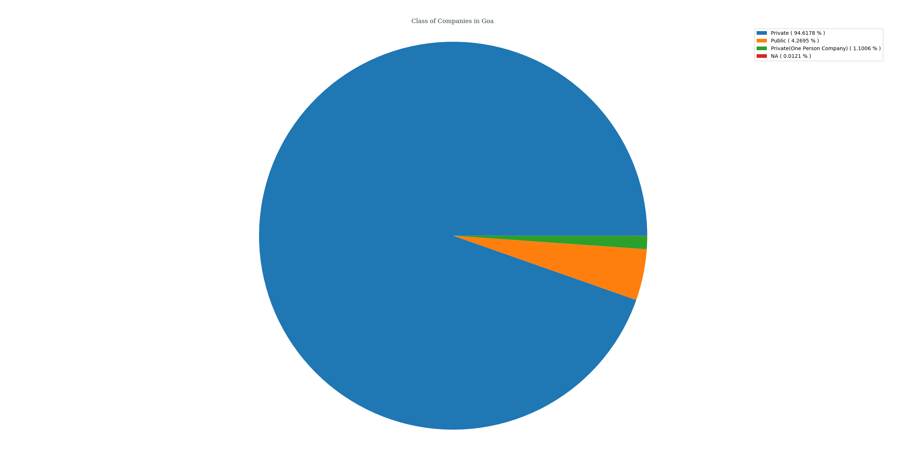
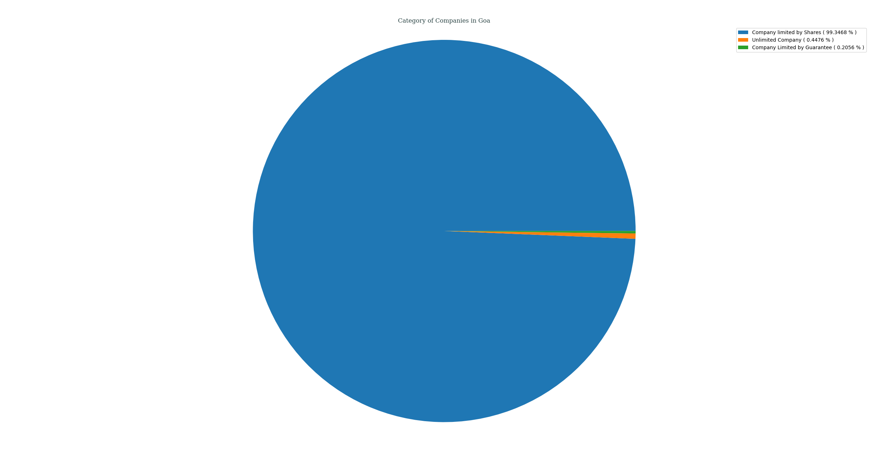
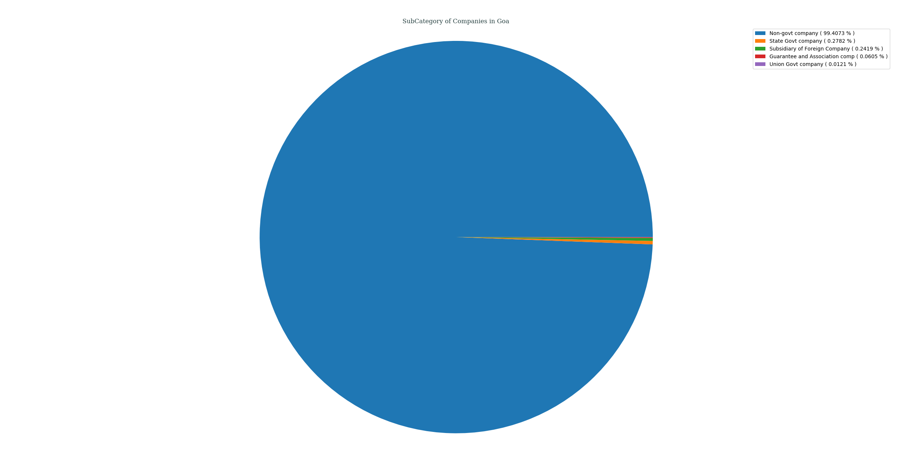
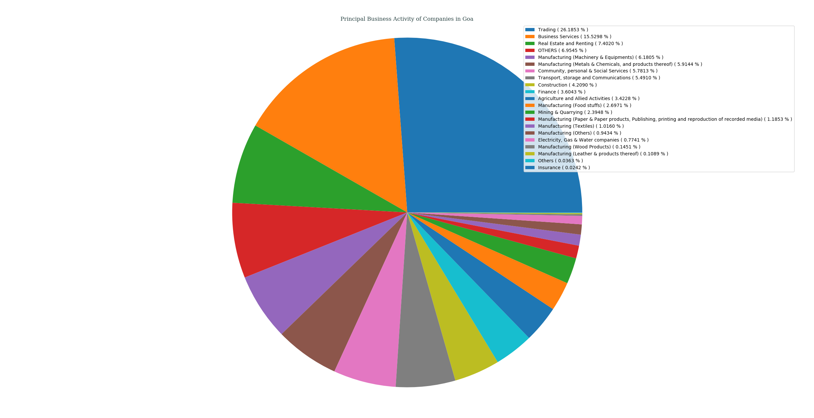
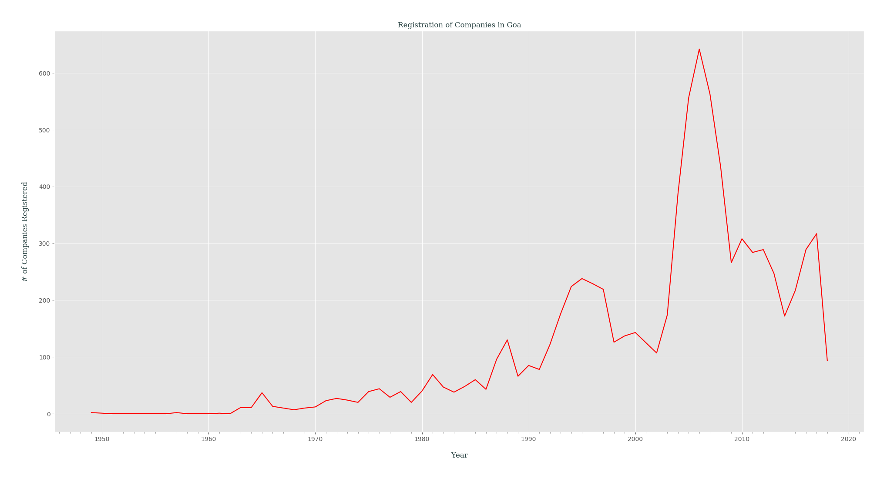

## Analysis of M.C.A. Data for _Goa_, India
### Status of Companies in Goa
Following PIE chart shows an overview of STATUS _( as of 21-04-2018 )_ of various companies registered in Goa, India.
- Active ( 50.8708% )
- Strike Off ( 38.0866% )
- Under Process of Striking off ( 8.0914% )
- Amalgamated ( 2.1045% )
- Converted to LLP and dissolved ( 0.2177% )
- Under liquidation ( 0.1814% )
- Converted to LLP ( 0.1572% )
- Not Available for eFiling ( 0.1209% )
- Dissolved ( 0.0605% )
- Dormant under section 455 ( 0.0484% )
- Liquidated ( 0.0484% )
- Captured ( 0.0121% )

---
### Class of Companies in Goa
Following PIE chart shows various companies categorized by their CLASS _( as of 21-04-2018 )_, present in Goa, India.
- Private ( 94.6292% )
- Public ( 4.2700% )
- Private(One Person Company) ( 1.1008% )

---
### Category of Companies in Goa
Following PIE chart shows various companies categorized by their CATEGORY _( as of 21-04-2018 )_, present in Goa, India.
- Company limited by Shares ( 99.3468% )
- Unlimited Company ( 0.4476% )
- Company Limited by Guarantee ( 0.2056% )

---
### Sub-Category of Companies in Goa
Following PIE chart shows various companies categorized by their SUB_CATEGORY _( as of 21-04-2018 )_, present in Goa, India.
- Non-govt company ( 99.4073% )
- State Govt company ( 0.2782% )
- Subsidiary of Foreign Company ( 0.2419% )
- Guarantee and Association comp ( 0.0605% )
- Union Govt company ( 0.0121% )

---
### Principal Business Activity of Companies in Goa
Following PIE chart shows various companies categorized by their PRINCIPAL_BUSINESS_ACTIVITY _( as of 21-04-2018 )_, present in Goa, India.
- Trading ( 26.1853% )
- Business Services ( 15.5298% )
- Real Estate and Renting ( 7.4020% )
- OTHERS ( 6.9545% )
- Manufacturing (Machinery & Equipments) ( 6.1805% )
- Manufacturing (Metals & Chemicals, and products thereof) ( 5.9144% )
- Community, personal & Social Services ( 5.7813% )
- Transport, storage and Communications ( 5.4910% )
- Construction ( 4.2090% )
- Finance ( 3.6043% )
- Agriculture and Allied Activities ( 3.4228% )
- Manufacturing (Food stuffs) ( 2.6971% )
- Mining & Quarrying ( 2.3948% )
- Manufacturing (Paper & Paper products, Publishing, printing and reproduction of recorded media) ( 1.1853% )
- Manufacturing (Textiles) ( 1.0160% )
- Manufacturing (Others) ( 0.9434% )
- Electricity, Gas & Water companies ( 0.7741% )
- Manufacturing (Wood Products) ( 0.1451% )
- Manufacturing (Leather & products thereof) ( 0.1089% )
- Others ( 0.0363% )
- Insurance ( 0.0242% )

---
### Registration of Companies by Year in Goa
Companies registered in Goa gets categorized by Year of Registration, which is plotted as year of registration vs. #-of companies registered in that certain year _( while filtering out those companies which didn't had any date of registration data )_.

