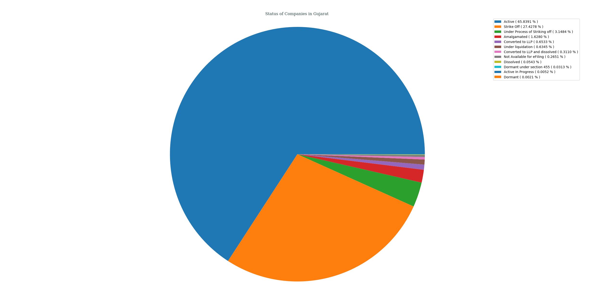
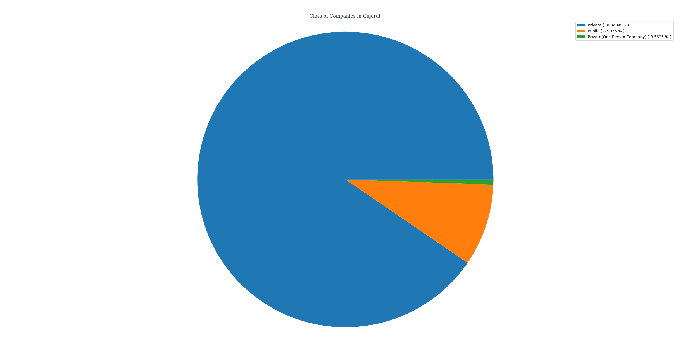
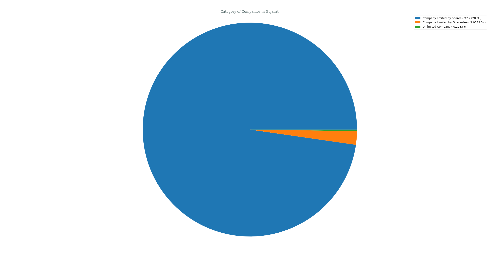
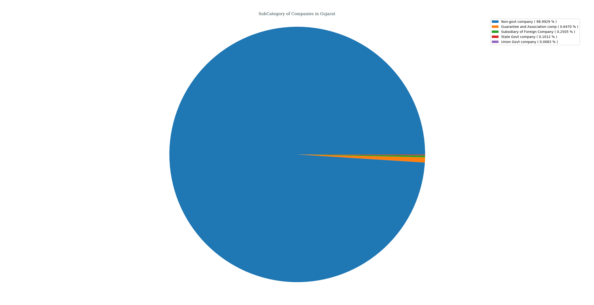

## Analysis of M.C.A. Data for _Gujarat_, India
### Status of Companies in Gujarat
Following PIE chart shows an overview of STATUS _( as of 21-04-2018 )_ of various companies registered in Gujarat, India.
- Active ( 65.8391% )
- Strike Off ( 27.4278% )
- Under Process of Striking off ( 3.1484% )
- Amalgamated ( 1.6280% )
- Converted to LLP ( 0.6533% )
- Under liquidation ( 0.6345% )
- Converted to LLP and dissolved ( 0.3110% )
- Not Available for eFiling ( 0.2651% )
- Dissolved ( 0.0543% )
- Dormant under section 455 ( 0.0313% )
- Active In Progress ( 0.0052% )
- Dormant ( 0.0021% )

---
### Class of Companies in Gujarat
Following PIE chart shows various companies categorized by their CLASS _( as of 21-04-2018 )_, present in Gujarat, India.
- Private ( 90.4540% )
- Public ( 8.9835% )
- Private(One Person Company) ( 0.5625% )

---
### Category of Companies in Gujarat
Following PIE chart shows various companies categorized by their CATEGORY _( as of 21-04-2018 )_, present in Gujarat, India.
- Company limited by Shares ( 97.7228% )
- Company Limited by Guarantee ( 2.0539% )
- Unlimited Company ( 0.2233% )

---
### Sub-Category of Companies in Gujarat
Following PIE chart shows various companies categorized by their SUB_CATEGORY _( as of 21-04-2018 )_, present in Gujarat, India.
- Non-govt company ( 98.9929% )
- Guarantee and Association comp ( 0.6470% )
- Subsidiary of Foreign Company ( 0.2505% )
- State Govt company ( 0.1012% )
- Union Govt company ( 0.0083% )

---
### Principal Business Activity of Companies in Gujarat
Following PIE chart shows various companies categorized by their PRINCIPAL_BUSINESS_ACTIVITY _( as of 21-04-2018 )_, present in Gujarat, India.
- Manufacturing (Metals & Chemicals, and products thereof) ( 16.2325% )
- Business Services ( 15.7358% )
- Trading ( 11.9790% )
- Construction ( 8.7461% )
- Manufacturing (Machinery & Equipments) ( 8.5384% )
- Manufacturing (Textiles) ( 8.5040% )
- Finance ( 7.8476% )
- Community, personal & Social Services ( 4.9099% )
- Manufacturing (Food stuffs) ( 2.9272% )
- Transport, storage and Communications ( 2.8280% )
- Agriculture and Allied Activities ( 2.5202% )
- Manufacturing (Others) ( 2.2061% )
- Real Estate and Renting ( 1.4652% )
- Manufacturing (Paper & Paper products, Publishing, printing and reproduction of recorded media) ( 1.4297% )
- Others ( 1.3671% )
- Electricity, Gas & Water companies ( 1.1970% )
- Mining & Quarrying ( 0.8682% )
- Manufacturing (Wood Products) ( 0.4686% )
- Manufacturing (Leather & products thereof) ( 0.0918% )
- OTHERS ( 0.0772% )
- Insurance ( 0.0605% )

---
### Registration of Companies by Year in Gujarat
Companies registered in Gujarat gets categorized by Year of Registration, which is plotted as year of registration vs. #-of companies registered in that certain year _( while filtering out those companies which didn't had any date of registration data )_.

