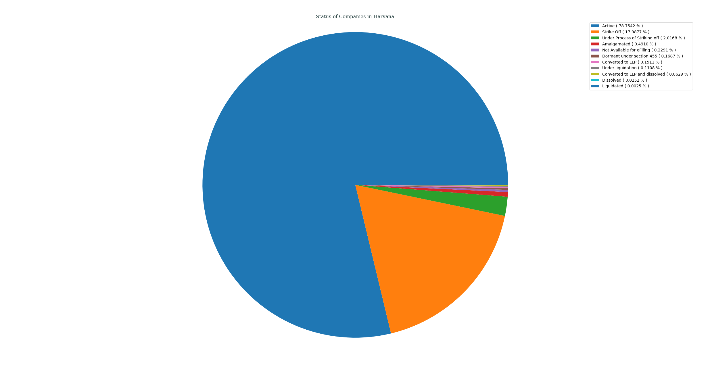
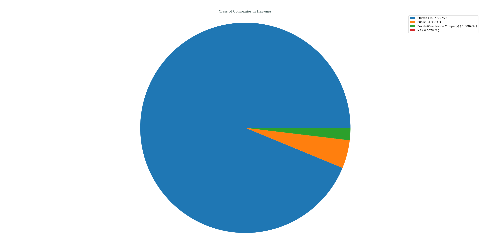
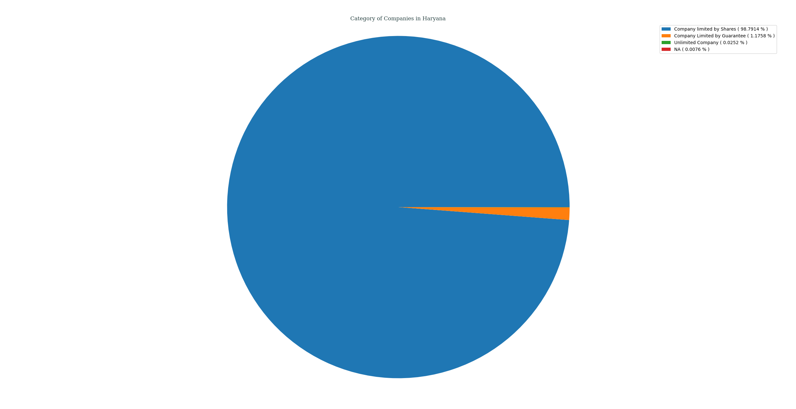
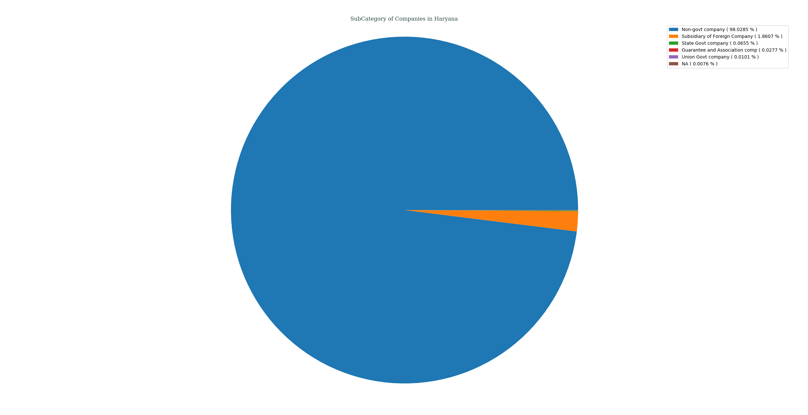
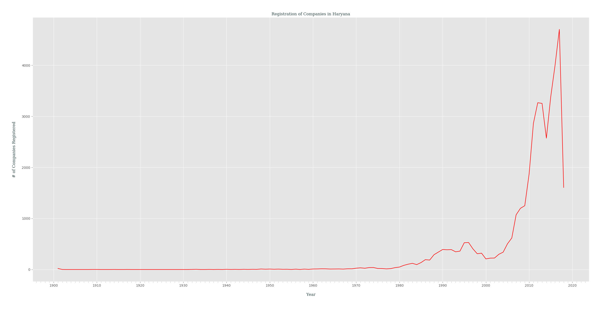

## Analysis of M.C.A. Data for _Haryana_, India
### Status of Companies in Haryana
Following PIE chart shows an overview of STATUS _( as of 21-04-2018 )_ of various companies registered in Haryana, India.
- Active ( 78.7542% )
- Strike Off ( 17.9877% )
- Under Process of Striking off ( 2.0168% )
- Amalgamated ( 0.4910% )
- Not Available for eFiling ( 0.2291% )
- Dormant under section 455 ( 0.1687% )
- Converted to LLP ( 0.1511% )
- Under liquidation ( 0.1108% )
- Converted to LLP and dissolved ( 0.0629% )
- Dissolved ( 0.0252% )
- Liquidated ( 0.0025% )

---
### Class of Companies in Haryana
Following PIE chart shows various companies categorized by their CLASS _( as of 21-04-2018 )_, present in Haryana, India.
- Private ( 93.7708% )
- Public ( 4.3333% )
- Private(One Person Company) ( 1.8884% )
- NA ( 0.0076% )

---
### Category of Companies in Haryana
Following PIE chart shows various companies categorized by their CATEGORY _( as of 21-04-2018 )_, present in Haryana, India.
- Company limited by Shares ( 98.7914% )
- Company Limited by Guarantee ( 1.1758% )
- Unlimited Company ( 0.0251% )
- NA ( 0.0075% )

---
### Sub-Category of Companies in Haryana
Following PIE chart shows various companies categorized by their SUB_CATEGORY _( as of 21-04-2018 )_, present in Haryana, India.
- Non-govt company ( 98.0285% )
- Subsidiary of Foreign Company ( 1.8607% )
- State Govt company ( 0.0655% )
- Guarantee and Association comp ( 0.0277% )
- Union Govt company ( 0.0101% )
- NA ( 0.0076% )

---
### Principal Business Activity of Companies in Haryana
Following PIE chart shows various companies categorized by their PRINCIPAL_BUSINESS_ACTIVITY _( as of 21-04-2018 )_, present in Haryana, India.
- Business Services ( 35.5524% )
- Trading ( 10.4693% )
- Community, personal & Social Services ( 7.0853% )
- Finance ( 6.9141% )
- Real Estate and Renting ( 6.6976% )
- Manufacturing (Metals & Chemicals, and products thereof) ( 6.1411% )
- Manufacturing (Machinery & Equipments) ( 5.8037% )
- Construction ( 5.5821% )
- Transport, storage and Communications ( 3.0844% )
- Manufacturing (Food stuffs) ( 2.6438% )
- Manufacturing (Textiles) ( 2.6236% )
- Agriculture and Allied Activities ( 2.1528% )
- Electricity, Gas & Water companies ( 1.3597% )
- Manufacturing (Paper & Paper products, Publishing, printing and reproduction of recorded media) ( 1.0248% )
- Others ( 0.7680% )
- Manufacturing (Others) ( 0.7428% )
- Mining & Quarrying ( 0.4557% )
- Manufacturing (Wood Products) ( 0.3223% )
- OTHERS ( 0.2619% )
- Manufacturing (Leather & products thereof) ( 0.2392% )
- Insurance ( 0.0755% )

---
### Registration of Companies by Year in Haryana
Companies registered in Haryana gets categorized by Year of Registration, which is plotted as year of registration vs. #-of companies registered in that certain year _( while filtering out those companies which didn't had any date of registration data )_.

