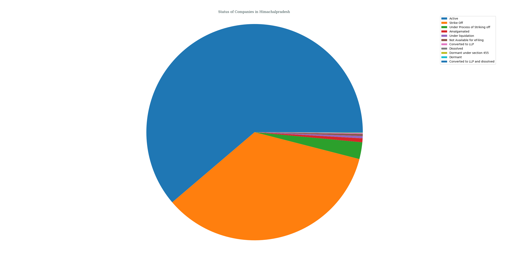
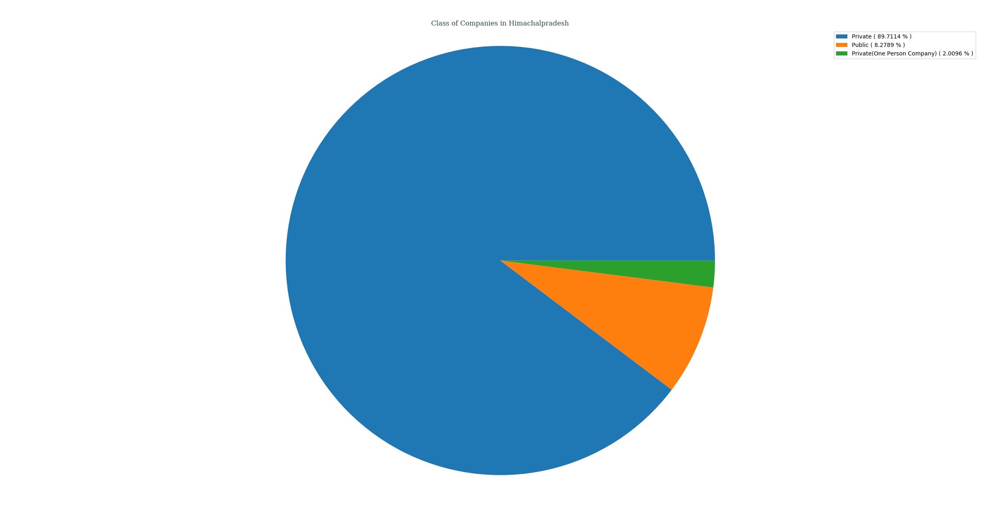
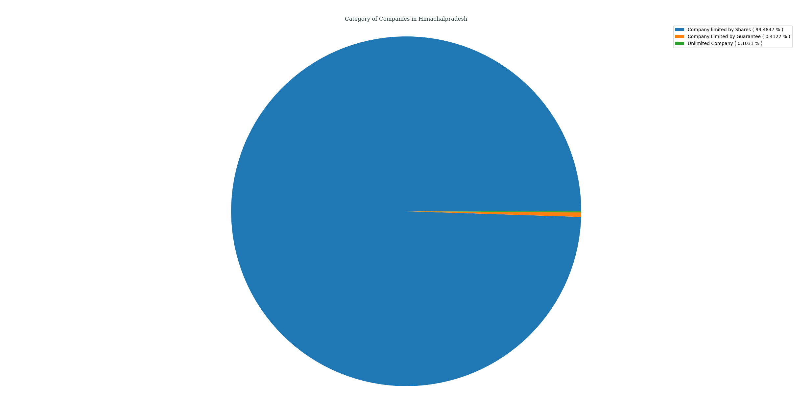
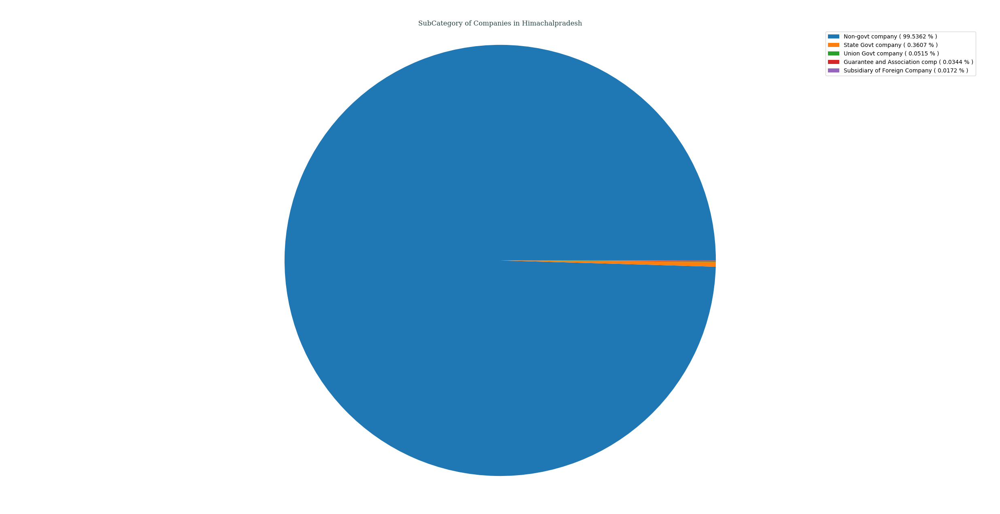
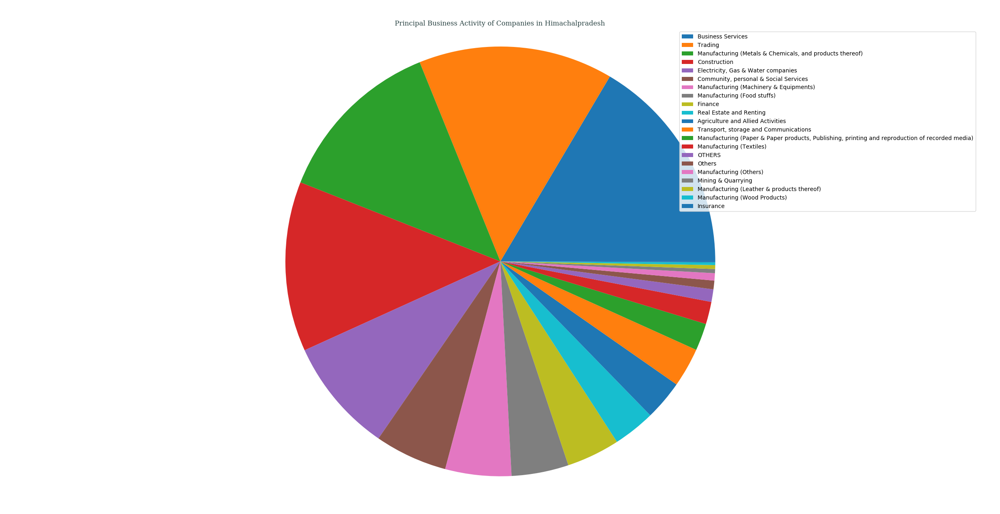
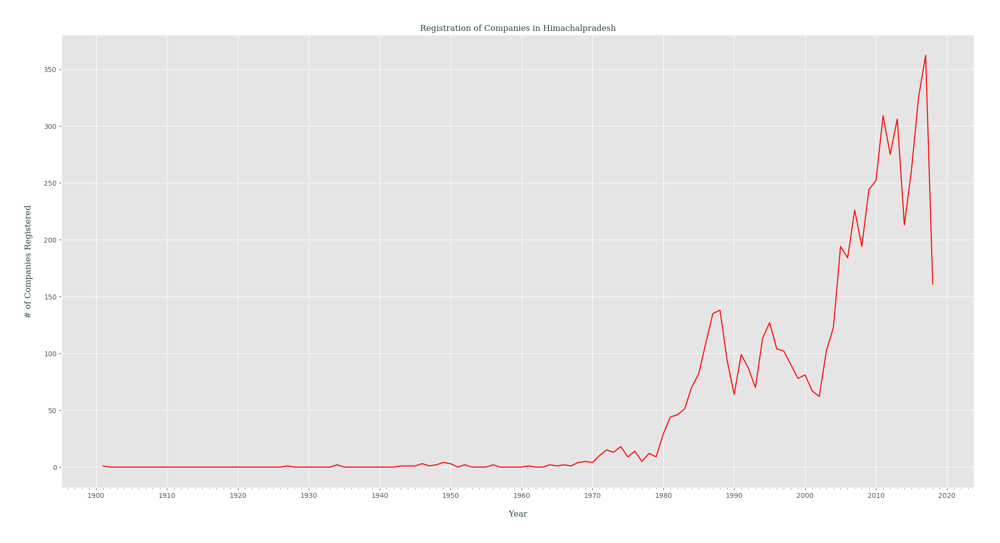

## Analysis of M.C.A. Data for _Himachal Pradesh_, India
### Status of Companies in Himachal Pradesh
Following PIE chart shows an overview of STATUS _( as of 21-04-2018 )_ of various companies registered in Himachal Pradesh, India.
- Active ( 61.2333% )
- Strike Off ( 34.7647% )
- Under Process of Striking off ( 2.5077% )
- Amalgamated ( 0.5840% )
- Under liquidation ( 0.3435% )
- Not Available for eFiling ( 0.3092% )
- Converted to LLP ( 0.1031% )
- Dissolved ( 0.0515% )
- Dormant under section 455 ( 0.0344% )
- Dormant ( 0.0344% )
- Converted to LLP and dissolved ( 0.0344% )

---
### Class of Companies in Himachal Pradesh
Following PIE chart shows various companies categorized by their CLASS _( as of 21-04-2018 )_, present in Himachal Pradesh, India.
- Private ( 89.7114% )
- Public ( 8.2789% )
- Private(One Person Company) ( 2.0096% )

---
### Category of Companies in Himachal Pradesh
Following PIE chart shows various companies categorized by their CATEGORY _( as of 21-04-2018 )_, present in Himachal Pradesh, India.
- Company limited by Shares ( 99.4847% )
- Company Limited by Guarantee ( 0.4122% )
- Unlimited Company ( 0.1031% )

---
### Sub-Category of Companies in Himachal Pradesh
Following PIE chart shows various companies categorized by their SUB_CATEGORY _( as of 21-04-2018 )_, present in Himachal Pradesh, India.
- Non-govt company ( 99.5362% )
- State Govt company ( 0.3607% )
- Union Govt company ( 0.0515% )
- Guarantee and Association comp ( 0.0344% )
- Subsidiary of Foreign Company ( 0.0172% )

---
### Principal Business Activity of Companies in Himachal Pradesh
Following PIE chart shows various companies categorized by their PRINCIPAL_BUSINESS_ACTIVITY _( as of 21-04-2018 )_, present in Himachal Pradesh, India.
- Business Services ( 16.4892% )
- Trading ( 14.6341% )
- Manufacturing (Metals & Chemicals, and products thereof) ( 12.8822% )
- Construction ( 12.7791% )
- Electricity, Gas & Water companies ( 8.6225% )
- Community, personal & Social Services ( 5.4620% )
- Manufacturing (Machinery & Equipments) ( 4.9639% 
- Manufacturing (Food stuffs) ( 4.2941% )
- Finance ( 4.0021% )
- Real Estate and Renting ( 3.1604% )
- Agriculture and Allied Activities ( 3.0058% )
- Transport, storage and Communications ( 2.9543% )
- Manufacturing (Paper & Paper products, Publishing, printing and reproduction of recorded media) ( 2.0440% )
- Manufacturing (Textiles) ( 1.6833% )
- OTHERS ( 0.9447% )
- Others ( 0.6527% )
- Manufacturing (Others) ( 0.5496% )
- Mining & Quarrying ( 0.3092% )
- Manufacturing (Leather & products thereof) ( 0.2920% )
- Manufacturing (Wood Products) ( 0.2061% )
- Insurance ( 0.0687% )

---
### Registration of Companies by Year in Himachal Pradesh
Companies registered in Himachal Pradesh gets categorized by Year of Registration, which is plotted as year of registration vs. #-of companies registered in that certain year _( while filtering out those companies which didn't had any date of registration data )_.

