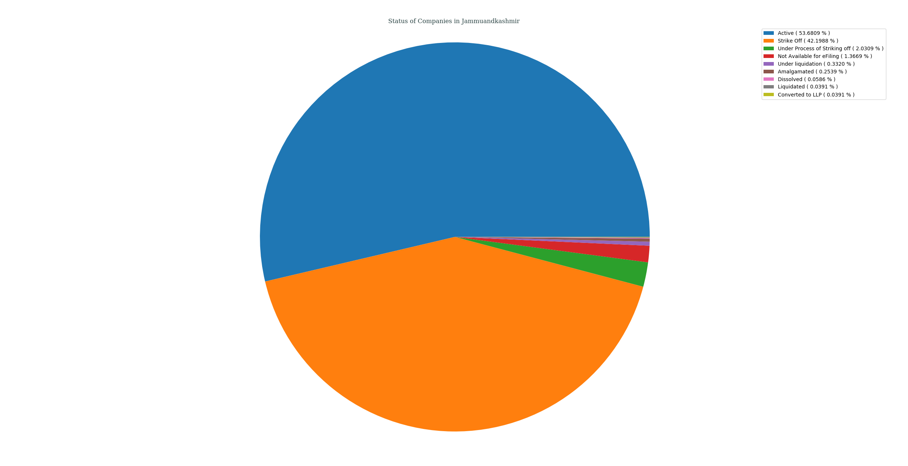
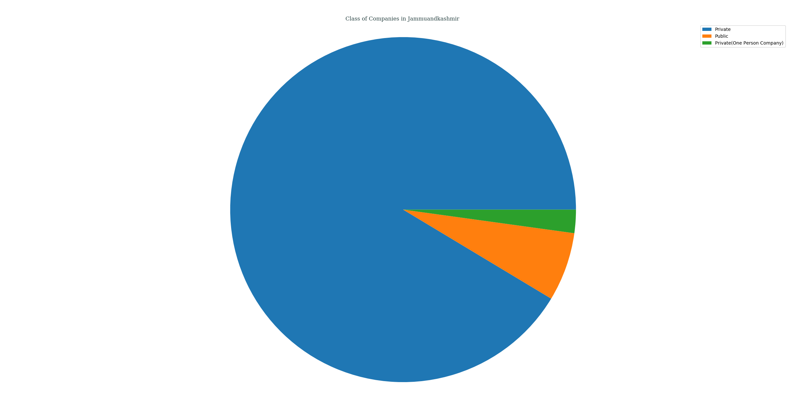
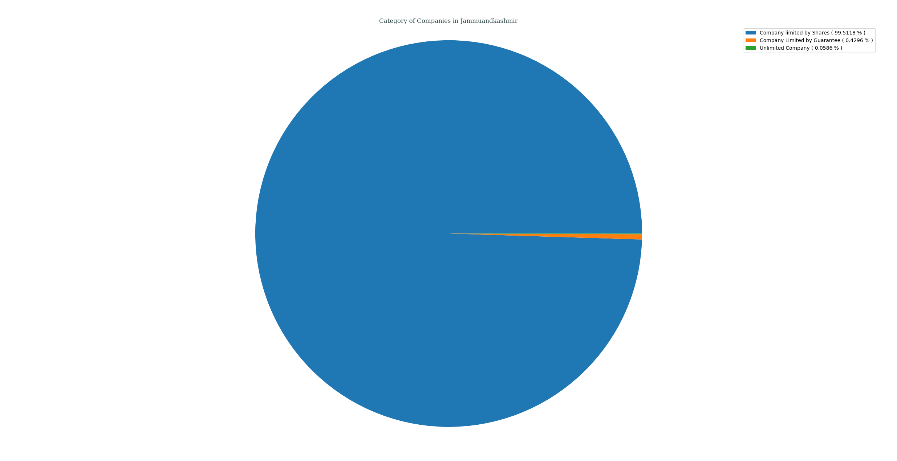
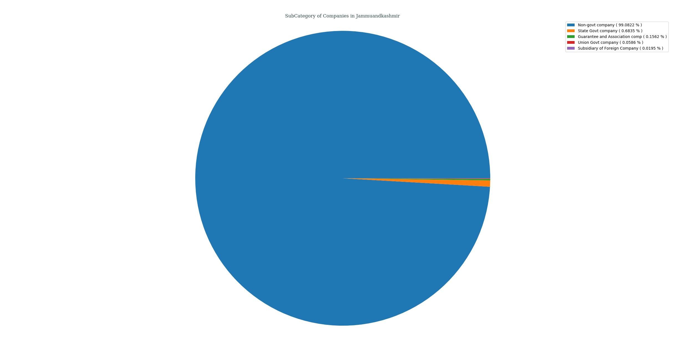
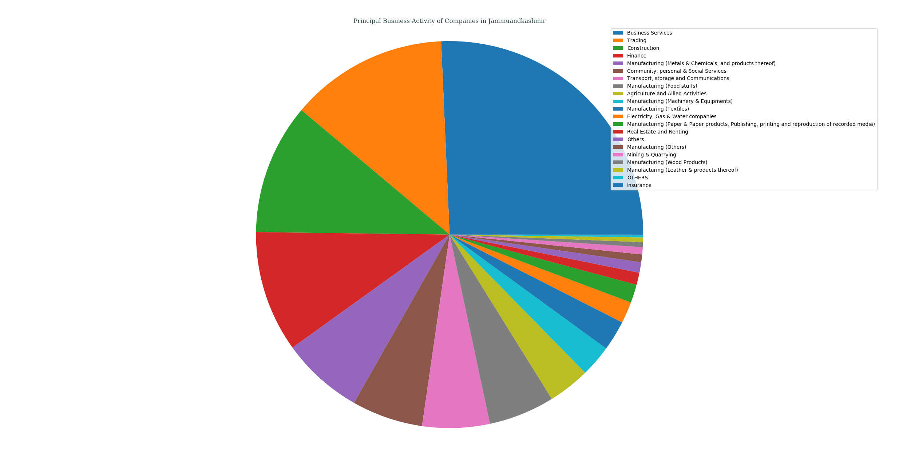
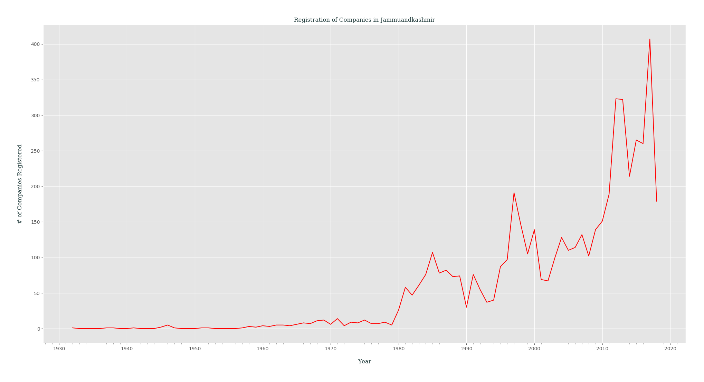

## Analysis of M.C.A. Data for _Jammu & Kashmir_, India
### Status of Companies in Jammu & Kashmir
Following PIE chart shows an overview of STATUS _( as of 21-04-2018 )_ of various companies registered in Jammu & Kashmir, India.
- Active ( 53.6809% )
- Strike Off ( 42.1988% )
- Under Process of Striking off ( 2.0309% )
- Not Available for eFiling ( 1.3669% )
- Under liquidation ( 0.3320% )
- Amalgamated ( 0.2539% )
- Dissolved ( 0.0586% )
- Liquidated ( 0.0391% )
- Converted to LLP ( 0.0391% )

---
### Class of Companies in Jammu & Kashmir
Following PIE chart shows various companies categorized by their CLASS _( as of 21-04-2018 )_, present in Jammu & Kashmir, India.
- Private ( 91.3689% )
- Public ( 6.4441% )
- Private(One Person Company) ( 2.1871% )

---
### Category of Companies in Jammu & Kashmir
Following PIE chart shows various companies categorized by their CATEGORY _( as of 21-04-2018 )_, present in Jammu & Kashmir, India.
- Company limited by Shares ( 99.5118% )
- Company Limited by Guarantee ( 0.4296% )
- Unlimited Company ( 0.0586% )

---
### Sub-Category of Companies in Jammu & Kashmir
Following PIE chart shows various companies categorized by their SUB_CATEGORY _( as of 21-04-2018 )_, present in Jammu & Kashmir, India.
- Non-govt company ( 99.0822% )
- State Govt company ( 0.6835% )
- Guarantee and Association comp ( 0.1562% )
- Union Govt company ( 0.0586% )
- Subsidiary of Foreign Company ( 0.0195% )

---
### Principal Business Activity of Companies in Jammu & Kashmir
Following PIE chart shows various companies categorized by their PRINCIPAL_BUSINESS_ACTIVITY _( as of 21-04-2018 )_, present in Jammu & Kashmir, India.
- Business Services ( 25.6981% )
- Trading ( 13.1810% )
- Construction ( 10.9158% )
- Finance ( 10.1347% )
- Manufacturing (Metals & Chemicals, and products thereof) ( 6.8541% )
- Community, personal & Social Services ( 5.9363% )
- Transport, storage and Communications ( 5.6239% )
- Manufacturing (Food stuffs) ( 5.5067% )
- Agriculture and Allied Activities ( 3.4954% )
- Manufacturing (Machinery & Equipments) ( 2.6362% )
- Manufacturing (Textiles) ( 2.5190% )
- Electricity, Gas & Water companies ( 1.7965% )
- Manufacturing (Paper & Paper products, Publishing, printing and reproduction of recorded media) ( 1.5231% )
- Real Estate and Renting ( 1.0154% )
- Others ( 0.8787% )
- Manufacturing (Others) ( 0.6444% )
- Mining & Quarrying ( 0.6054% )
- Manufacturing (Wood Products) ( 0.4101% )
- Manufacturing (Leather & products thereof) ( 0.3905% )
- OTHERS ( 0.1757% )
- Insurance ( 0.0586% )

---
### Registration of Companies by Year in Jammu & Kashmir
Companies registered in Jammu & Kashmir gets categorized by Year of Registration, which is plotted as year of registration vs. #-of companies registered in that certain year _( while filtering out those companies which didn't had any date of registration data )_.

