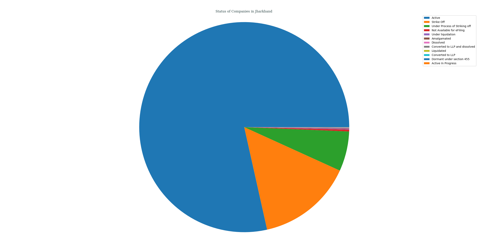
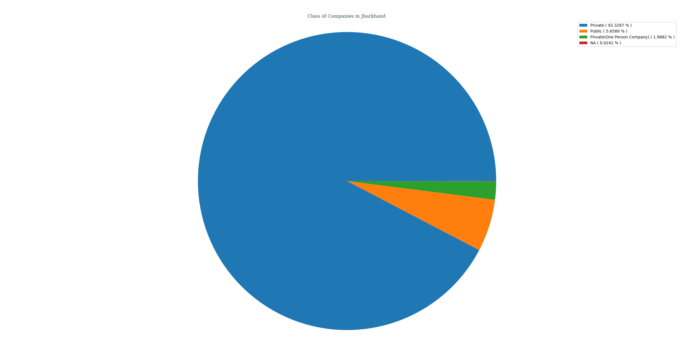
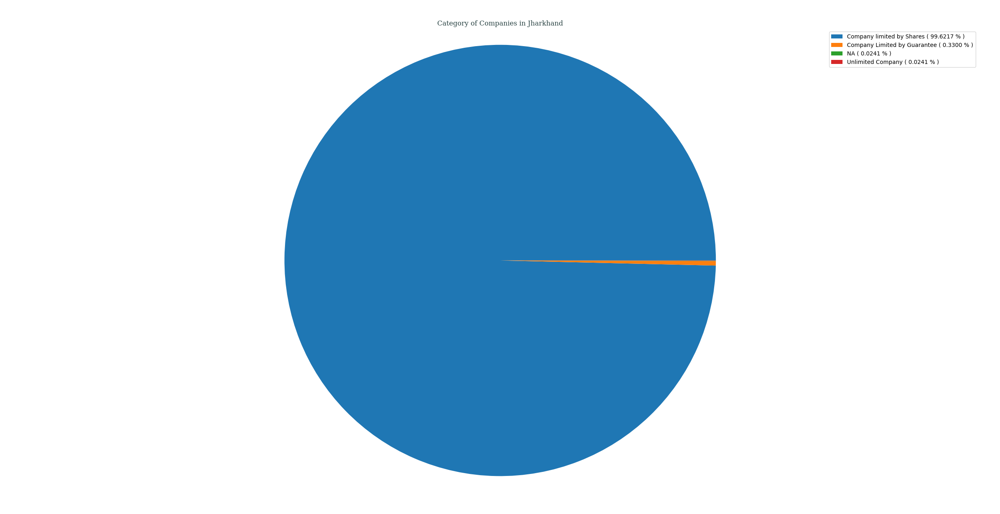
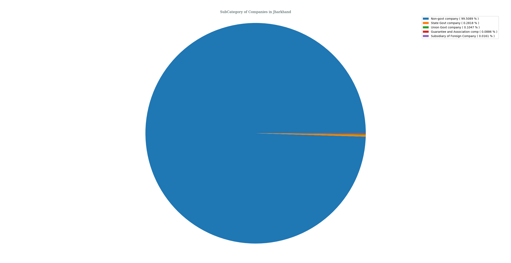
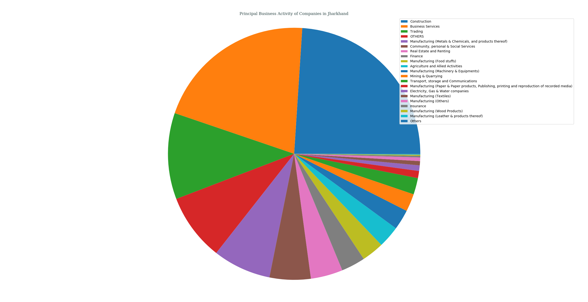
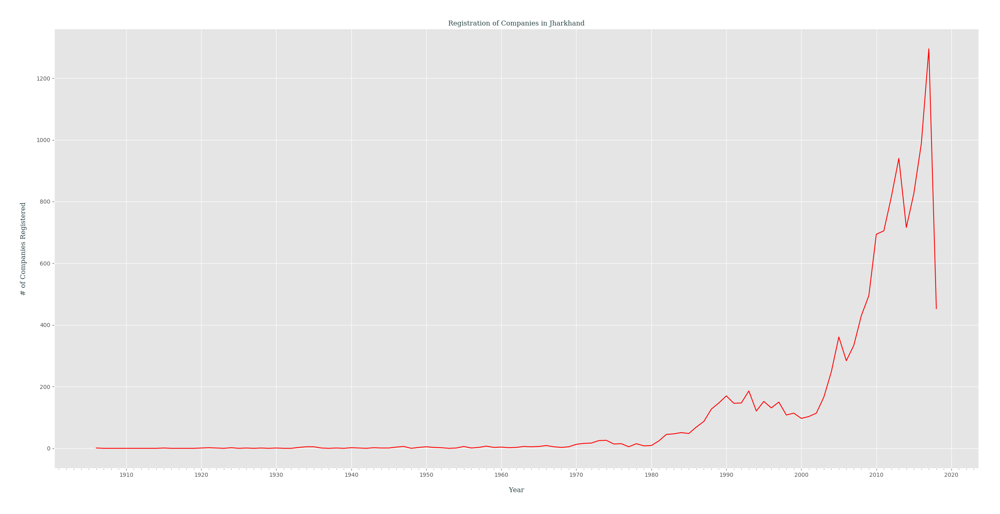

## Analysis of M.C.A. Data for _Jharkhand_, India
### Status of Companies in Jharkhand
Following PIE chart shows an overview of STATUS _( as of 21-04-2018 )_ of various companies registered in Jharkhand, India.
- Active ( 78.4996% )
- Strike Off ( 14.7146% )
- Under Process of Striking off ( 6.1257% )
- Not Available for eFiling ( 0.2898% )
- Under liquidation ( 0.0966% )
- Amalgamated ( 0.0885% )
- Dissolved ( 0.0805% )
- Converted to LLP and dissolved ( 0.0402% )
- Liquidated ( 0.0241% )
- Converted to LLP ( 0.0161% )
- Dormant under section 455 ( 0.0161% )
- Active In Progress ( 0.0080% )

---
### Class of Companies in Jharkhand
Following PIE chart shows various companies categorized by their CLASS _( as of 21-04-2018 )_, present in Jharkhand, India.
- Private ( 92.3287% )
- Public ( 5.6589% )
- Private(One Person Company) ( 1.9882% )
- NA ( 0.0241% )

---
### Category of Companies in Jharkhand
Following PIE chart shows various companies categorized by their CATEGORY _( as of 21-04-2018 )_, present in Jharkhand, India.
- Company limited by Shares ( 99.6217% )
- Company Limited by Guarantee ( 0.3300% )
- NA ( 0.0241% )
- Unlimited Company ( 0.0241% )

---
### Sub-Category of Companies in Jharkhand
Following PIE chart shows various companies categorized by their SUB_CATEGORY _( as of 21-04-2018 )_, present in Jharkhand, India.
- Non-govt company ( 99.4848% )
- State Govt company ( 0.2817% )
- Union Govt company ( 0.1046% )
- Guarantee and Association comp ( 0.0885% )
- NA ( 0.0241% )
- Subsidiary of Foreign Company ( 0.0161% )

---
### Principal Business Activity of Companies in Jharkhand
Following PIE chart shows various companies categorized by their PRINCIPAL_BUSINESS_ACTIVITY _( as of 21-04-2018 )_, present in Jharkhand, India.
- Construction ( 23.9717% )
- Business Services ( 20.8001% )
- Trading ( 11.0521% )
- OTHERS ( 8.5889% )
- Manufacturing (Metals & Chemicals, and products thereof) ( 7.4459% )
- Community, personal & Social Services ( 5.2725% )
- Real Estate and Renting ( 4.1053% )
- Finance ( 3.0669% )
- Manufacturing (Food stuffs) ( 2.8415% )
- Agriculture and Allied Activities ( 2.7932% )
- Manufacturing (Machinery & Equipments) ( 2.5839% )
- Mining & Quarrying ( 2.2700% )
- Transport, storage and Communications ( 2.1090% )
- Manufacturing (Paper & Paper products, Publishing, printing and reproduction of recorded media) ( 0.9177% )
- Electricity, Gas & Water companies ( 0.7164% )
- Manufacturing (Textiles) ( 0.5393% )
- Manufacturing (Others) ( 0.4669% )
- Insurance ( 0.2093% )
- Manufacturing (Wood Products) ( 0.1288% )
- Manufacturing (Leather & products thereof) ( 0.0644% )
- Others ( 0.0563% )

---
### Registration of Companies by Year in Jharkhand
Companies registered in Jharkhand gets categorized by Year of Registration, which is plotted as year of registration vs. #-of companies registered in that certain year _( while filtering out those companies which didn't had any date of registration data )_.

