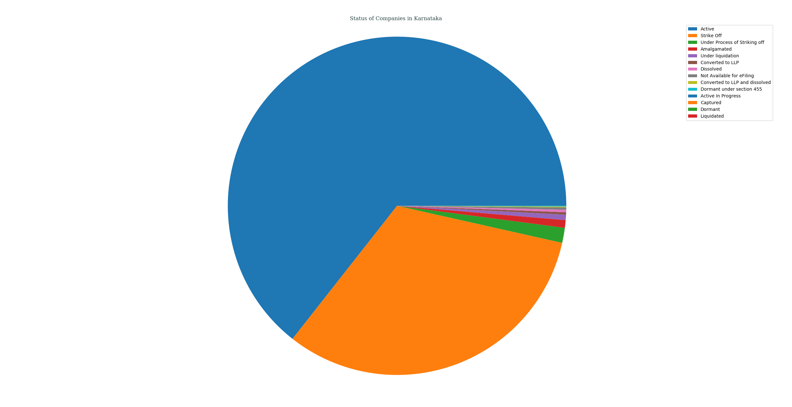
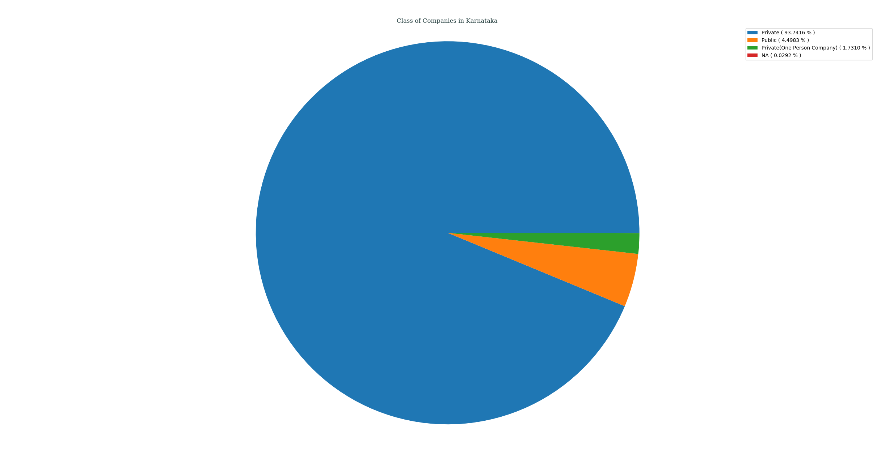
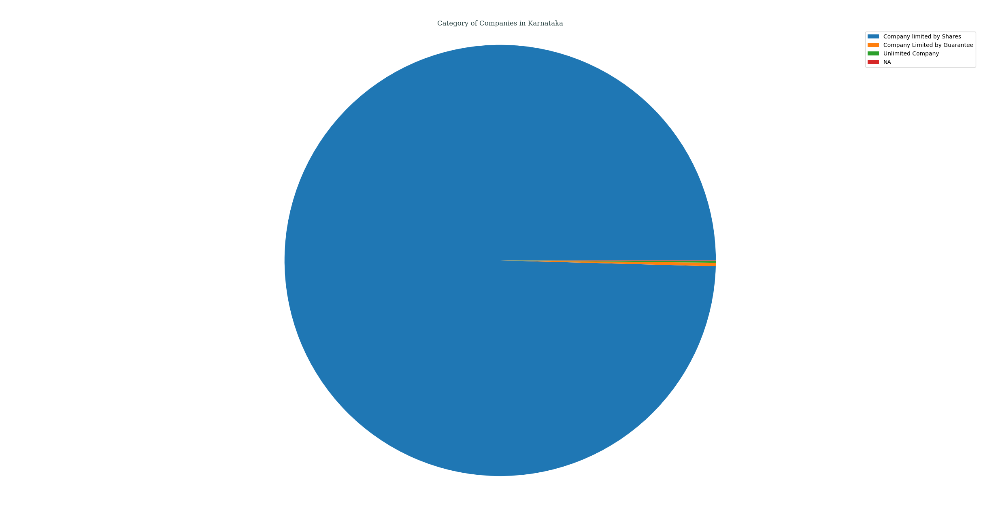
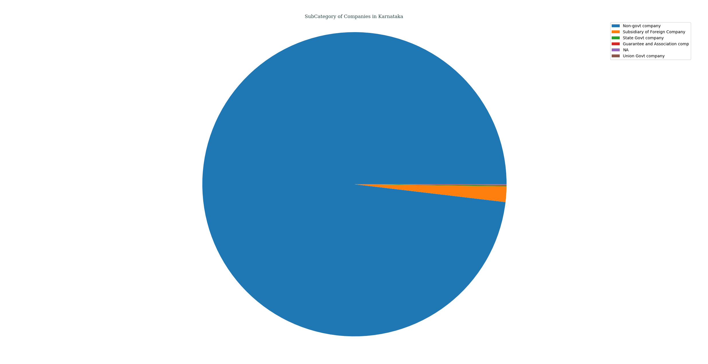
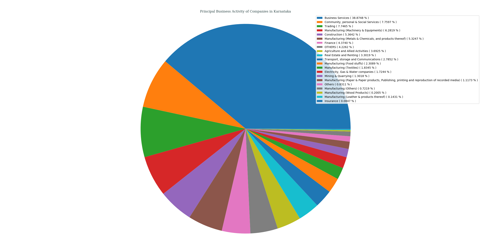
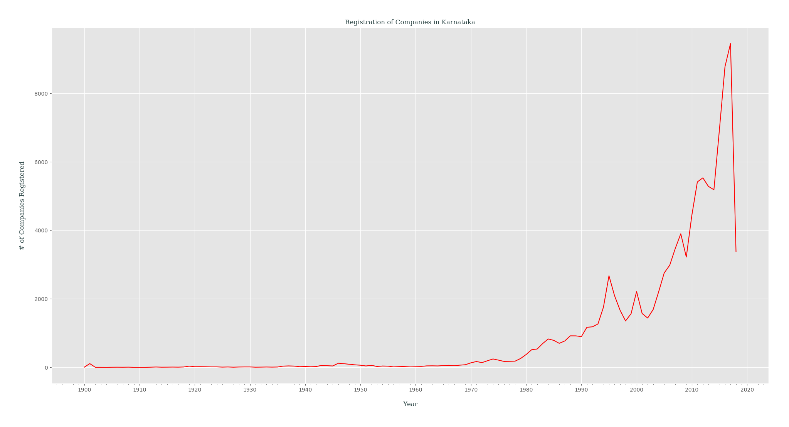

## Analysis of M.C.A. Data for _Karnataka_, India
### Status of Companies in Karnataka
Following PIE chart shows an overview of STATUS _( as of 21-04-2018 )_ of various companies registered in Karnataka, India.
- Active ( 64.4045% )
- Strike Off ( 32.0780% )
- Under Process of Striking off ( 1.4364% )
- Amalgamated ( 0.7342% )
- Under liquidation ( 0.5055% )
- Converted to LLP ( 0.2353% )
- Dissolved ( 0.2325% )
- Not Available for eFiling ( 0.2212% )
- Converted to LLP and dissolved ( 0.0781% )
- Dormant under section 455 ( 0.0659% )
- Active In Progress ( 0.0038% )
- Captured ( 0.0028% )
- Dormant ( 0.0009% )
- Liquidated ( 0.0009% )

---
### Class of Companies in Karnataka
Following PIE chart shows various companies categorized by their CLASS _( as of 21-04-2018 )_, present in Karnataka, India.
- Private ( 93.7416% )
- Public ( 4.4983% )
- Private(One Person Company) ( 1.7310% )
- NA ( 0.0292% )

---
### Category of Companies in Karnataka
Following PIE chart shows various companies categorized by their CATEGORY _( as of 21-04-2018 )_, present in Karnataka, India.
- Company limited by Shares ( 99.5651% )
- Company Limited by Guarantee ( 0.2654% )
- Unlimited Company ( 0.1374% )
- NA ( 0.0320% )

---
### Sub-Category of Companies in Karnataka
Following PIE chart shows various companies categorized by their SUB_CATEGORY _( as of 21-04-2018 )_, present in Karnataka, India.
- Non-govt company ( 98.1278% )
- Subsidiary of Foreign Company ( 1.6463% )
- State Govt company ( 0.1045% )
- Guarantee and Association comp ( 0.0687% )
- NA ( 0.0320% )
- Union Govt company ( 0.0207% )

---
### Principal Business Activity of Companies in Karnataka
Following PIE chart shows various companies categorized by their PRINCIPAL_BUSINESS_ACTIVITY _( as of 21-04-2018 )_, present in Karnataka, India.
- Business Services ( 38.8748% )
- Community, personal & Social Services ( 7.7597% )
- Trading ( 7.7465% )
- Manufacturing (Machinery & Equipments) ( 6.2819% )
- Construction ( 5.3642% )
- Manufacturing (Metals & Chemicals, and products thereof) ( 5.3247% )
- Finance ( 4.3740% )
- OTHERS ( 4.2262% )
- Agriculture and Allied Activities ( 3.6925% )
- Real Estate and Renting ( 3.3019% )
- Transport, storage and Communications ( 2.7852% )
- Manufacturing (Food stuffs) ( 2.3089% )
- Manufacturing (Textiles) ( 1.8345% )
- Electricity, Gas & Water companies ( 1.7244% )
- Mining & Quarrying ( 1.3018% )
- Manufacturing (Paper & Paper products, Publishing, printing and reproduction of recorded media) ( 1.1173% )
- Others ( 0.8311% )
- Manufacturing (Others) ( 0.7219% )
- Manufacturing (Wood Products) ( 0.2005% )
- Manufacturing (Leather & products thereof) ( 0.1431% )
- Insurance ( 0.0847% )

---
### Registration of Companies by Year in Karnataka
Companies registered in Karnataka gets categorized by Year of Registration, which is plotted as year of registration vs. #-of companies registered in that certain year _( while filtering out those companies which didn't had any date of registration data )_.

