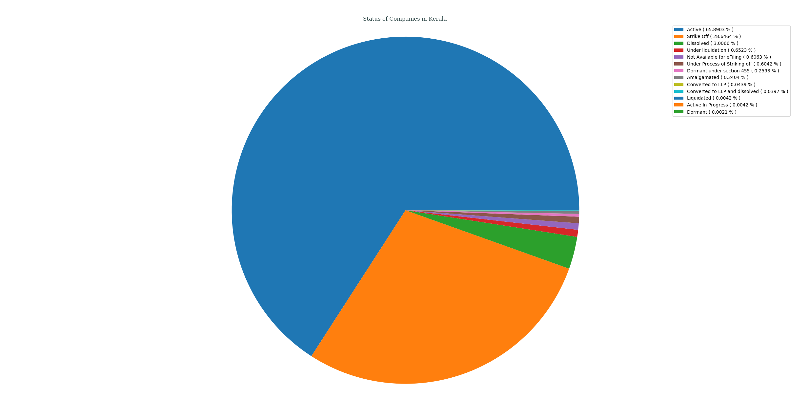
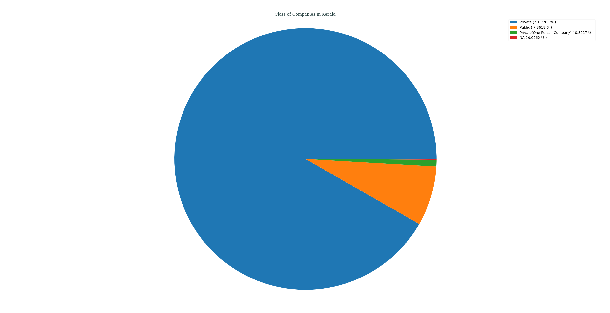
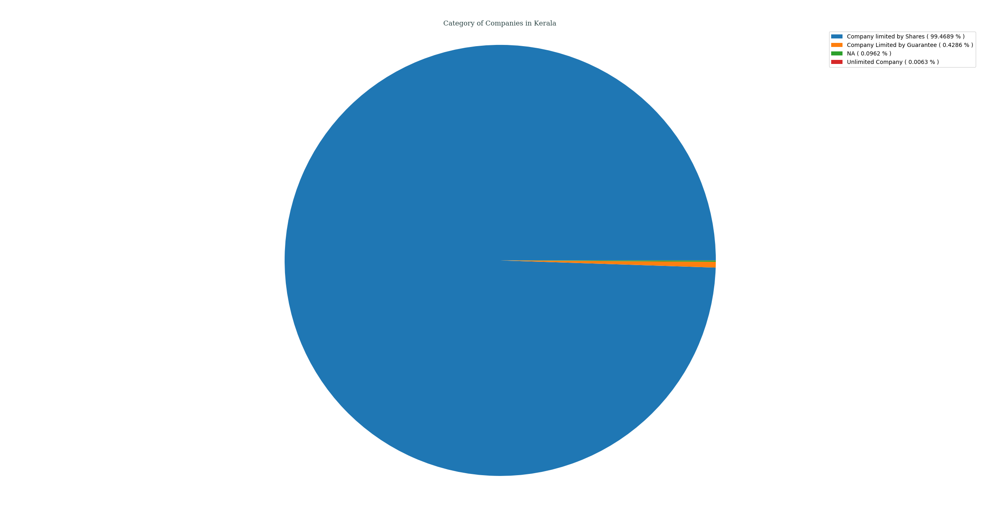
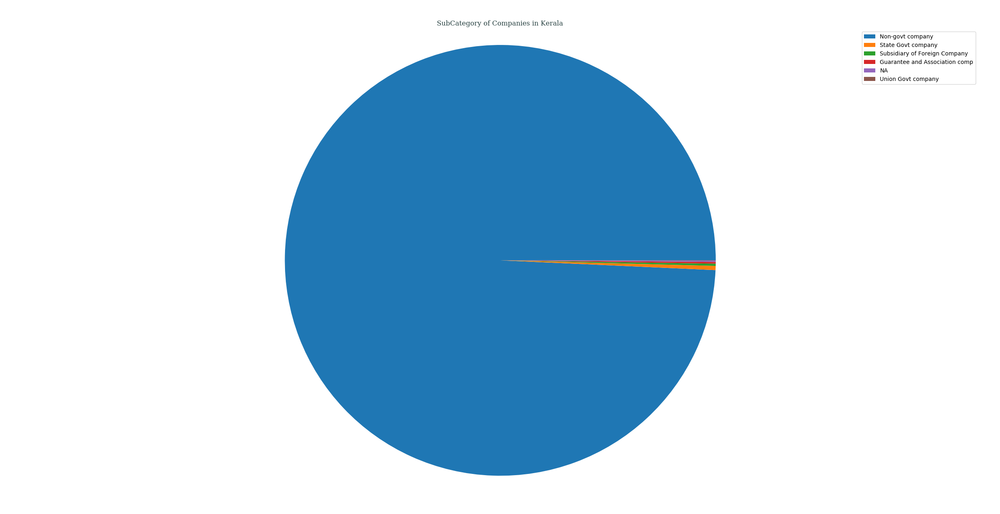
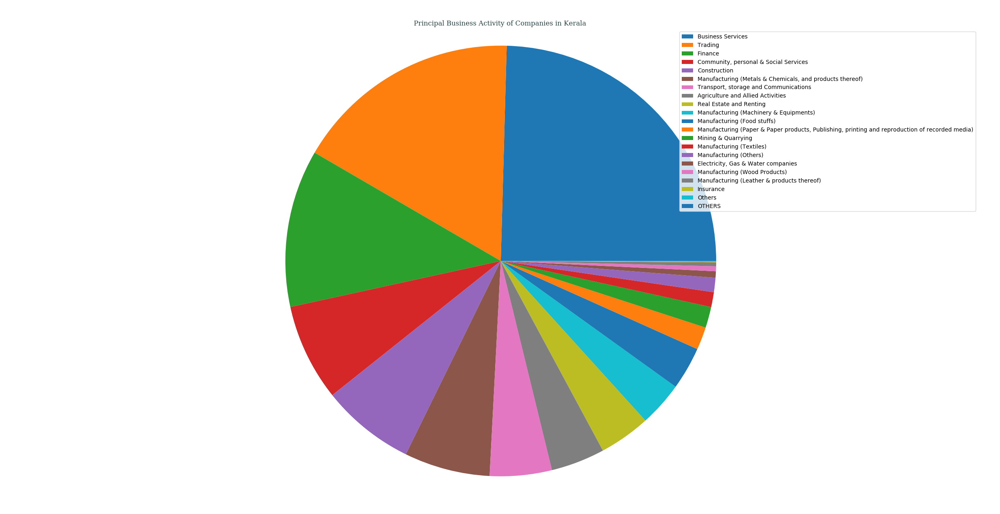
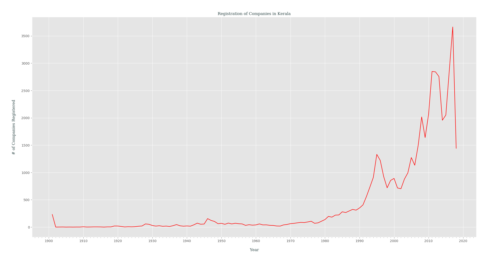

## Analysis of M.C.A. Data for _Kerala_, India
### Status of Companies in Kerala
Following PIE chart shows an overview of STATUS _( as of 21-04-2018 )_ of various companies registered in Kerala, India.
- Active ( 65.8903% )
- Strike Off ( 28.6464% )
- Dissolved ( 3.0066% )
- Under liquidation ( 0.6523% )
- Not Available for eFiling ( 0.6063% )
- Under Process of Striking off ( 0.6042% )
- Dormant under section 455 ( 0.2593% )
- Amalgamated ( 0.2404% )
- Converted to LLP ( 0.0439% )
- Converted to LLP and dissolved ( 0.0397% )
- Liquidated ( 0.0042% )
- Active In Progress ( 0.0042% )
- Dormant ( 0.0021% )

---
### Class of Companies in Kerala
Following PIE chart shows various companies categorized by their CLASS _( as of 21-04-2018 )_, present in Kerala, India.
- Private ( 91.7203% )
- Public ( 7.3618% )
- Private(One Person Company) ( 0.8217% )
- NA ( 0.0962% )

---
### Category of Companies in Kerala
Following PIE chart shows various companies categorized by their CATEGORY _( as of 21-04-2018 )_, present in Kerala, India.
- Company limited by Shares ( 99.4689% )
- Company Limited by Guarantee ( 0.4286% )
- NA ( 0.0962% )
- Unlimited Company ( 0.0063% )

---
### Sub-Category of Companies in Kerala
Following PIE chart shows various companies categorized by their SUB_CATEGORY _( as of 21-04-2018 )_, present in Kerala, India.
- Non-govt company ( 99.2787% )
- State Govt company ( 0.3094% )
- Subsidiary of Foreign Company ( 0.1673% )
- Guarantee and Association comp ( 0.1254% )
- NA ( 0.0962% )
- Union Govt company ( 0.0230% )

---
### Principal Business Activity of Companies in Kerala
Following PIE chart shows various companies categorized by their PRINCIPAL_BUSINESS_ACTIVITY _( as of 21-04-2018 )_, present in Kerala, India.
- Business Services ( 24.5630% )
- Trading ( 17.0486% )
- Finance ( 11.8194% )
- Community, personal & Social Services ( 7.2761% )
- Construction ( 7.0294% )
- Manufacturing (Metals & Chemicals, and products thereof) ( 6.4377% )
- Transport, storage and Communications ( 4.6458% )
- Agriculture and Allied Activities ( 4.0437% )
- Real Estate and Renting ( 3.8513% )
- Manufacturing (Machinery & Equipments) ( 3.3579% )
- Manufacturing (Food stuffs) ( 3.2157% )
- Manufacturing (Paper & Paper products, Publishing, printing and reproduction of recorded media) ( 1.7040% )
- Mining & Quarrying ( 1.5723% )
- Manufacturing (Textiles) ( 1.1144% )
- Manufacturing (Others) ( 1.0747% )
- Electricity, Gas & Water companies ( 0.4830% )
- Manufacturing (Wood Products) ( 0.3701% )
- Manufacturing (Leather & products thereof) ( 0.2906% )
- Insurance ( 0.0648% )
- Others ( 0.0335% )
- OTHERS ( 0.0042% )

---
### Registration of Companies by Year in Kerala
Companies registered in Kerala gets categorized by Year of Registration, which is plotted as year of registration vs. #-of companies registered in that certain year _( while filtering out those companies which didn't had any date of registration data )_.

