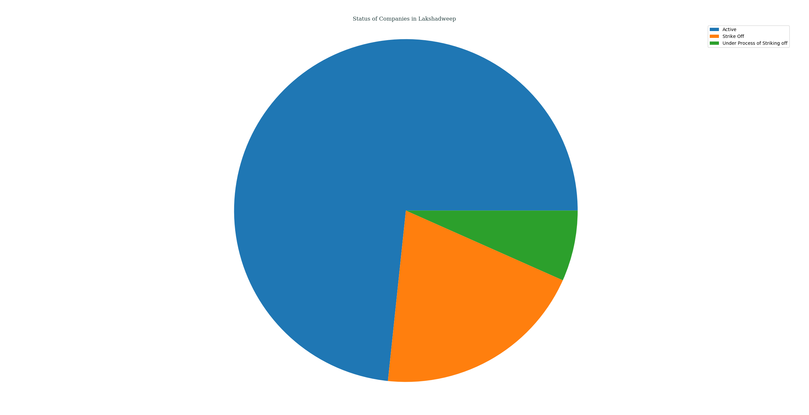
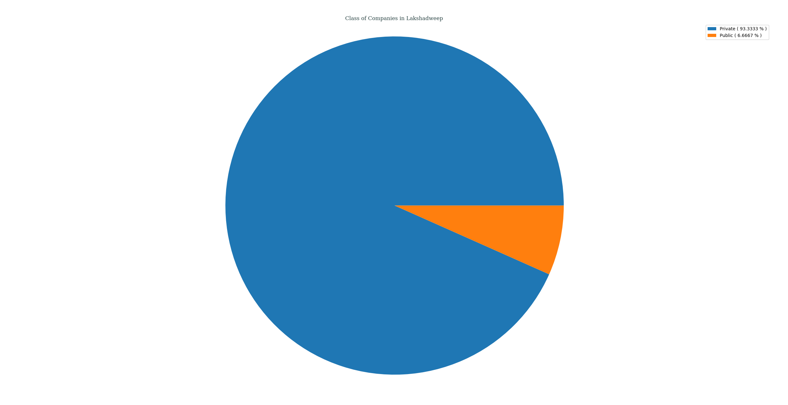
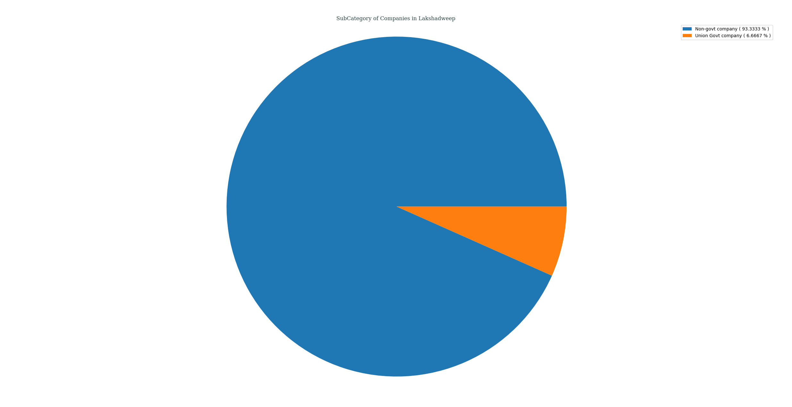
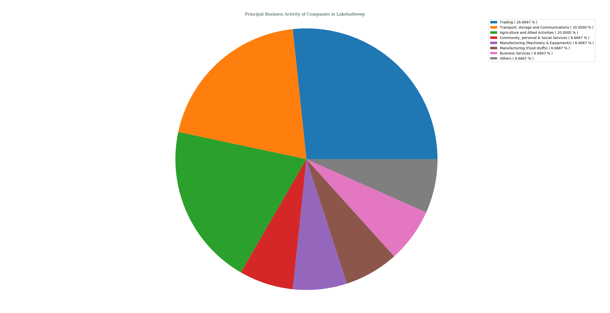
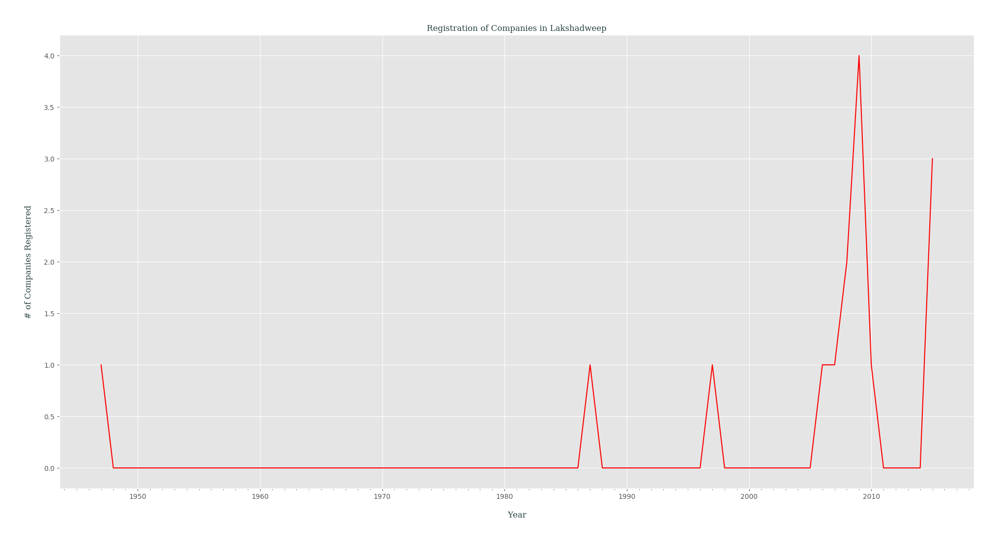

## Analysis of M.C.A. Data for _Lakshadweep_, India
### Status of Companies in Lakshadweep
Following PIE chart shows an overview of STATUS _( as of 21-04-2018 )_ of various companies registered in Lakshadweep, India.
- Active ( 73.3333% )
- Strike Off ( 20.0000% )
- Under Process of Striking off ( 6.6667% )

---
### Class of Companies in Lakshadweep
Following PIE chart shows various companies categorized by their CLASS _( as of 21-04-2018 )_, present in Lakshadweep, India.
- Private ( 93.3333% )
- Public ( 6.6667% )

---
### Category of Companies in Lakshadweep
Following PIE chart shows various companies categorized by their CATEGORY _( as of 21-04-2018 )_, present in Lakshadweep, India.
- Company limited by Shares ( 93.3333% )
- Company Limited by Guarantee ( 6.6667% )

---
### Sub-Category of Companies in Lakshadweep
Following PIE chart shows various companies categorized by their SUB_CATEGORY _( as of 21-04-2018 )_, present in Lakshadweep, India.
- Non-govt company ( 93.3333% )
- Union Govt company ( 6.6667% )

---
### Principal Business Activity of Companies in Lakshadweep
Following PIE chart shows various companies categorized by their PRINCIPAL_BUSINESS_ACTIVITY _( as of 21-04-2018 )_, present in Lakshadweep, India.
- Trading ( 26.6667% )
- Transport, storage and Communications ( 20.0000% )
- Agriculture and Allied Activities ( 20.0000% )
- Community, personal & Social Services ( 6.6667% )
- Manufacturing (Machinery & Equipments) ( 6.6667% )
- Manufacturing (Food stuffs) ( 6.6667% )
- Business Services ( 6.6667% )
- Others ( 6.6667% )

---
### Registration of Companies by Year in Lakshadweep
Companies registered in Lakshadweep gets categorized by Year of Registration, which is plotted as year of registration vs. #-of companies registered in that certain year _( while filtering out those companies which didn't had any date of registration data )_.

